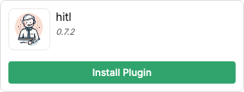

{/* vale off */}

import integrationVersions from '/snippets/integrations/versions.mdx'
import { OpenInHub } from '/snippets/integrations/open-in-hub.jsx'
import Cards from '/snippets/integrations/cards/botpress/zendesk.mdx'
import Triggers from '/snippets/integrations/triggers/botpress/zendesk.mdx'

{/* vale on */}

<OpenInHub integration={integrationVersions.zendesk}/>

The official Zendesk integration allows you to create and manage support tickets directly from your bot. You can also assign a Zendesk agent to communicate directly with the user, all within the same conversation initially handled by the bot.

<Tip>
Your Zendesk agent can continue the conversation on any messaging channel supported by Botpress. For example:

- [Webchat](/webchat/)
- [WhatsApp](/integrations/integration-guides/whatsapp/)
- [Messenger](/integrations/integration-guides/messenger)
</Tip>

## Setup

<Info>
  You will need:

  - A [published bot](/get-started/quick-start)
  - A [Zendesk account](https://www.zendesk.com/lp/brand/?utm_source=google&utm_medium=Search-Paid&utm_network=g&utm_campaign=SE_AW_AM_CA_EN_N_Sup_Brand_TM_Alpha_D_H&matchtype=e&utm_term=zendesk&utm_content=598844228779&theme=&gad_source=1&gad_campaignid=7993749347&gbraid=0AAAAADn4z6gHcJduDz_4dLVEw2Vc9I-lF&gclid=Cj0KCQjwrPHABhCIARIsAFW2XBOh1fGjHUcrDUDTaKTms6Qyrpi6Vo80Jj9_StfCFnEjiR_REi9zoZEaAjFjEALw_wcB)
</Info>
<Warning>
  We recommend that you **only link your Zendesk account with one bot**. Linking the same Zendesk account with multiple bots will raise an error and cause unexpected behaviour.
</Warning>

<Steps titleSize="h3">
  <Step title="Add the Zendesk Integration">
    First, install the official Zendesk integration. Use the search bar to find and select the Zendesk Integration. Once found, install this onto your bot.
  </Step>
  <Step title="Set up the Zendesk Integration">
    Switch to the Zendesk admin center, and find the Zendesk API menu. Ensure you have both password and token access enabled.

    You will then need to create a distinct API token. Copy this for later use.

    Return to your bot's dashboard. Here you will need to input your organizational subdomain, your consistent Zendesk account email, and the copied API token. Ensure to save this configuration and activate the newly installed integration.
  </Step>
  <Step title="Install the HITL plugin">
    Next, install the official HITL plugin. This will allow you to start HITL from any point in your Workflow.

    1. Navigate back to Botpress Hub and search for the HITL plugin.
    2. Select it, then select **Install Plugin**:

    

    3. In the **Configuration** menu, open the dropdown under **HITL integration**.
    4. Select **Zendesk**.
    5. Scroll down and select **Save**.

    <Tip>
      The **Configuration** section contains many optional fields. You can use these to customize your HITL experience.
    </Tip>
  </Step>
  <Step title="Add the Start HITL Card">
    Now, you can bring a live agent into the conversation anywhere in your Workflow:

    1. Open a Workflow in Studio and create (or select) a Node.
    2. Add the **Start HITL** Card:

    <Frame>
      
      
    </Frame>

    3. Fill in the required fields:

    | Fields              | Description |
    | :----------------- | :---------- |
    | **Ticket Title**    | The name of the ticket created for the live agent. |
    | **User ID**         | The user ID associated with the ticket. Enter the `{{event.userId}}` variable to use the current user's ID. |
    | **Conversation ID** | The conversation ID associated with the ticket. Enter the `{{event.conversationId}}` variable to use the current conversation's ID. |
  </Step>
</Steps>

<Check>
  Done! You can now create and manage support tickets directly from your bot.
</Check>

---

## Cards

<Cards />

---

## Triggers

<Triggers />
