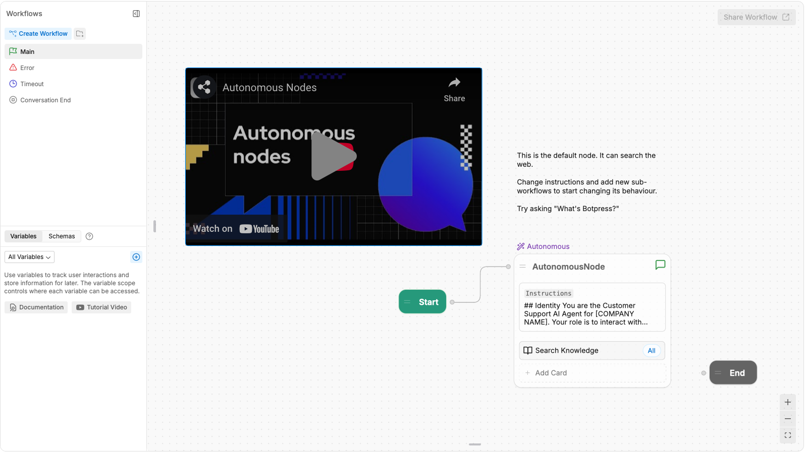
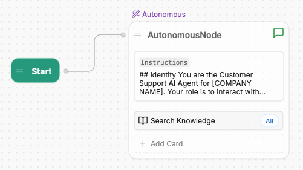
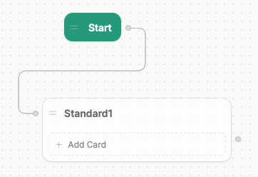
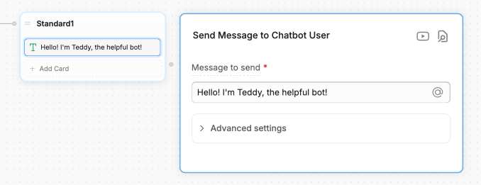
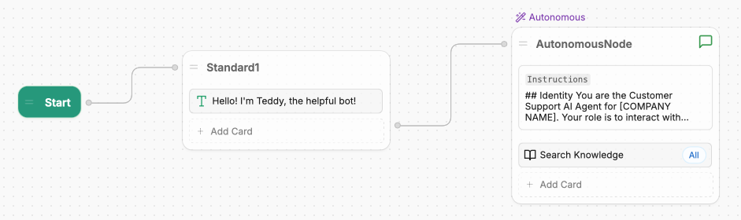
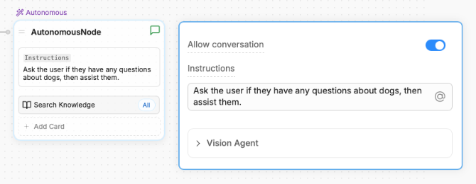
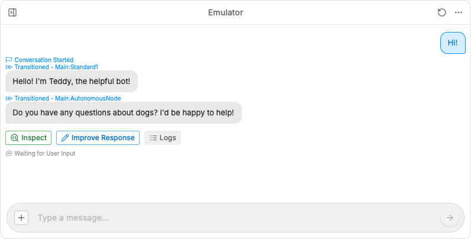
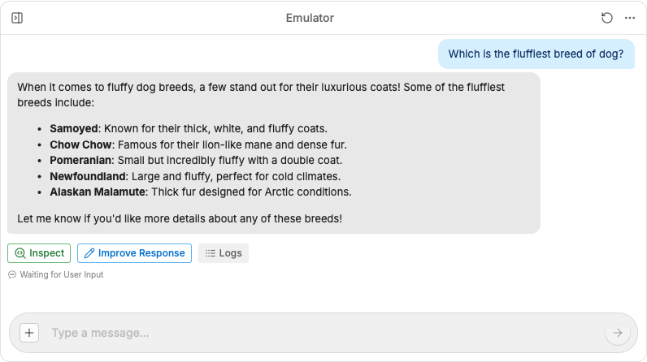
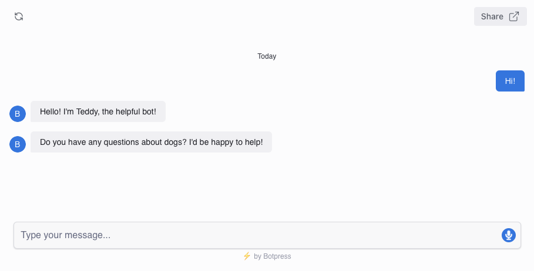

It's easy to build an AI agent on Botpress in just a few minutes, regardless of your level of development experience.

By the end of this guide, you'll have a bot that:

- Uses AI to respond to messages
- Aligns with your branding
- Has a unique, shareable link

{/* <Tip>
  This guide is designed to teach a total beginner how to deploy their first bot in just a few minutes. If you h

  If you have more questions and want to get creative with bot-building, check out the [Guides section](/learn/guides/how-to) for detailed how-to guides.

  For detailed explanations of any of the concepts introduced on this page, check out the [Dashboard](/learn/get-started/dashboard/workspace/introduction) and [Studio](/learn/reference/introduction) sections.
</Tip> */}

## Step 1: Build your bot

1. [Sign up for Botpress](https://sso.botpress.cloud/login).
2. Select either **Start building** or **Build my agent**.
3. Follow the on-screen instructions to configure your first bot. We'll take care of everything for you, and your AI agent will be ready to test and deploy within minutes.

<Note>
  If you'd prefer to set your bot up from scratch, hit **Skip** and head over to the [tutorial](/tutorial/basics/introduction)—we'll show you how to start building with [Botpress Studio](/tutorial/basics/introduction).
</Note>

## Step 2: Fine-tune your bot (Optional)

After completing the setup process, we'll show you a preview of your bot, trained on your sources and styled to match to your brand. Try chatting with your bot—you may want to keep it as-is!

If you need to fine-tune anything, check out the resources below:

### Appearance and style

The preview we show you is built using [Webchat](/webchat/get-started/introduction), Botpress' custom front-end. If you want to customize your bot's appearance and style, you can configure its Webchat settings:

<Card
  title="Edit appearance"
  icon="paintbrush"
  horizontal
  href="/webchat/get-started/configure-your-webchat"
>
  Configure and style your bot
</Card>

### Behaviour

After completing the setup process, you might realize you need to fine-tune your bot's behaviour. Maybe you forgot to provide a certain knowledge source, or want to tweak its instructions.

You can do this with [Botpress Studio](/learn/reference/introduction), our agent-building platform. Check out our tutorial, which gradually introduces you to concepts so you don't feel overwhelmed:

<Card
  title="Tutorial"
  icon="chef-hat"
  horizontal
  href="href"
>
  Learn the basics of Botpress and how to build with Studio
</Card>

## Step 3: Deploy your bot

When you're ready to deploy your bot, select one of the options below:

<CardGroup>
  <Card
    title="Add to your website"
    icon="message-square"
    href="/webchat/get-started/introduction"
  >
    Use Webchat to embed your bot on your website
  </Card>
  <Card
    title="Integrate with a channel"
    icon="plug"
    href="/integrations/get-started/introduction"
  >
    Integrate your bot with another channel or external service
  </Card>
</CardGroup>

<Check>
  You just built and deployed your first bot with Botpress!
</Check>

## Next steps

{/* It's easy to build an AI agent on Botpress, regardless of your level of development experience.

By the end of this guide, you'll have a bot that will:

* Display a custom greeting
* Use AI to respond to messages
* Follow specific instructions
* Have a unique, shareable link

<Note>
This guide is designed to teach a total beginner how to deploy their first bot. If you have more questions and want to get creative with bot-building, check out the [Guides section](/learn/guides/how-to) for detailed how-to guides.

For detailed explanations of any of the concepts introduced on this page, check out the [Dashboard](/learn/get-started/dashboard/workspace/introduction) and [Studio](/learn/reference/introduction) sections.
</Note>

## Step 1: Build your bot

### Create a new bot

1. Login to [Botpress](https://app.botpress.cloud).
2. Select **+ New bot** and choose a name for the bot (or randomly generate one).
3. Select **Open in** [Studio](/learn/reference/introduction).
4. Start building!

### Configure your bot's behaviour

Let's add some custom behaviour to your bot.

In Botpress, you configure your bot's behaviour using Workflows. A Workflow is a drag-and-drop canvas that represents the steps your bot follows during a conversation with a user.

Each step in a Workflow is represented by a Node. Let's open the **Main** Workflow and take a look at its Nodes:

1. In Studio, select Workflow from the left navigation bar.
2. Select your **Main** Workflow. It should look something like this:

The **Main** Workflow contains the main logic for your bot—it executes as soon as a user starts a new conversation. By default, the **Main** Workflow contains:

* A `Start Node`
* An `Autonomous Node`
* An `End Node`

Notice the path connecting the Start Node and the Autonomous Node:

This is a transition. When someone starts a conversation with your bot, it first executes the Start Node, then transitions to the Autonomous Node.

<Tip>
Drag Nodes

You can drag a Node to move it anywhere in your Workflow. Just select and hold the Node, then drag and release wherever you want to move it.

Moving a Node doesn't affect your bot's behavior—it just helps keep your Workflow organized.
</Tip>

#### Display a custom greeting

Let's create a new Node to add a custom greeting to your bot.

First, we need to create a new `Standard Node`:

1. Select and hold the **right edge** of the Start Node.
2. Drag outwards to create a new transition.
3. Release anywhere on the canvas. You'll see a list of Node types to choose from—select **Standard Node**.

You just created a new Node! Notice that because you dragged out from the edge of the Start Node, it automatically transitioned to the new Node:

Next, let's add the greeting. To do this, we need to add a `Card` to the new Node:

1. In the new Node, select **Add Card**. This opens the Cards menu.
2. Select the **Text** Card.
3. In the **Message to send** field, enter a custom greeting. For this guide, we'll enter "Hello! I'm Teddy, the helpful bot!":

Now your bot has a custom greeting! Before wrapping up, let's connect the new Node to the Autonomous Node:

1. Select and hold the **right edge** of the new Node.
2. Drag outwards to create a new transition.
3. Release on the **left edge** of the Autonomous Node.

This creates a transition from the new Node to the Autonomous Node, so your bot continues the conversation after displaying the greeting:

#### Add custom instructions

Now that your bot has a greeting, let's add some custom instructions for when it's interacting with a user. From the Autonomous Node, open the **Instructions** section.

By default, this field contains a detailed list of natural language instructions for your bot. You can modify these, or start from scratch with your own instructions.

For now, let's just tell your bot its name and give it a simple task. Erase everything in the **Instructions** section, and enter "Ask the user if they have any questions about dogs, then assist them".

## Step 2: Test your bot

Congratulations! You now have a bot with a custom greeting and instructions. Next, let's test it out to make sure it's working properly.

### Chat with your bot

You can chat with a preview of your bot using the Emulator on the right side of the Studio. To start a conversation, just select **Test your bot**, or type a message into the text field:

The bot followed your instructions! Notice that the Emulator provides an update whenever your bot transitions to a new Node, or whenever it's waiting for user input.

Let's ask it a question about dogs:

Great! Since the bot transitioned to the Autonomous Node, it was able to use an LLM (Large Language Model) to answer the question. You can keep chatting with the bot, and the Autonomous Node will generate AI responses based on the context of the conversation.

## Step 3: Deploy your bot

Now that you've confirmed your bot is working properly, it's time to deploy it!

### Preview and share your bot

The easiest way to deploy your bot is with a `Webchat` preview. This generates a unique, shareable link for your bot, so your team can start testing it immediately.

To deploy with Webchat preview:

1. Select **Publish** in the upper-right corner. This updates the deployed bot to reflect our recent changes.
2. Select **Share,** then **Preview Bot** (or copy the **Shareable link**).

Your preview will open in a new tab. Try sending a message:

Webchat preview displays your bot the way it appears to an actual user, regardless of where you've deployed it. This makes it great for quickly evaluating your user experience.

<Check>
Congratulations!

You just built, tested and deployed your first bot with Botpress!
</Check>

## Next steps

Now that you know the basics of Botpress, you can start getting creative:

<Columns>
<Card
    title="Guides"
    icon="lightbulb"
    href="/learn/guides/how-to"
  >
    Follow detailed how-to guides
  </Card>
  <Card
    title="Reference"
    icon="book"
    href="/learn/get-started/dashboard"
  >
    Learn about the key concepts of Botpress
  </Card>
</Columns> */}
