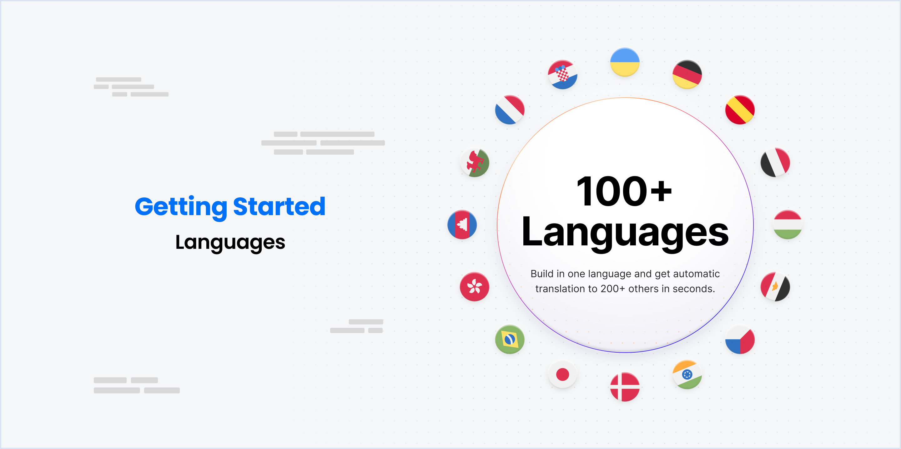
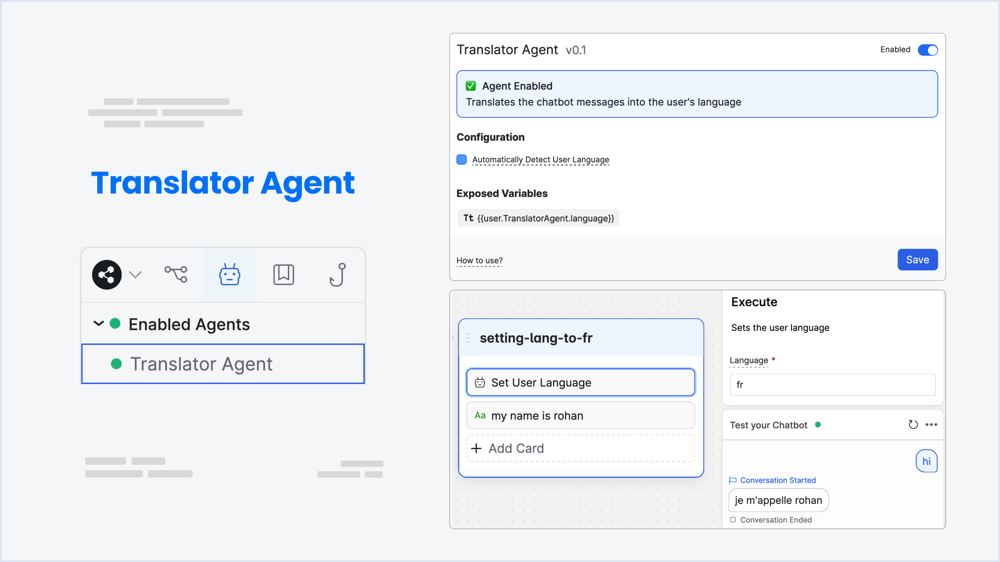

import { Img } from '/snippets/image.mdx'
import { Youtube } from '/snippets/youtube.mdx'



## Supported Languages

With Botpress, you can build chatbots that are able to converse with people in more than 100+ languages!

<table>
  <thead>
    <tr>
      <th>

      </th>

      <th>

      </th>

      <th>

      </th>

      <th>

      </th>

      <th>

      </th>
    </tr>
  </thead>

  <tbody>
    <tr>
      <td>
        Afrikaans
      </td>

      <td>
        Albanian
      </td>

      <td>
        Alemannic
      </td>

      <td>
        Amharic
      </td>

      <td>
        Arabic
      </td>
    </tr>

    <tr>
      <td>
        Aragonese
      </td>

      <td>
        Armenian
      </td>

      <td>
        Assamese
      </td>

      <td>
        Asturian
      </td>

      <td>
        Azerbaijani
      </td>
    </tr>

    <tr>
      <td>
        Bashkir
      </td>

      <td>
        Basque
      </td>

      <td>
        Bavarian
      </td>

      <td>
        Belarusian
      </td>

      <td>
        Bengali
      </td>
    </tr>

    <tr>
      <td>
        Bihari
      </td>

      <td>
        Bishnupriya Manipuri
      </td>

      <td>
        Bosnian
      </td>

      <td>
        Breton
      </td>

      <td>
        Bulgarian
      </td>
    </tr>

    <tr>
      <td>
        Burmese
      </td>

      <td>
        Catalan
      </td>

      <td>
        Cebuano
      </td>

      <td>
        Central Bicolano
      </td>

      <td>
        Chechen
      </td>
    </tr>

    <tr>
      <td>
        Chinese (Simplified and Traditional)
      </td>

      <td>
        Chuvash
      </td>

      <td>
        Corsican
      </td>

      <td>
        Croatian
      </td>

      <td>
        Czech
      </td>
    </tr>

    <tr>
      <td>
        Danish
      </td>

      <td>
        Divehi
      </td>

      <td>
        Dutch
      </td>

      <td>
        Eastern Punjabi
      </td>

      <td>
        Egyptian Arabic
      </td>
    </tr>

    <tr>
      <td>
        Emilian-Romagnol
      </td>

      <td>
        Erzya
      </td>

      <td>
        Esperanto
      </td>

      <td>
        Estonian
      </td>

      <td>
        Fiji Hindi
      </td>
    </tr>

    <tr>
      <td>
        Finnish
      </td>

      <td>
        French
      </td>

      <td>
        Galician
      </td>

      <td>
        Georgian
      </td>

      <td>
        German
      </td>
    </tr>

    <tr>
      <td>
        Goan Konkani
      </td>

      <td>
        Greek
      </td>

      <td>
        Gujarati
      </td>

      <td>
        Haitian
      </td>

      <td>
        Hebrew
      </td>
    </tr>

    <tr>
      <td>
        Hill Mari
      </td>

      <td>
        Hindi
      </td>

      <td>
        Hungarian
      </td>

      <td>
        Icelandic
      </td>

      <td>
        Ido
      </td>
    </tr>

    <tr>
      <td>
        Ilokano
      </td>

      <td>
        Indonesian
      </td>

      <td>
        Interlingua
      </td>

      <td>
        Irish
      </td>

      <td>
        Italian
      </td>
    </tr>

    <tr>
      <td>
        Japanese
      </td>

      <td>
        Javanese
      </td>

      <td>
        Kannada
      </td>

      <td>
        Kapampangan
      </td>

      <td>
        Kazakh
      </td>
    </tr>

    <tr>
      <td>
        Khmer
      </td>

      <td>
        Kirghiz
      </td>

      <td>
        Korean
      </td>

      <td>
        Kurdish (Kurmanji)
      </td>

      <td>
        Kurdish (Sorani)
      </td>
    </tr>

    <tr>
      <td>
        Latin
      </td>

      <td>
        Latvian
      </td>

      <td>
        Limburgish
      </td>

      <td>
        Lithuanian
      </td>

      <td>
        Lombard
      </td>
    </tr>

    <tr>
      <td>
        Low Saxon
      </td>

      <td>
        Luxembourgish
      </td>

      <td>
        Macedonian
      </td>

      <td>
        Maithili
      </td>

      <td>
        Malagasy
      </td>
    </tr>

    <tr>
      <td>
        Malay
      </td>

      <td>
        Malayalam
      </td>

      <td>
        Maltese
      </td>

      <td>
        Manx
      </td>

      <td>
        Marathi
      </td>
    </tr>

    <tr>
      <td>
        Mazandarani
      </td>

      <td>
        Meadow Mari
      </td>

      <td>
        Minangkabau
      </td>

      <td>
        Mingrelian
      </td>

      <td>
        Mongolian
      </td>
    </tr>

    <tr>
      <td>
        Mangolian
      </td>

      <td>
        Nahautl
      </td>

      <td>
        Neapolitan
      </td>

      <td>
        Nepali
      </td>

      <td>
        Newar
      </td>
    </tr>

    <tr>
      <td>
        North Frisian
      </td>

      <td>
        Northern Sotho
      </td>

      <td>
        Norwegian (Bokmål)
      </td>

      <td>
        Norwegian (Nynorsk)
      </td>

      <td>
        Occitan
      </td>
    </tr>

    <tr>
      <td>
        Oriya
      </td>

      <td>
        Ossetian
      </td>

      <td>
        Palatinate German
      </td>

      <td>
        Pashto
      </td>

      <td>
        Persian
      </td>
    </tr>

    <tr>
      <td>
        Piedmontese
      </td>

      <td>
        Polish
      </td>

      <td>
        Portuguese
      </td>

      <td>
        Quechua
      </td>

      <td>
        Romanian
      </td>
    </tr>

    <tr>
      <td>
        Romansh
      </td>

      <td>
        Russian
      </td>

      <td>
        Sakha
      </td>

      <td>
        Sanskrit
      </td>

      <td>
        Sardinian
      </td>
    </tr>

    <tr>
      <td>
        Scots
      </td>

      <td>
        Scottish Gaelic
      </td>

      <td>
        Serbian
      </td>

      <td>
        Serbo-Croatian
      </td>

      <td>
        Sicilian
      </td>
    </tr>

    <tr>
      <td>
        Sindhi
      </td>

      <td>
        Sinhalese
      </td>

      <td>
        Slovak
      </td>

      <td>
        Slovenian
      </td>

      <td>
        Somali
      </td>
    </tr>

    <tr>
      <td>
        Southern Azerbaijani
      </td>

      <td>
        Spanish
      </td>

      <td>
        Sundanese
      </td>

      <td>
        Swahili
      </td>

      <td>
        Swedish
      </td>
    </tr>

    <tr>
      <td>
        Tagalog
      </td>

      <td>
        Tajik
      </td>

      <td>
        Tamil
      </td>

      <td>
        Tatar
      </td>

      <td>
        Telugu
      </td>
    </tr>

    <tr>
      <td>
        Thai
      </td>

      <td>
        Tibetan
      </td>

      <td>
        Turkish
      </td>

      <td>
        Turkmen
      </td>

      <td>
        Ukrainian
      </td>
    </tr>

    <tr>
      <td>
        Upper Sorbian
      </td>

      <td>
        Urdu
      </td>

      <td>
        Uyghur
      </td>

      <td>
        Uzbek
      </td>

      <td>
        Venetian
      </td>
    </tr>

    <tr>
      <td>
        Vietnamese
      </td>

      <td>
        Volapük
      </td>

      <td>
        Walloon
      </td>

      <td>
        Waray
      </td>

      <td>
        Welsh
      </td>
    </tr>

    <tr>
      <td>
        West Flemish
      </td>

      <td>
        West Frisian
      </td>

      <td>
        Western Punjabi
      </td>

      <td>
        Yiddish
      </td>

      <td>
        Yoruba
      </td>
    </tr>

    <tr>
      <td>
        Zazaki
      </td>

      <td>
        Zeelandic
      </td>

      <td>

      </td>

      <td>

      </td>

      <td>

      </td>
    </tr>
  </tbody>
</table>

<br />

## Translator Agent

<Youtube url="https://www.youtube.com/embed/SIrmuihqNhs?si=FXZQJ59rRLW07D2D" />



The Translator Agent allows your chatbot to interact with users in different languages, breaking language barriers and expanding the range of your bot's audience.

### Configuration

* **Automatically Detect User Language** - When enabled, the Translator Agent will automatically detect the user's language from their input.

Activating this feature consequently sets the `{{user.TranslatorAgent.language}}` variable when it's not already defined.

### Exposed Variables

* **user.TranslatorAgent.language**: This variable represents the detected language of the user.

### Example - setting language to french

1. Open the Toolbox Cards and drag the **Set User Language** Card into your first node(ideally).
2. Specify a language. In this case, we will use `fr` for French.

The Translator Agent automatically translates the chatbot's responses into the user's language once activated. If you wish to define the user's language manually, you can directly set the `{{user.TranslatorAgent.language}}` variable.

This variable is set to `null` by default, which means that the Translator Agent will automatically detect the user's language from their input.

### Resetting the language

Drag the **Reset User Language** Card into your flow. This will reset the `{{user.TranslatorAgent.language}}` variable to `null`.

You can do this in Execute Code card as well:

```javascript
//use null to reset the language, otherwise set it to a language code
{{user.TranslatorAgent.language}} = null;
```
