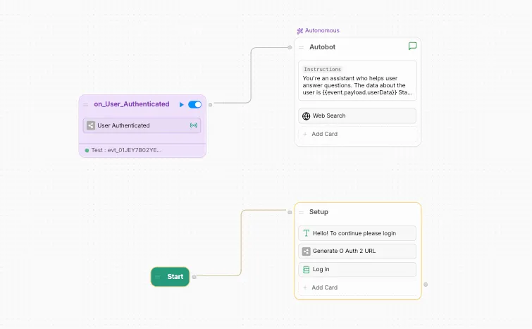

import { YouTube } from '/snippets/youtube.mdx'

OAuth can be very useful especially in cases where validating the identify of the user is crucial. In the example that follows we walk through how we was able to setup OAuth verification with GitHub as my platform of choice in our Botpress bot.

This was accomplished with the help of a custom integration for setting up OAuth with GitHub.

## Demo

**When the user is authenticated**

<YouTube url="https://www.youtube.com/embed/c0J5woV0UMQ?si=VBLHrUigHiUYzm0m" />

**When the user is unauthenticated**

<YouTube url="https://www.youtube.com/embed/c0J5woV0UMQ?si=2bh-MFniNSxgw_rL" />

## Bot Setup

The bot setup is straightforward. First, the user is prompted to log in by clicking on a link generated by the integration. Once the login is successful, an event is emitted. This event is captured by a trigger node, which then hands off control to an autonomous node.



## Integration

The integration has a couple of responsibilities:

1. Generating the OAuth link that users will click on.
2. Capturing a successful authentication which then emits an event containing the conversation ID and data about the authenticated user.

This is achieved using an action ( here called “Generate OAuth2 URL” ) and the integration’s Botpress webhook handler. The webhook captures successful authentication and emits a Botpress event ( in this case, “User Authenticated” ).

### Writing this integration

You can use the [Building](doc:building-integrations) to bootstrap an integration, then add the following code as a starting point to achieve the above result. Once you get it working, we suggest you modify the integration to fit your purposes.

In `integration.definition.ts` we define the events (which bot builders can hook onto in the Studio), and actions which allow for generating the URL that should be displayed to the end user.

```typescript integration.definition.ts
import { conversation, IntegrationDefinition, z } from '@botpress/sdk'
import { integrationName } from './package.json'
import { DEFAULT_STORE_KEY } from 'src/store'

export default new IntegrationDefinition({
  name: integrationName,
  version: '0.0.1',
  readme: 'hub.md',
  icon: 'icon.svg',
  configuration: {
    schema: z.object({
      clientId: z.string(),
      clientSecret: z.string(),
      state: z.string().default("secure_random_string").hidden(), // This is used for the authentication handshake, you can change it to a random string.
    })
  },
  events: {
    onUserAuthenticated: {
      title: 'User Authenticated',
      description: 'Fires when a user has been authenticated',
      schema: z.object({
        userData: z.any(),
        conversationIdxx: z.string(),
      })
    }
  },
  actions: {
    generateUrl: {
      title: 'Generate OAuth2 URL',
      description: 'Generates an OAuth2 URL to authenticate the user',
      input: {
        schema: z.object({
          conversationId: z.string().default('{{event.conversationId}}').hidden()
        })
      },
      output: {
        schema: z.object({
          url: z.string()
        })
      }
    }
  },
  states: {
    [DEFAULT_STORE_KEY]: {
      type: 'integration',
      schema: z.object({
        bpWebhookUrl: z.string(),
        conversationId: z.string(),
      }),
    }
  }
})
```

In src/index.ts is the main logic for generating a shareable sign-up url for OAuth, and a handler method to handle the OAuth response.

```typescript index.ts
import * as sdk from "@botpress/sdk";
import * as bp from ".botpress";
import { Store } from './store'

export default new bp.Integration({
  register: async ({ webhookUrl, client, ctx }) => {
    const store = new Store(client, ctx);
    await store.initialize({
      bpWebhookUrl: webhookUrl,
      conversationId: "",
    })
    console.log("Integration registered")
  },
  unregister: async () => {},
  actions: {
    generateUrl: async ({ client, input, ctx } ) => {
      const store = new Store(client, ctx);
      await store.load();

      await store.set("conversationId", input.conversationId);
      const webhookUrl = await store.get("bpWebhookUrl");

      const clientId = ctx.configuration.clientId;
      const redirectUri = webhookUrl; // Redirect back to the integration
      const state = ctx.configuration.state; // For CSRF protection
      const scope = "read:user"; // Request access to read user profile

      const githubOAuthUrl = `https://github.com/login/oauth/authorize?client_id=${clientId}&redirect_uri=${encodeURIComponent(
        redirectUri
      )}&scope=${scope}&state=${state}`;

      return { url: githubOAuthUrl };
    },
  },
  channels: {},
  handler: async ({ req, client, ctx }) => {
    const store = new Store(client, ctx);
    await store.load();
    const webhookUrl = await store.get("bpWebhookUrl");

    // Construct a URLSearchParams object
    const params = new URLSearchParams(req.query);

    // Extract query parameters
    const code = params.get("code"); // Extract 'code'
    const sec_string = params.get("state"); // Extract 'state'

    // Verify the `state` to protect against CSRF
    if (sec_string !== ctx.configuration.state) {
      return { status: 403, message: "Invalid state" };
    }

    // Exchange the code for an access token
    const tokenResponse: any = await fetch("https://github.com/login/oauth/access_token", {
      method: "POST",
      headers: { "Content-Type": "application/json", Accept: "application/json" },
      body: JSON.stringify({
        client_id: ctx.configuration.clientId,
        client_secret: ctx.configuration.clientSecret,
        code,
        redirect_uri: webhookUrl,
      }),
    }).then((res) => res.json());

    // Fetch user data
    const userData: any = await fetch("https://api.github.com/user", {
      headers: {
        Authorization: `Bearer ${tokenResponse.access_token}`,
      },
    }).then((res) => res.json());

    // Send a message to the user
    const conversationId = await store.get("conversationId");

    await client.createEvent({
      type: "onUserAuthenticated",
      conversationId: conversationId,
      payload: {
        conversationIdxx: conversationId,
        userData: userData,
      }
    })

    return { status: 200, message: "Success" };
  },
});
```

In src/store.ts we add some logic to be able to save authentication parameters which will help us know who is who when getting a callback request from OAuth.

```typescript store.ts
import * as sdk from "@botpress/sdk";

export const DEFAULT_STORE_KEY = "globalStore";

export class Store {
  private client: sdk.IntegrationSpecificClient<any>;
  private ctx: sdk.IntegrationContext;
  private globalStoreKey: string;
  private validKeys: string[] = [];

  constructor(
    client: sdk.IntegrationSpecificClient<any>,
    ctx: sdk.IntegrationContext,
    globalStoreKey = DEFAULT_STORE_KEY
  ) {
    this.client = client;
    this.ctx = ctx;
    this.globalStoreKey = globalStoreKey;
  }

  private async fetchGlobalStore(): Promise<Record<string, any>> {
    const result = await this.client.getState({
      type: "integration",
      id: this.ctx.integrationId,
      name: this.globalStoreKey,
    });
    return result.state.payload || {}; // Default to an empty object if no state exists
  }

  private async updateGlobalStore(store: Record<string, any>): Promise<void> {
    console.log('updating store', store)
    await this.client.setState({
      type: "integration",
      id: this.ctx.integrationId,
      name: this.globalStoreKey,
      payload: store,
    });
  }

  async initialize(initialState: Record<string, any>): Promise<void> {
    this.validKeys = Object.keys(initialState);
    await this.updateGlobalStore(initialState);
  }

  async load(): Promise<void> {
    const store = await this.fetchGlobalStore();
    this.validKeys = Object.keys(store);
  }

  private validateKey(key: string): void {
    if (!this.validKeys.includes(key)) {
      throw new Error(`Key ${key} isn't a valid key, valid keys are: ${this.validKeys.join(", ")}`);
    }
  }

  async set(key: string, value: any): Promise<void> {
    this.validateKey(key);
    const store = await this.fetchGlobalStore();
    console.log('got store', store);
    store[key] = value; // Update the key in the global store
    await this.updateGlobalStore(store); // Save the updated store back
  }

  async get(key: string): Promise<any> {
    this.validateKey(key);
    const store = await this.fetchGlobalStore();
    return store[key]; // Retrieve the value for the key
  }
}

```

<br />

After adding this code, deploy it to the bot you want to work on, and configure it using GitHub parameters (or whatever platform you'd like to port this to) and hit "Save Configuration".

If you'd like to try out the GitHub example above, you can use this link to create the credentials :

[https://github.com/settings/developers#oauth-apps](https://github.com/settings/developers#oauth-apps)

The "Authorization callback URL" should be your webhook URL, located in the configuration page of the integration. There is no need to enable the device flow.

That's it, now you can publish your bot, and try it out. Once that works, feel free to use this code as a starting point for your OAuth Integration.
