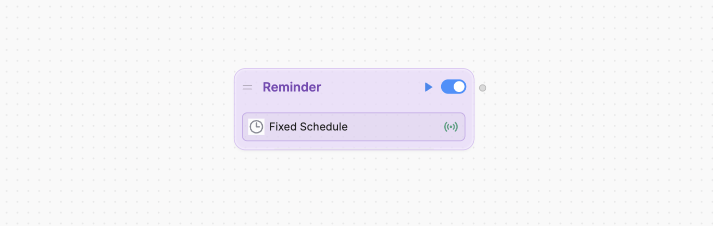
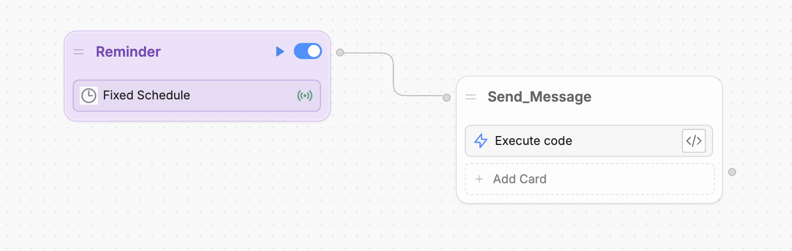
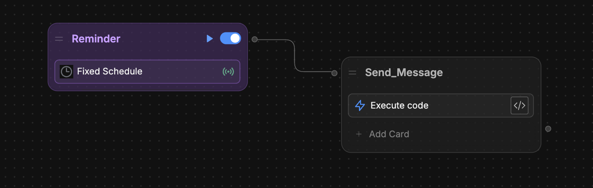

You can have your bot send a message to all your users' active conversations at regular intervals. This is useful if you want to send reminders, notifications, or other time-sensitive messages to your users.

<Info>
    You will need:

    - A [published bot](/learn/get-started/quick-start)
</Info>

## Step 1: Setup your Personal Access Token

Since you need to use the Botpress API to send a reminder to all users, you need to set up a [Personal Access Token](/learn/get-started/dashboard/workspace/user-profile#personal-access-tokens) for authentication.

### Create the token

1. In the bottom-left corner of the [Dashboard](/learn/get-started/dashboard/), select your profile picture.
2. Select **Personal access tokens**, then **Generate new token.**
3. Enter a note to remember the token's purpose—like "Reminders".
4. Select **Generate Token**.
5. Copy the generated token and store it somewhere—once you leave this page, you won't be able read it again.

### Store the token in a variable

Next, [create a configuration variable](/learn/reference/variables/scopes/configuration#create-a-configuration-variable) called `PERSONAL_ACCESS_TOKEN` and store your token in it. This will let you access the token in code.

## Step 2: Add a Fixed Schedule Trigger

Add a [Fixed Schedule](/learn/reference/cards/fixed-schedule) Trigger to your bot's [Workflow](/learn/reference/workflows). This will make sure your reminder sends on a set interval.

<Frame>
  
  
</Frame>

You can configure the Trigger to execute at whatever interval you'd like.

## Step 3: Add an Execute Code Card

Connect an [Execute Code](/learn/reference/cards/execute-code) Card to your Trigger:

<Frame>
  
  
</Frame>

## Step 4: Apply the custom code

Paste the following code into the Card's configuration:

``` javascript
const botId = '<your-bot-id>' // Replace with your actual bot ID (found in the Studio URL)
const botpressApiUrl = 'https://api.botpress.cloud/v1/chat/conversations'
const botpressApiKey = env.PERSONAL_ACCESS_TOKEN

const response = await axios.get(botpressApiUrl, {
  headers: {
    Authorization: `Bearer ${botpressApiKey}`,
    'x-bot-id': botId
  }
})

// Optional: Log the list of conversations
console.log(response.data)

response.data.conversations.forEach((conversation) => {
  const conversationId = conversation.id
  client.createMessage({
    conversationId,
    userId: botId,
    tags: {},
    type: 'text',
    payload: {
      text: "Don't forget to drink water!", // Your reminder message
    },
  })
})
```

Be sure to replace the placeholder value for `botId` with your actual bot ID. To find your bot ID:

1. Open your bot in the Studio.
2. Get the bot ID from the URL's path. For example:
`https://studio.botpress.cloud/THIS_IS_YOUR_BOT_ID/`

<Check>
    Once you've published the latest version of your bot, it will send reminders to all active conversations at the specified interval.
</Check>
