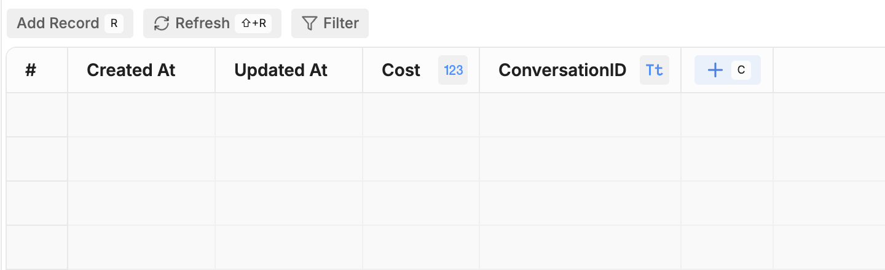
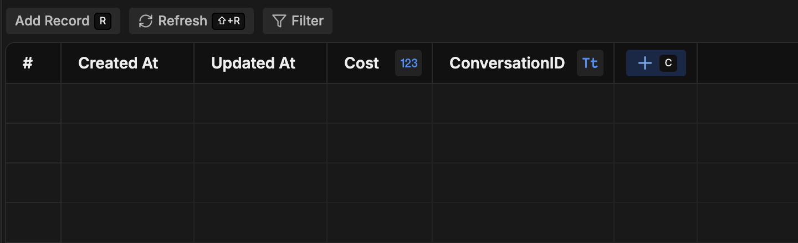
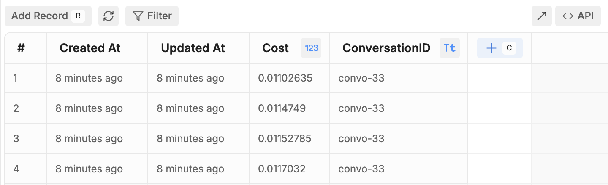
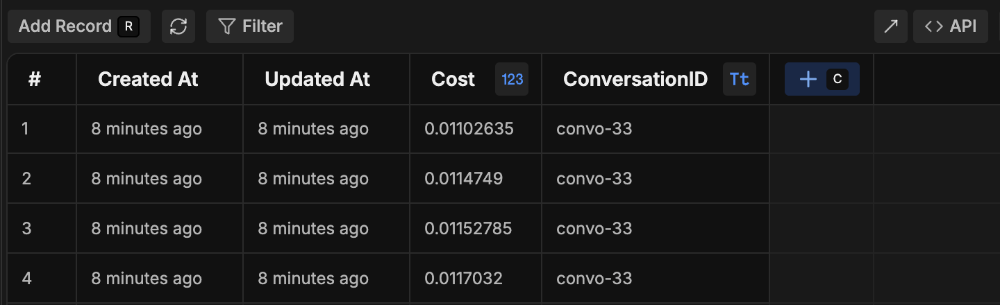

You can store data about your bot's AI spend in a table that automatically updates throughout all your bot's conversations. This includes cost from any of your bot's AI usage, including:

- [Autonomous Nodes](/learn/reference/nodes/autonomous-node)
- [AI Cards](/learn/reference/cards/ai/introduction)
- Queries to a [Knowledge Base](/learn/reference/knowledge-base/introduction)

<Info>
    You will need:

    - A [published bot](/learn/get-started/quick-start)
</Info>

## Step 1: Create a table

1. [Create a new table](/learn/reference/tables#creating-a-table) named `SpendTable`.
2. Add two columns to the table:
    - **Cost** (set the type to **Number**)
    - **ConversationID** (set the type to **String**)

<Frame>
  
  
</Frame>

## Step 2: Add a Hook to track AI spend

1. [Create a new Hook](/learn/reference/hooks#add-a-hook) with the type [After Turn End](/learn/reference/hooks#after-turn-end).
2. Paste the following code into the Hook:

``` javascript
// Convert spend from nano-dollars to dollars
const llm_spend = metadata.tokens.cost / 1000000000;

// Create a row for the current turn's AI spend
client.createTableRows({
  table: 'SpendTable',
  rows: [
    {
      Cost: llm_spend,
      ConversationID: event.conversationId,
    }
  ]
});
```

This Hook runs after each turn—that is, after the bot has received a message, processed it, and sent its response. The code snippet above does the following:

- Retrieves the AI spend for the current turn
- Convert the cost from nano-dollars into standard dollars
- Saves the cost and conversation ID to the `SpendTable`

## Step 3: Test your table

Try chatting with your bot in the emulator. After every message your bot sends, your table should automatically create a new row. The AI spend will display in the **Cost** column:

<Frame>
  
  
</Frame>

<Check>
  Your table will now keep a record of your bot's AI spend for each turn.
</Check>

## Step 4 (Optional): Calculate total AI spend per conversation

Your table now stores the AI spend for each turn—but you can also store each conversation's total AI spend in a separate table.

1. Create a second table named `TotalSpendTable`.
2. Add the same two columns as the first table:
    - **Cost** (set the type to **Number**)
    - **ConversationID** (set the type to **String**)
3. [Create a new Hook](/learn/reference/hooks#add-a-hook) with the type [After Conversation End](/learn/reference/hooks#after-conversation-end).
4. Paste the following code into the Hook:

``` javascript
// Finds table rows with the current conversation ID
const tableResponse = await client.findTableRows({
  table: 'SpendTable',
  filter: {
    ConversationID: event.conversationId
  }
});

// Calculates the total AI spend for the conversation
let totalSpend = 0;
for (let i = 0; i < tableResponse.rows.length; i++) {
  totalSpend += tableResponse.rows[i].Cost;
};

// Creates a row in the new table with the total AI spend for the conversation
client.createTableRows({
  table: 'TotalSpendTable',
  rows: [
    {
      Cost: totalSpend,
      ConversationID: event.conversationId,
    }
  ]
});
```

This Hook runs after the end of each conversation. The code snippet above does the following:

- Retrieves the AI spend for each turn of the conversation
- Sums them up to get the total AI spend for the conversation
- Creates a row in `TotalSpendTable` with the total AI spend for the conversation

<Warning>

    If you're using an Autonomous Node in your main [Workflow](/learn/reference/workflows), the conversation will only end when it [times out](/learn/reference/bot-settings#inactivity-timeout). This means you'll need to wait for the duration of your bot's inactivity timeout before your table updates with the total AI spend.

</Warning>
