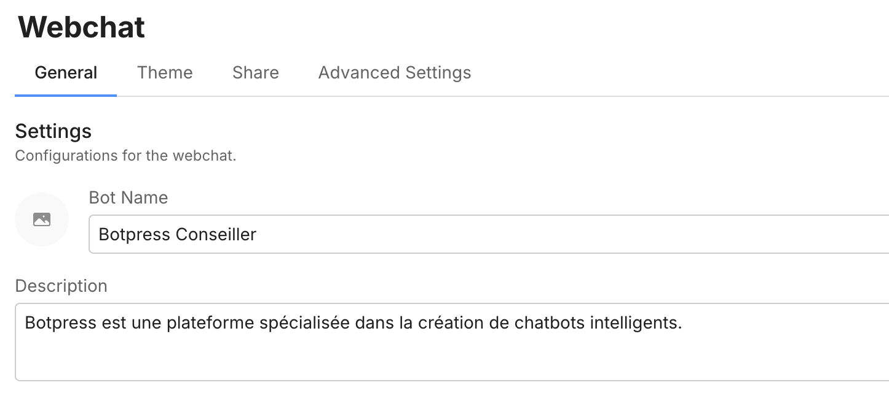
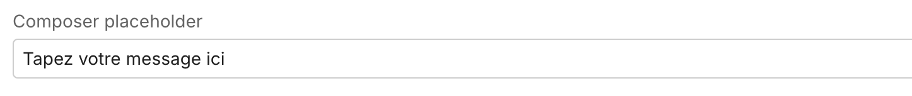
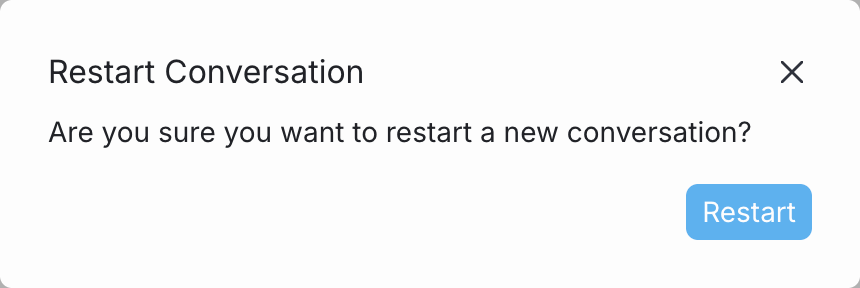
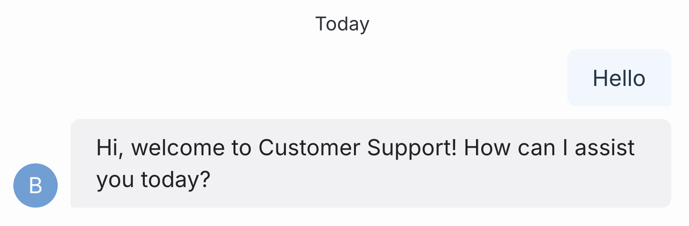

If your bot is having conversations in a language other than English, you can translate its [Webchat](/webchat/) UI to match. This includes the bot's greeting, buttons, and any other text that appears in the Webchat window.

<Info>
    You will need:

    - A [published bot](/learn/get-started/quick-start)
    - Knowledge of CSS
    
    For the purposes of this guide, we'll translate the bot's Webchat UI to French. However, you can use the same steps to translate your bot's webchat UI into any language.
</Info>

<Tip>
    Visual learner? Check out our [YouTube guide](https://www.youtube.com/watch?v=afZCpkWHZsI) on translating your bot.
</Tip>

## Step 1: Translate elements from Dashboard

You can translate some elements of the Webchat UI directly from your bot's Webchat settings in the [Dashboard](/learn/get-started/dashboard):

### Name and description

To translate the name and description of your bot, modify the **Bot Name** and **Description** fields:

<Frame>

</Frame>

### Composer placeholder

To translate the placeholder text in the Composer, modify the **Composer placeholder** field:

<Frame>

</Frame>

## Step 2: Translate elements with CSS

Other elements of the Webchat UI need to be translated using CSS. To modify Webchat's built-in CSS classes:

1. Open your bot's Webchat settings in the [Dashboard](/learn/get-started/dashboard).
2. Select the **Theme** tab, then scroll to the **Styles** section.
3. Copy and paste the CSS snippets below into the **Styles** section, then modify the highlighted lines as needed.

<Tip>
    For a full list of Webchat CSS classes, check out our [guide on styling Webchat](/webchat/get-started/styling-your-webchat#use-custom-styles).
</Tip>


### New conversation modal

You can translate the modal that appears when a user restarts a conversation:

<Frame>
    
</Frame>

Just copy and paste the following CSS to the **Styles** section of your bot's Webchat settings, then modify the highlighted lines as needed:

```css [expandable] {9, 24-25, 39}
/* Change the modal's title */
.bpModalTitle {
    visibility: hidden;
    position: relative;
}
.bpModalTitle:after {
    visibility: visible;
    position: absolute;
    content: "Créer une nouvelle conversation"; /* Replace this with your own translation*/
}

/* Change "New Conversation" */
.bpModalButtonConfirm {
  position: relative;
  color: transparent;
}
.bpModalButtonConfirm:after {
  position: absolute;
  top: 50%;
  left: 50%;
  transform: translate(-50%, -50%);
  color: var(--message-text);
  white-space: nowrap;
  content: "Nouvelle conversation";
  /* Replace this with your own translation*/
}

.bpModalButtonCancel {
    visibility: hidden;
    position: relative;
}

.bpModalButtonCancel:after {
    visibility: visible;
    position: absolute;
    top: 50%;
    left: 50%;
    transform: translate(-50%, -50%);
    content: "Annuler"; /* Replace this with your own translation*/
}
```

### "Today" label

You can translate the "Today" label that appears in a Webchat conversation:

<Frame>

</Frame>

Just copy and paste the following CSS to the **Styles** section of your bot's Webchat settings, then modify the highlighted lines as needed:

```css [expandable] {8}
/* Change the "Today" label text */
div.bpMessageContainer[data-direction="system"] > p.bpMessageBlocksTextText {
  visibility: hidden !important;
  position: relative !important;
}

div.bpMessageContainer[data-direction="system"] > p.bpMessageBlocksTextText::before {
  content: "Aujourd'hui" !important; /* Replace this with your own translation*/
  visibility: visible !important;
  position: absolute !important;
  top: 0;
  left: 0;
  white-space: nowrap;
}
```

<Check>
    Your bot's Webchat UI is now translated!
</Check>
