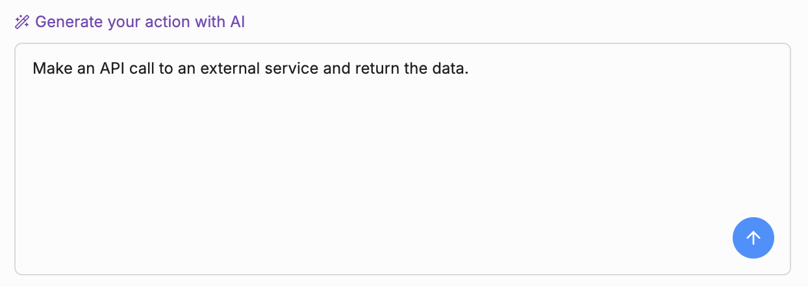
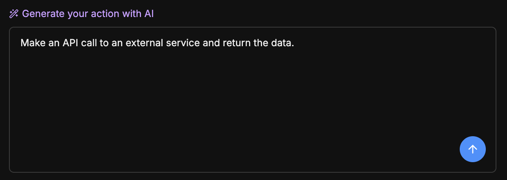
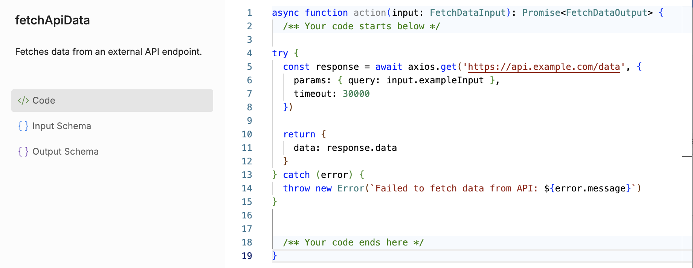
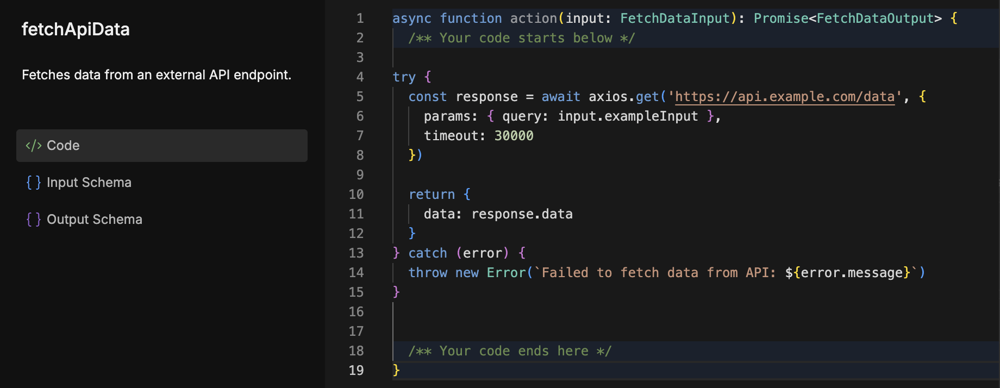
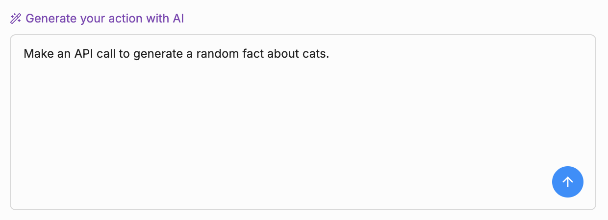
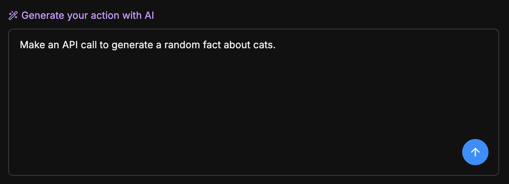
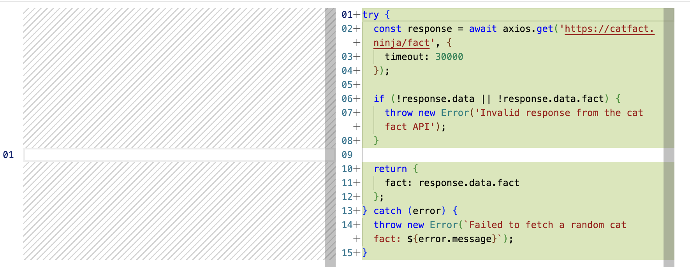
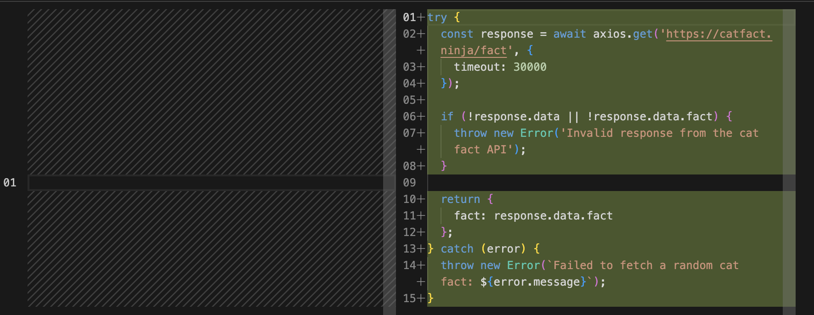
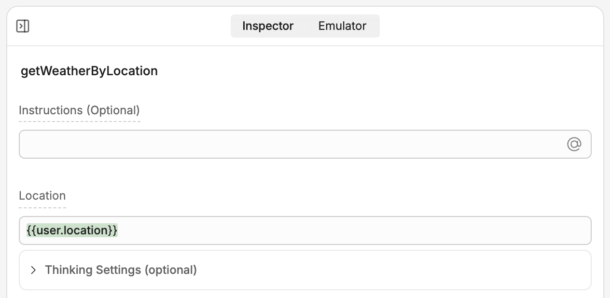
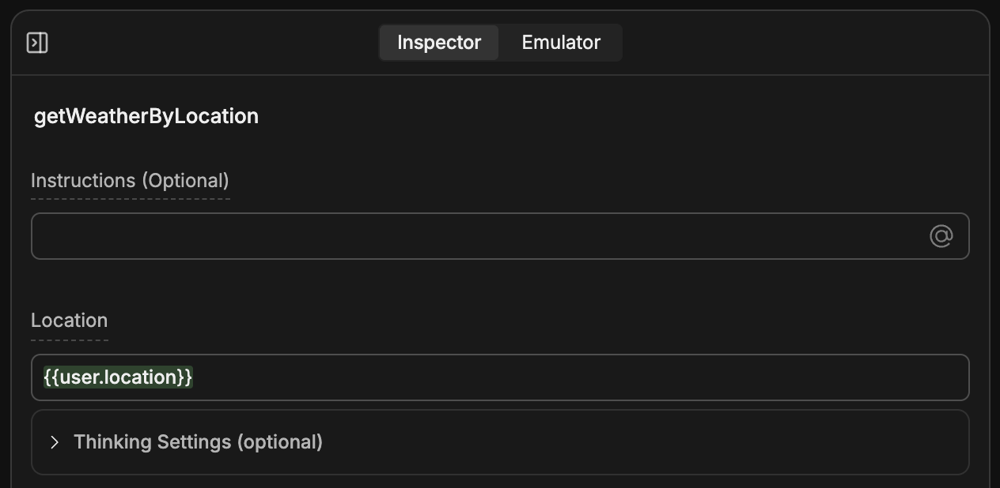

<Icon icon="bolt"/> Actions are **custom AI-generated tools** you can provide to your bot.

<Tabs>
  <Tab title="Just write your prompt...">
    <Frame>
      
      
    </Frame>
  </Tab>
  <Tab title="then use the generated Action.">
    <Frame>
      
      
    </Frame>
  </Tab>
</Tabs>

You can use Actions to extend your bot's general functionality beyond what's available with the default [Cards](/learn/reference/cards/introduction) or [integrations](/integrations/get-started/introduction). For example:

- Making repeated API calls to an external service
- Perform a specific calculation multiple times
- Manipulate data and [variables](/learn/reference/variables/overview)

<Tip>
  Actions are code-based, but you don't need to write the code yourself—AI does all the work based on your prompt.
</Tip>

---

## Overview

Actions are [TypeScript functions](https://www.typescriptlang.org/docs/handbook/2/functions.html) that execute their code whenever an [Autonomous Node](/learn/reference/nodes/autonomous-node) calls them.

Just like [Execute Code Cards](/learn/reference/cards/execute-code), Actions let your bot use custom code. However, they're different two important ways:

- Actions are *only available in Autonomous Nodes*—they execute when AI decides they should
- Actions are *re-usable*—your Autonomous Node can call them as many times as it needs

---

## Create an Action

To create a new Action:

1. Go to the **<Icon icon="bolt"/> Actions** menu in the Studio.
2. Select **Create Action**.

This opens the editor for your new Action. From here, you have two options:

### Generate using AI (recommended)

You can generate the entire Action using AI. In the bottom-left corner, write a prompt that describes what you want your Action to do:

<Frame>
  
  
</Frame>

Your bot will generate code based on your prompt:

<Frame>
  
  
</Frame>

If you want to refine the code, you can keep prompting to make updates.

When you're happy with the generated code, select **Accept** to add it to your Action.

### Write code yourself

If you prefer, you can write the Actions' code yourself—just edit the function on the right side of the editor.

<Note>
  For more information, check out our guide on [using code in Botpress Studio](/learn/guides/advanced/use-code).
</Note>

### Edit your Action's name/description

Whether you generate your Action with AI or write it by hand, you can edit its name and description. Just select them in the upper-left corner or the editor, then enter a new name/description.

---

## Use Actions

When you're ready to use a Action, you can add it to any Autonomous Node:

1. Select **+ Add Card** on any Node to open the Card tray.
2. Search for your Action, or find it under **Bot Actions**.
3. Add it to the Autonomous Node.

This gives your Autonomous Node access to execute the Action whenever it decides it's appropriate to.

### Give your Autonomous Node instructions

If you add an Action to your Autonomous Node, you should add instructions to the Node's prompt so it knows when to use the Action. For example:

```wrap
Use the `fetchApiData` Action when you need data from an external API.
```

For more information, check out our guide on prompting your [Autonomous Node](/learn/reference/nodes/autonomous-node#prompting-tips).

### Manually provide inputs

By default, the Autonomous Node decides how to fill in the Action's input fields based on the conversation's context. However, you can manually fill in these fields if you'd prefer:

1. Select your Action from the Autonomous Node to open its inspector.
2. Select the input field you want to manually fill in, then select **<Icon icon="hand"/> Manual.**

Now, you can manually fill in the field. For example, with data stored in a variable:

<Frame>
  
  
</Frame>

---

## Schemas

Actions use input and output [Schemas](/learn/reference/schemas) to tell your bot what data they expect and what data to return.

Schemas are automatically created when you create an Action, and they automatically update when you edit your Action using AI. This means you don't have to worry about them if you're only using AI to generate your Action.

### Use a custom schema

If you're writing any of your Action's code by hand, you can write or select a custom Schema:

1. In your Action's editor, select **<Icon icon="braces" /> Input Schema** or **<Icon icon="braces" /> Output Schema**.
2. Here, you can edit your Action's default Schema directly, or select a previously-created Schema from the drop-down menu.
