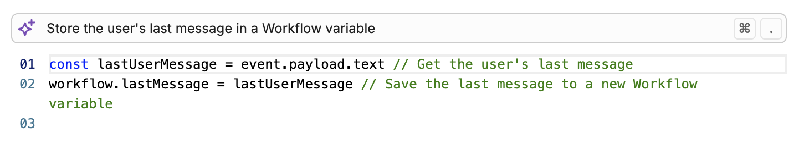
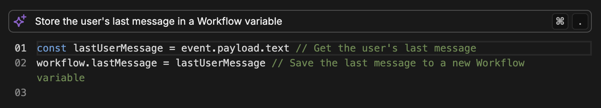

The Execute Code Card lets you **run custom [JavaScript](https://developer.mozilla.org/en-US/docs/Web/JavaScript) code within a Node**.

You can use the Execute Code Card to extend the functionality of your bot beyond Studio's built-in Cards. For example, you can:

- Perform complex calculations
- Manipulate data and variables
- Call external APIs

<Note>
    Execute Code Cards allow you to generate one-time code snippets at specific points in your Workflow. For reusable code snippets, use [Actions](/learn/reference/actions).
</Note>

<Warning>
    You can't import external libraries within an Execute Code Card. To make API requests, you can use [axios](https://axios-http.com/docs/intro).
</Warning>

## Generate code using AI

The Execute Code card allows you to generate code using AI, so you don't have to write it all from scratch:

<Frame>
  
  
</Frame>

At the top of the code editor, write a prompt and hit enter to generate code using AI. You can then edit this code manually or ask AI to make revisions to it.