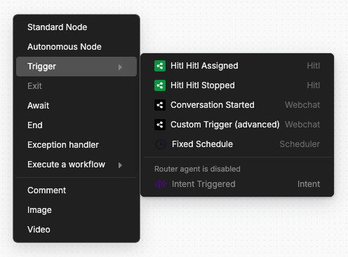
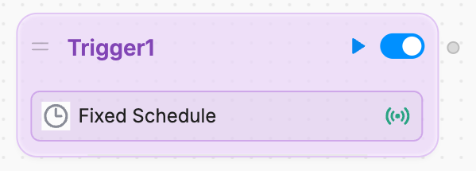
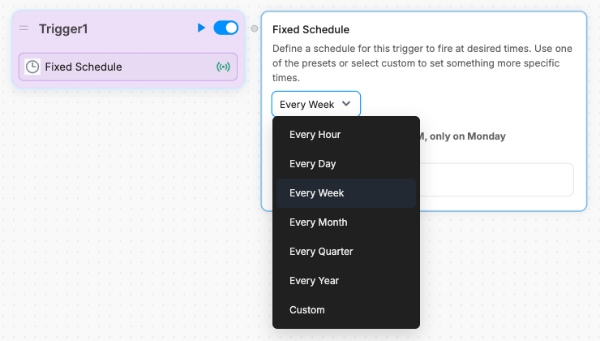
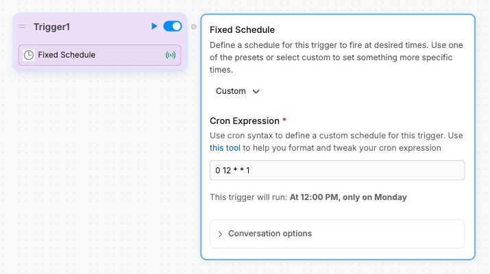
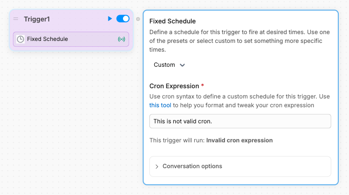

The **Fixed Schedule** Card lets you trigger some part of your Workflow at a specific time.

<Tip>
    You can use the Fixed Schedule Card to [send reminders to your users](/learn/guides/how-to/send-reminders).
</Tip>

## Add the Card

To add the Fixed Schedule Card:

<Steps titleSize="h3">
    <Step title="Open the Trigger menu">
        Right-click anywhere in your Workflow. Then, hover over the Trigger menu:

        
    </Step>
    <Step title="Add the Fixed Schedule Card">
        Select **Fixed Schedule** to add the Card:

        
    </Step>
</Steps>

## Schedule the Card

You can use the Card's settings to schedule when it executes:

## Set a Custom Schedule

You can use a <Tooltip tip="A string of text representing a schedule.">cron expression</Tooltip> to set a custom schedule for the Card.

<Tip>
    To learn about cron expressions and test them out yourself, check out [crontab guru](https://crontab.guru).
</Tip>

In the Card's scheduling options, select **Custom** to open the cron field:

The Card will preview when the trigger is scheduled, or let you know if your cron expression is invalid:

