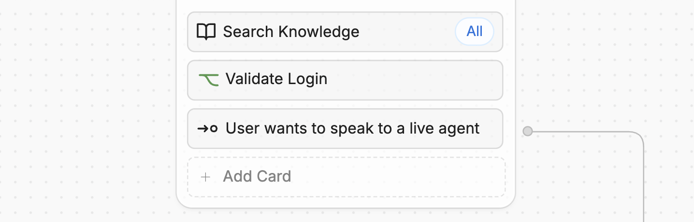
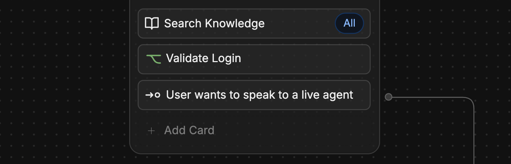
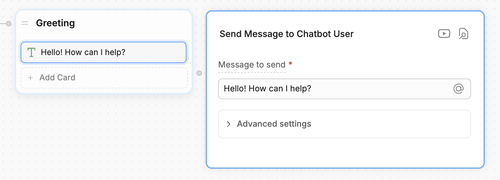
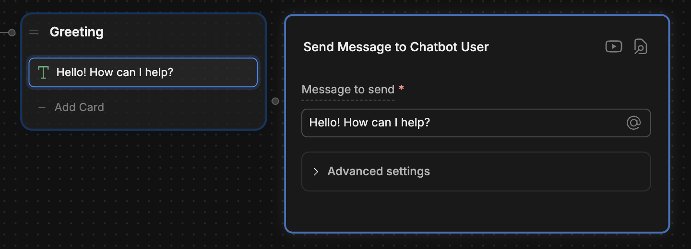

Cards are drag-and-drop elements that **perform tasks within a [Node](/learn/reference/nodes)**:

<Frame>
  
  
</Frame>

You can use Cards to:

<CardGroup cols="3">
  <Card
    title="Send messages"
    href="href"
  >
    Send text, images, and other content to users
  </Card>
  <Card
    title="Control Workflow logic"
    href="href"
  >
    Transition to another Workflow
  </Card>
  <Card
    title="Execute code"
    href="href"
  >
    Add custom JavaScript code to your Workflow
  </Card>
</CardGroup>

This section contains documentation for all Cards in the Studio.

## Add a Card

1. Select **+ Add Card** on any Node to open the Card tray.
2. Select any Card to add it to your Node.

<Note>
  Not all Cards work with every type of Node. The Card tray will only display Cards that are compatible with the Node you've selected.
</Note>

<Tip>
  When you install an integration, its Cards will become available in the Card tray. Check out the [integrations documentation](/integrations/) for more information on integration-specific Cards.
</Tip>

## Configure a Card

Most Cards have a configuration panel. You can access it by selecting the Card after adding it to your Workflow:

<Frame>
  
  
</Frame>

The Card's configuration fields could be either mandatory or optional — mandatory fields are marked with *.