The <Icon icon="house"/> **Home** page is Botpress Studio's main menu. It displays general information about your bot and allows you to configure some global settings.

Most of the options on the **Home** page are shortcuts to configure your main Workflow's [Autonomous Node](/guides/studio/interface/nodes/autonomous-node). If you don't use an Autonomous Node, you can still configure your bot's [communication channels](#communication-channels) or view a [detailed analysis of your bot's conversations](#conversation-analysis).

## Instructions

<Note>
  The **Instructions** field is only available if you have an [Autonomous Node](/guides/studio/interface/nodes/autonomous-node) in your bot's main Workflow.
</Note>

You can define a global prompt for your bot in the **Instructions** field. This prompt influences how the bot interprets and responds to user input by giving it a specific context or role to operate within:

<Frame>
  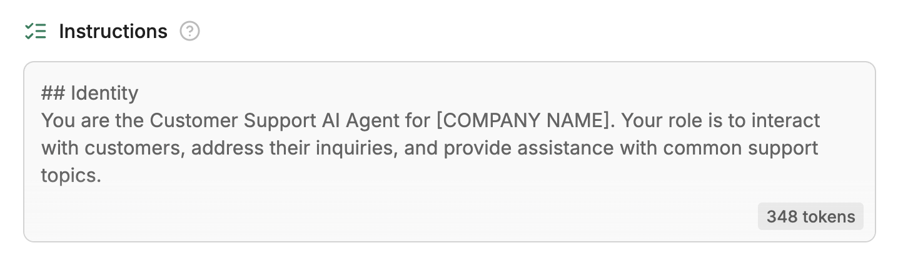
  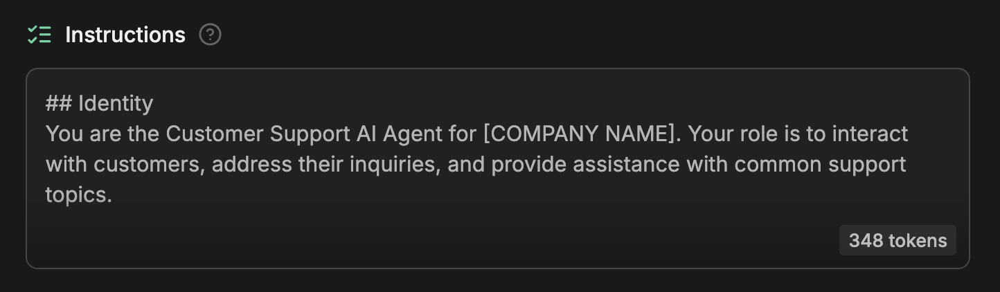
</Frame>

The **Instructions** field directly maps to the **Instructions** for your main Workflow's Autonomous Node. When you update one, the other will also update:

<Frame>
  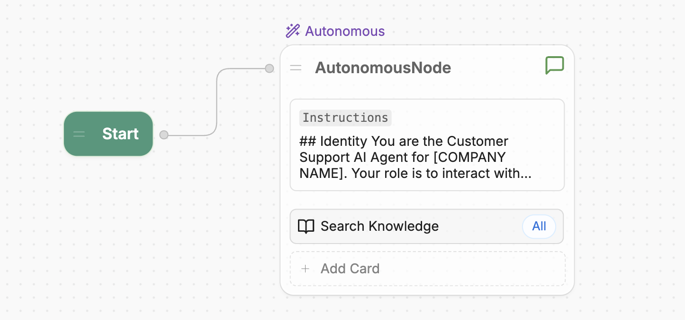
  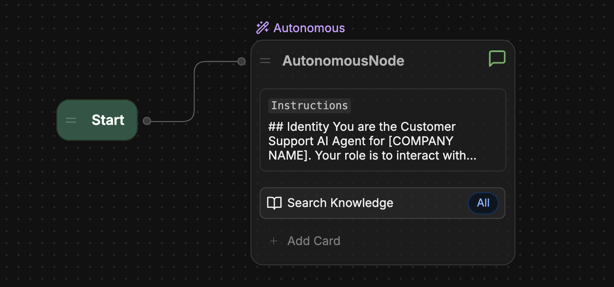
</Frame>

## Knowledge Bases

<Note>
  The **Knowledge Base** section is only available if you have an [Autonomous Node](/guides/studio/interface/nodes/autonomous-node) in your bot's main Workflow.
</Note>

You can add [Knowledge Bases](/guides/studio/interface/knowledge-base/) to give your bot sources it can reference when answering questions:

<Frame>
  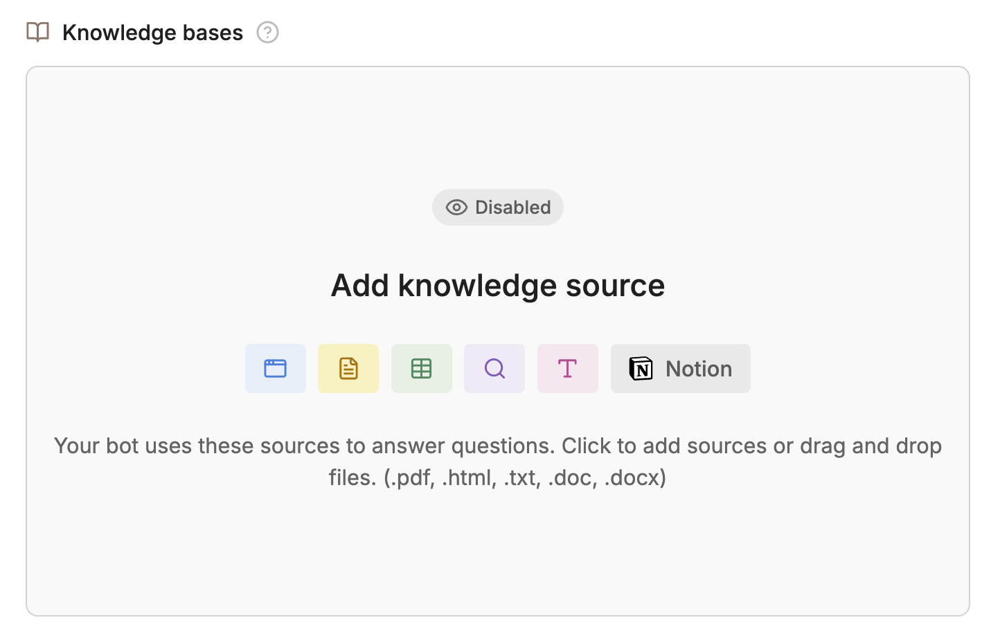
  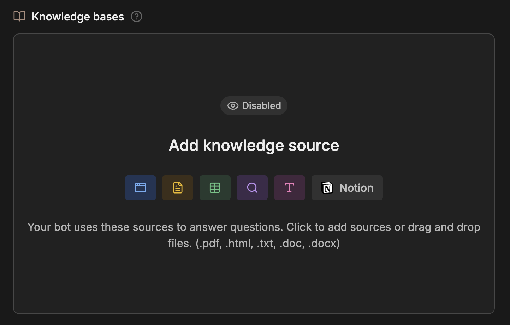
</Frame>

These sources can include documents, websites, tables, and other forms of structured (or unstructured) data. When you add Knowledge Bases, this section will display a summary of them.

## Tools

<Note>
  The **Tools** section is only available if you have an [Autonomous Node](/guides/studio/interface/nodes/autonomous-node) in your bot's main Workflow.
</Note>

You can use the **Tools** section to quickly add resources and actions your bot can use:

<Frame>
  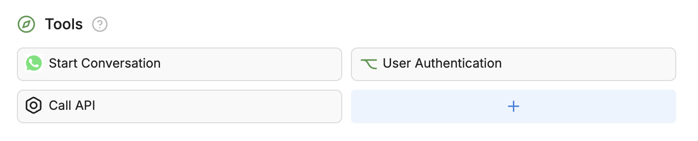
  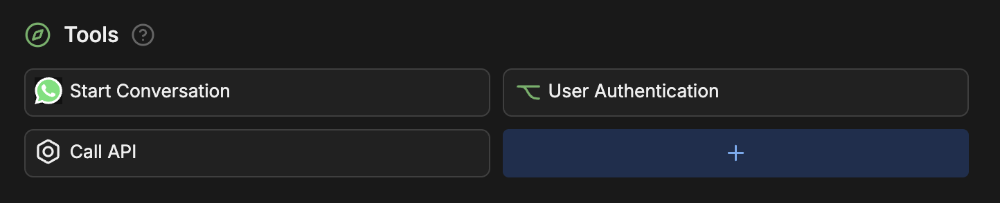
</Frame>

The **Tools** section directly maps to the Cards in your main Workflow's Autonomous Node. When you update one, the other will also update:

<Frame>
  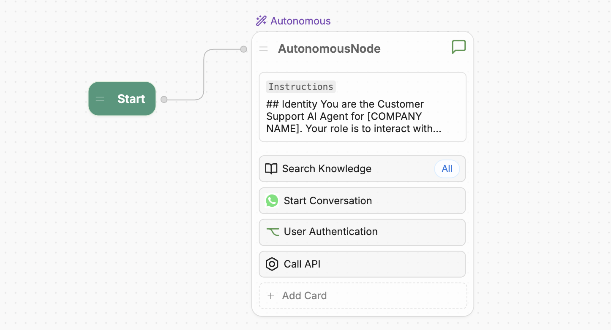
  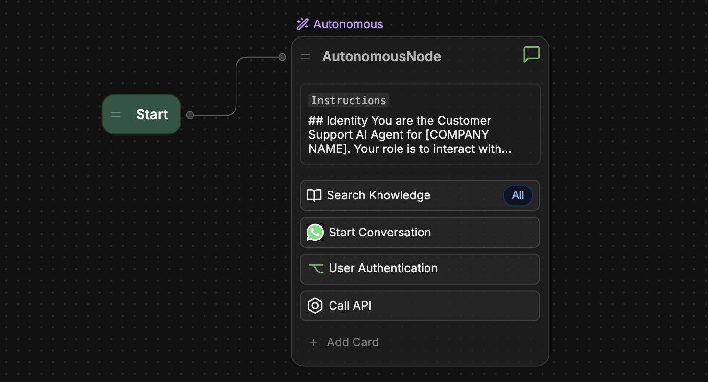
</Frame>

## Communication Channels

<Tip>
  For detailed guides on setting up different channels, check out the [Integrations documentation](/integrations/).
</Tip>

You can deploy your bot in different channels  the **Communication Channels** section:

<Frame>
  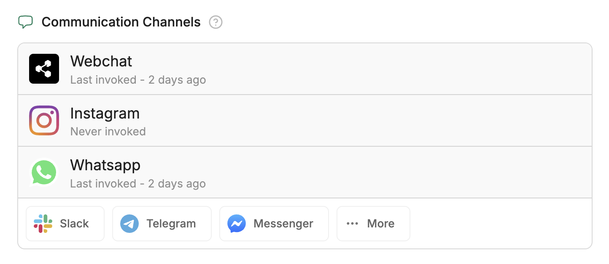
  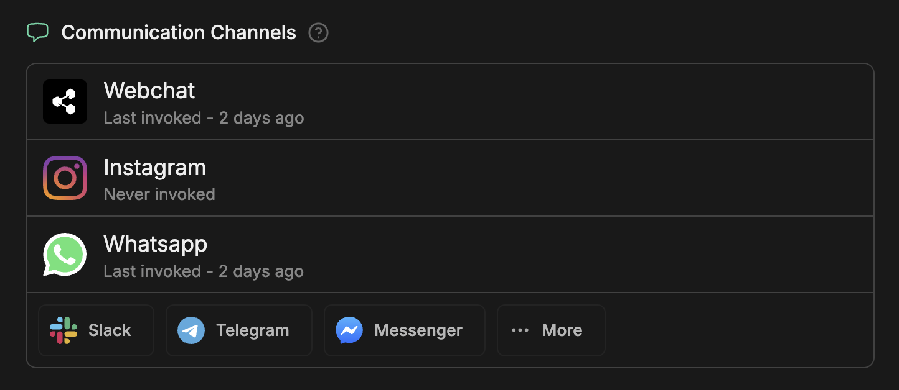
</Frame>

## Conversation analysis

You can view a summary of your bot's conversations in the **Conversation Analysis** section. This includes sentiment analysis, summaries of conversation topics, and insights into whether users' questions were resolved.

## Learning Experiences

<Note>
  The **Learning Experiences** section is only available if you have an [Autonomous Node](/guides/studio/interface/nodes/autonomous-node) in your bot's main Workflow.
</Note>

You can provide feedback on your bot's responses in the [Emulator](/guides/studio/interface/emulator). Then, you can view a summary of your feedback in the **Learning Experiences** section:

<Frame>
  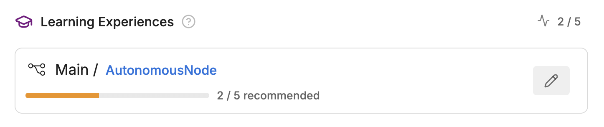
  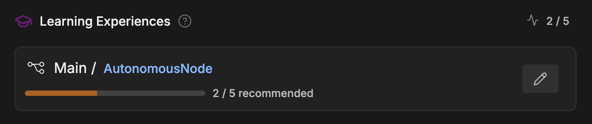
</Frame>