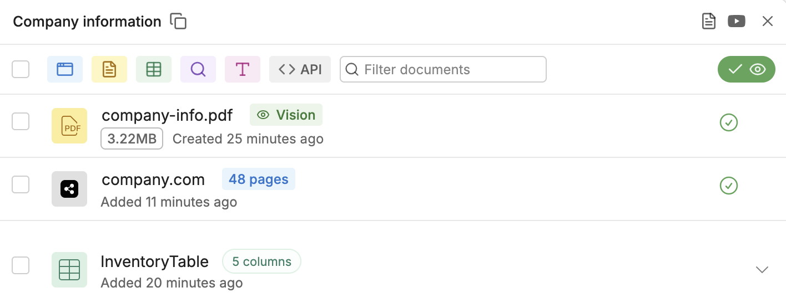
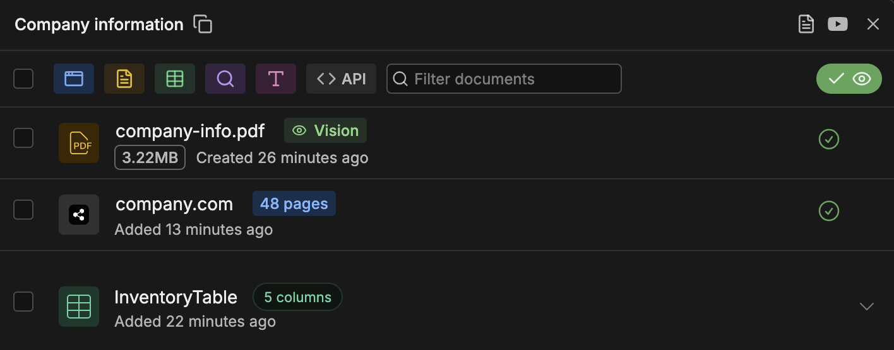
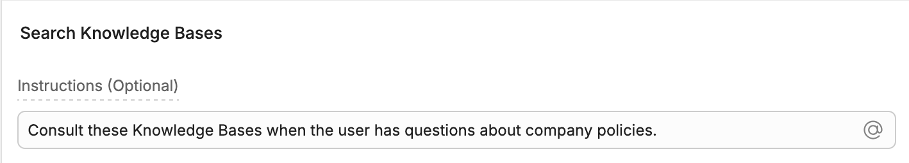
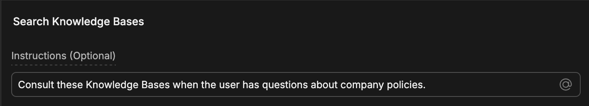
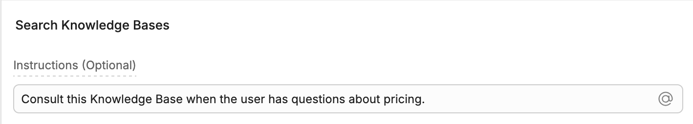
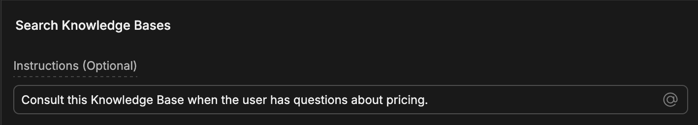

<Icon icon="book-open"/> Knowledge Bases are **sources of information you provide to your bot**.

<Frame>
  
  
</Frame>

You can use a Knowledge Base to make your bot reference a specific source when answering a user. For example, you might want to:

- Provide your bot with specialized information (like company policies, pricing charts, or troubleshooting steps)
- Scope your bot's responses to specific topics
- Let your bot reference data from [tables](/learn/reference/tables) in its responses

---

## Create a Knowledge Base

To create a Knowledge Base:

1. Navigate to the <Icon icon="book-open"/> **Knowledge Base** menu in the studio.
2. Select **New Knowledge Base**.

---

## Add sources

Once you've created a Knowledge Base, you can [add sources to it](/learn/reference/knowledge-base/add-sources):

<CardGroup cols={3}>
  <Card
    title="Websites"
    icon="app-window"
    href="/learn/reference/knowledge-base/add-sources#websites"
    horizontal
  />
  <Card
    title="Documents"
    icon="file-text"
    href="/learn/reference/knowledge-base/add-sources#documents"
    horizontal
  />
  <Card
    title="Tables"
    icon="table"
    href="/learn/reference/knowledge-base/add-sources#tables"
    horizontal
  />
  <Card
    title="Search the web"
    icon="search"
    href="/learn/reference/knowledge-base/add-sources#search-the-web"
    horizontal
  />
  <Card
    title="Rich text"
    icon="type"
    href="/learn/reference/knowledge-base/add-sources#rich-text"
    horizontal
  />
  <Card
    title="Integrations"
    icon="boxes"
    href="/learn/reference/knowledge-base/add-sources#sources-from-integrations"
    horizontal
  />
</CardGroup>

Your bot will reference these sources when searching for an answer to a user's question.

---

## Search a Knowledge Base

Your bot searches Knowledge Bases differently depending on whether it's executing an [Autonomous Node](/learn/reference/nodes/autonomous-node) or a [Standard Node](/learn/reference/nodes/introduction#standard-nodes):

### Using an Autonomous Node

<Tip>
  Since your bot only references Knowledge Bases when they're needed, they're useful for de-cluttering your [Autonomous Node's prompt](/learn/reference/nodes/autonomous-node#be-specific).
</Tip>

The default Autonomous Node in a bot's [Main Workflow](/learn/reference/workflows) contains a **Search Knowledge** Card that searches all Knowledge Bases by default. This means that a newly created AI agent is already equipped to search your Knowledge Bases.

You can scope which Knowledge Bases the Autonomous Node searches using the Search Knowledge Card's configuration menu:

1. Open the drop-down menu under **Included Knowledge Bases**.
2. Select whichever Knowledge Bases you want to include in searches.

<Note>
Depending on your needs, you can also add multiple Search Knowledge Cards to your Autonomous Node. For more information, check out the guide on [searching multiple Knowledge Bases](#search-multiple-knowledge-bases).
</Note>

### Using a Standard Node

Since Standard Nodes don't use AI to generate responses, they don't consult your Knowledge Bases by default. To make your bot search your Knowledge Bases within a Standard Node, you can use:

- A [Capture Information Card](/learn/reference/cards/capture-information#raw-input)
- A **Query Knowledge Bases** Card

<Warning>
  Both of these Cards require the [Knowledge Agent](/learn/reference/agents/knowledge-agent) to work properly—make sure it's enabled.
</Warning>

<Note>
  By default, neither of these Cards send their response to the user directly—instead, you can access the response by referencing `turn.KnowledgeAgent.answer`, then send it to the user manually.
</Note>

---

## Search multiple Knowledge Bases

If you're using an [Autonomous Node](/learn/reference/nodes/autonomous-node), you have two options for searching multiple Knowledge Bases:

### Search all Knowledge Bases simultaneously

If you need your bot to search all selected Knowledge Bases for every user query, you can use a single Search Knowledge Card:

1. [Add a Search Knowledge Card](/learn/reference/cards/introduction#add-a-card) to your Autonomous Node (if it doesn't already contain one).
2. Select the Card to open its configuration menu.
2. Open the drop-down menu under **Included Knowledge Bases**.
3. Select whichever Knowledge Bases you want to include in searches.

With this configuration, the Autonomous Node performs a search on all the selected Knowledge Bases simultaneously, then orders the results by score. This is useful if:

- You have multiple Knowledge Bases that can answer similar questions
- You need to combine the answers from different Knowledge Bases in the same message

<Warning>
  Generally, searching all Knowledge Bases simultaneously consumes more LLM tokens and has higher latency than  [picking which Knowledge Bases to search based on context](#pick-knowledge-bases-to-search-based-on-the-query).
</Warning>

### Pick Knowledge Bases to search based on the query

If you need your bot to search certain Knowledge Bases in certain circumstances, you can use multiple Search Knowledge Cards:

1. [Add multiple Search Knowledge Cards](/learn/reference/cards/introduction#add-a-card) to your Autonomous Node.
2. Configure each Card's **Included Knowledge Bases** depending on your needs.

With this configuration, the Autonomous Node views each Search Knowledge Card as a different tool, and picks one to search based on the user's query. This is useful if you have distinct Knowledge Bases that you need to query in different circumstances, and want to avoid overlap between them.

<Warning>
  For this configuration to work, you need to specify instructions in each Search Knowledge Card's **Instructions** field. Otherwise, the Autonomous Node won't be able to tell the two Cards apart, and will pick one randomly.

  For example, you could add these instructions for questions about company policies:

  <Frame>
    
    
  </Frame>

  And these instructions for questions about pricing:

  <Frame>
    
    
  </Frame>

</Warning>

---

## Handle no answer found

If your Workflow has an Autonomous Node, your bot will generate an appropriate response when it doesn't find an answer in the Knowledge Base. However, you can also program a custom response:

1. In your Autonomous Node, add a [Transition](/learn/reference/cards/flow-logic#transition) Card.
2. In the Card's **Condition** field, paste the following:

```javascript
{{!event.state.agentVariables.KnowledgeAgent.turn.answer}}
```
3. Add the following to your Autonomous Node's prompt:

```markdown
Transition when no answer is found in the Knowledge Base.
```

Now, your bot will activate the Transition Card whenever it doesn't find an answer in the Knowledge Base. You can handle the transition however you want—for example, with a Node that sends a custom error message.

---

## Storage limit

Information you store in Knowledge Bases counts towards your [Vector DB Storage](/learn/get-started/dashboard/workspace/usage#vector-db-storage), which depends on your [Botpress plan/add-ons](https://botpress.com/pricing).

---

## Troubleshooting

If your bot isn't returning the expected results, you can try troubleshooting it in a few different ways:

### Check logs

Your bot's [logs](/learn/reference/debugger-logs-json#logs) display:

- The exact query that was sent to the Knowledge Base
- The results (including source name, content preview, amount of tokens used by the content, row metadata if the source is a table) if there are any matches

Using that information, you can try refining what's sent to the Knowledge Base (or the sources themselves).

### Inspect responses

If you're using an Autonomous Node to search Knowledge Bases, you can use the [Inspect](/learn/reference/nodes/autonomous-node#check-the-inspect-window) window to analyze your bot's process when searching Knowledge Bases.
