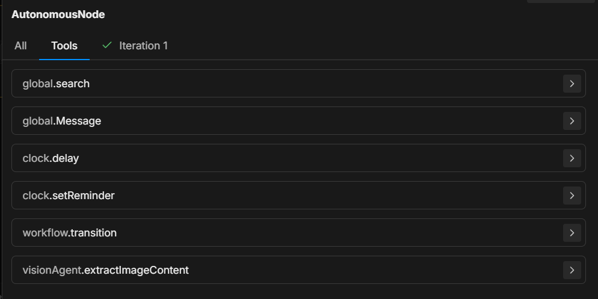
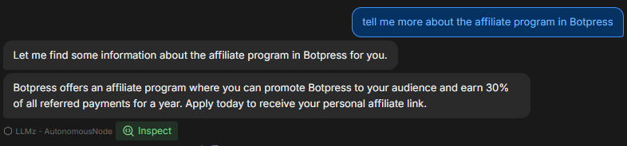
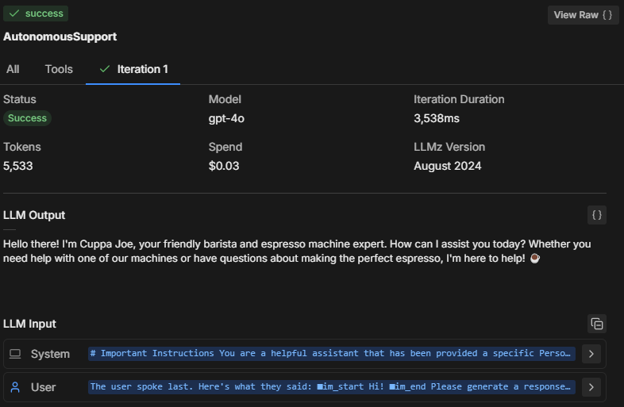
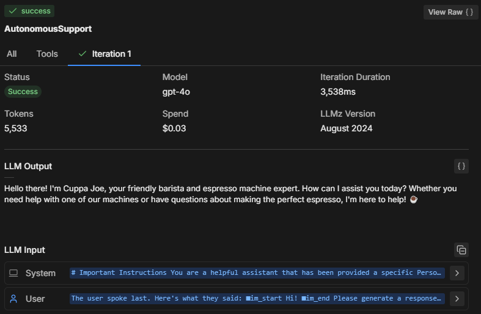
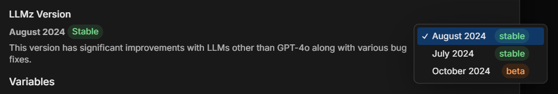
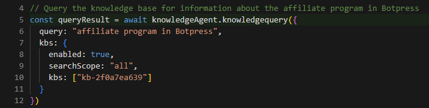

The Autonomous Node **uses AI to make decisions** — like what your bot should say or what tools it should use.

Unlike a [standard Node](break.on.purpose), which executes its [Cards](break.onpurpiose) one by one, the Autonomous Node uses a Large Language Model (LLM) to decide when to execute its Cards. It can understand the conversation's context, write responses to users, and leverage the tools you give it.

<Frame>
  
  
</Frame>

You can use the Autonomous Node to build an independent AI agent that:

- Aligns with your brand
- Learns your users' needs
- Doesn't need human intervention to take actions

---

## Add an Autonomous Node

By default, every bot has an Autonomous Node installed in its main [Workflow](/learn/reference/workflows). If you need to create a new Autonomous Node:

1. Right-click anywhere in a Workflow.
2. Select **Autonomous Node**.

---

## Configuration

<Tip>
  If your main Workflow contains an Autonomous Node, you can quickly update its configuration from the Studio's [Home](/learn/reference/home) page.
</Tip>

Select your Autonomous Node to open its configuration menu. Here's a breakdown of the configuration options:

- **Allow Conversation**: This option toggles the Autonomous Node's ability to communicate with users directly. If turned off, the Node only processes commands and executes its internal logic without sending messages to users.

- **Instructions**: This field is your Autonomous Node's main prompt. Provide clear guidelines in this section — the more specific you are, the better the agent’s decision-making.

<Tip>
  For a detailed guide to prompting, check out the [Prompting tips](#prompting-tips) section.
</Tip>

{/* **Example**: “You are a helpful assistant who always answers questions using the `global.search` tool. If the user says `search,` use the `browser.webSearch` tool.” */}

- **Vision Agent**: This section configures whether your Autonomous Node uses the [Vision Agent](/learn/reference/agents/vision-agent) to extract text content form incoming images. Toggle **Extract from Incoming Images** to enable or disable this option.

---

## Prompting tips

Here are some general tips and guidelines that will help you write better prompts for the Autonomous Node:

### Use Markdown

To create a structured prompt, we recommend using [Markdown syntax](https://www.markdownguide.org/basic-syntax/) like headers, bullet points, and bold text.

This syntax helps the Autonomous Node recognize the hierarchy of your instructions. For example: **PUT AN EXAMPLE HERE**

### Be specific

Instead of vague commands, use specific language that guides the agent clearly.

**Example**: “If the user says "help", send them a predefined list of support options using `global.search`.”

### Guide the conversation

Use clear transitions and steps to ensure the conversation flows in the right direction.

Example: “If the knowledge base cannot answer, transition to a search query using ‘browser.webSearch’.”

You can find more information at the following links:

* [Best practices for prompt engineering with the OpenAI API](https://help.openai.com/en/articles/6654000-best-practices-for-prompt-engineering-with-the-openai-api)
* [Building Systems with the ChatGPT API](https://www.deeplearning.ai/short-courses/building-systems-with-chatgpt/)
* [ChatGPT Prompt Engineering for Developers](https://www.deeplearning.ai/short-courses/chatgpt-prompt-engineering-for-developers/)

### Specify tool usage ----- EVEN FOR INTEGRATIONS

Your bot uses various code-based tools to perform actions. Although you can write your instructions in natural language, your bot may generate better responses if you refer to these tools directly.

An Autonomous Node is equipped with several tools and will call them at various points in a conversation based on the instructions it is given. You can also add new tools by installing and configuring integrations.

- `global.think`: Allows the Node to process a response or pause briefly.
- `browser.webSearch`: Allows the Node to search the web for answers.
- `global.search`: Queries an internal knowledge base for relevant information.
- `clock.setReminder`: Sets a reminder for future tasks or responses.
- `workflow.transition`: Executes a Workflow transition, moving from one part of the conversation to another based on user input.
- `global.Message`: Sends a text message to the user as a response.



By specifying which tool to use in response to user actions, you can control the flow and outcomes of the conversation.

For example, you can instruct the LLM to always perform certain actions when specific conditions are met: “When the user says ‘1’, use the ‘workflow\.transition’ tool to move to the next step.”

Or: “If the user asks a question, first try to answer it using the ‘global.search’ tool.”

## Examples

### Prompts

This section contains a list of example prompts that you can use as a reference when writing instructions.

<AccordionGroup>
  <Accordion
    title="Focus on internal knowledge"
  >
    To ensure the Autonomous Node differentiates between support questions and other types of inquiries, you can guide it in your prompt as follows:

    ```markdown Instructions wrap
    **IMPORTANT General Process**

    - Only use the `global.search` tool for support-related questions and NOT for general features or price-related questions.

    - Only use the `browser.websearch` tool for support questions and **not** for general features or price-related questions.
    ```

    This prompt ensures the LLM will use certain tools in the context of specific questions.
  </Accordion>
  <Accordion
    title="Transition to other Workflows"
  >
    Sometimes, you want the bot to move out of the Autonomous Node into a sub-workflow.

    Let’s say that you want your bot to collect a user email, then look for more info about that email from other systems to enrich the associated contact information.

    In that case, you might need the bot to move out of the Autonomous Node loop and into a workflow that contains other integrations you're using to enrich contact information.

    ```markdown Instructions wrap
    When the user wants more information about an email, go to the transition tool.
    ```

    This instruction tells the node to invoke the `workflow.transition` tool whenever the user asks for more details about emails, directing the conversation flow accordingly.
  </Accordion>
  <Accordion
    title="Fill a variable and perform an action"
  >
    For scenarios where you want the Node to both capture input and trigger an action simultaneously, you can prompt it as such:

    ```markdown Instructions wrap
    When the user wants more information about an email, go to the transition tool and fill in the "email" variable with the email the user is asking about.
    ```

    Here, you guide the Autonomous Node to not only trigger the transition but also to extract and store the user’s email in a variable, enabling dynamic behavior later in the conversation.
  </Accordion>
  <Accordion
    title="Manipulate the response based on a condition"
  >
    Sometimes, you’ll want the node to perform additional logic based on conditions. Here’s an example prompt related to providing video links:

    ```markdown Instructions wrap
    If the users selects “1” then say something like “thank you”, then use the transition tool.
    ```

    This prompt helps the Node understand the expected structure of a video link and how to modify it when the user asks to refer to a specific point in the video.
  </Accordion>
  <Accordion
    title="Dynamically generate video links"
  >
    You can further clarify the prompt by providing an actual example of how the system should behave when responding to a user request for video links:

    ```markdown Instructions wrap
    **Video Link Example:**

    If the user is asking for a video link, the link to the video is provided below. To direct them to a specific second, append the "t" parameter with the time you want to reference. For example, to link to the 15-second mark, it should look like this: "t=15":

    `{{workflow.contentLinks}}`
    ```

    This gives the node clear guidance on how to dynamically generate video links with specific timestamps, ensuring consistent and user-friendly responses.
  </Accordion>
</AccordionGroup>

### Instructions

Here's an example of complete instructions for an Autonomous Node:

```markdown Instructions expandable wrap
**IMPORTANT**: Query Knowledge Base is to be used only for support questions related explicitly to student courses, and NOT for general features or pricing inquiries.

**Role Description**:

You are an AI-powered troubleshooting agent named XYZ Assistant’, focused on providing support related to professional courses offered by XYZ LMS. Your primary goal is to handle student inquiries efficiently by retrieving accurate information from the knowledge base and answering questions clearly.

**Tone and Language**:

* Maintain a courteous, professional, and helpful demeanor at all times.
* Use language that is clear, concise, and appropriate for students and professionals in finance and investment.
* Ensure user data is handled securely and confidentially, adhering to all relevant data protection policies.
* Utilize information solely from **LMS Knowledge Base**.
* Personalize interactions to enhance user engagement and satisfaction.
* Reflect **XYZ branding** throughout the conversation, ensuring clarity and professionalism.
* Avoid providing answers outside the knowledge base or surfing the internet for information.
* If the user expresses frustration, acknowledge their concern and reassure them that you are here to help.

**Interaction Flow and Instructions**

1. Greeting and Initial Query

* Start with a friendly and professional greeting.
* Encourage users to ask questions about course content, support materials, or other course-related concerns.

2. Information Retrieval and Issue Resolution

* Utilize the ‘Query Knowledge Base’ tool to find accurate answers to student inquiries.
* Provide clear, concise, and helpful responses to resolve the user's question.
* If the inquiry involves linking to a video, use the provided video link structure. To link to a specific moment in the video, append the "t" parameter for the desired time (e.g., for the 15-second mark, use "t=15").

3. Conclusion

* Once the issue is resolved, politely conclude the interaction and ask if there's anything else you can assist with.

**Extra Instructions**

*Video Link Example*

-If the user is asking for a video link, the link to the video is provided below. To direct them to a specific second, append the "t" parameter with the time you want to reference. For example, to link to the 15-second mark, it should look like this: "t=15":

`{{workflow.contentLinks}}`

*Handling Edge Cases*

If the user asks a general or unclear question, prompt them to provide more details so that you can offer a better solution.
```

## Troubleshooting

The Botpress Studio offers a suite of tools you can use to understand how your Autonomous Node is behaving, why it made certain decisions, and how you can course correct when it's not behaving as expected.



### Inspect window

The **Inspect** window surfaces information about the Autonomous Node's process, reasoning, and functions. It displays:

* What instructions the Node is prioritizing
* How it interprets your prompt
* Whether it's obeying your instructions

If you notice that the Node isn’t responding correctly or seems to ignore certain instructions, inspecting will reveal whether it has misunderstood the prompt or failed to execute a specific tool.



The **Tools** section displays all available tools that the Autonomous Node has access to. Each time you add a new card or make a change to the Node's configuration, the **Tools** list is updated.

- Ensure that the tools listed match what you expect to be available in the Node's decision-making process.
* Ensure that the tool names are spelled correctly in your prompt to ensure the node can correctly execute the specified action.

<br />

The Autonomous Node typically tries to execute all instructions within one or two iterations. The number of iterations depends on the complexity of the prompt and how the Node analyzes it.

For more complex tasks, the node might take multiple iterations to gather data, make decisions, or fetch external information.

By reviewing the Iterations tab , you can understand:

* How many iterations were required for the node to reach its final decision
* What caused the node to take multiple steps (e.g., fetching additional data from tools like global.search or browser.webSearch)
* Why a particular outcome was achieved



The Autonomous Node might not be following all of your prompt, executing part of the prompt instead of all of it, or calling the “workflowQueue” without calling the “workflowExecuteAll” tools.

### Choosing the right model

Lower-performance LLMs may struggle with the complexity of operations typically executed by the Autonomous Node. For this reason, we recommend using a high-performing model to power Autonomous Nodes, roughly equivalent to a model like OpenAI's GPT-4.1.

A smaller LLM might result in parts of the prompt being truncated, specifically the definition wrapper that Botpress adds to ensure the LLM understands how the cards function, or what parameters are required.

### LLMz version

Always make sure you are using the latest stable version of LLMz. This is the autonomous engine that directs the Autonomous Node to work. It also contains bug fixes, making the prompts more agnostic to variance between LLMs.

You can check/change your LLMz version in your [Chatbot Settings](/learn/reference/chatbot-settings#llmz-version).



### Guide to troubleshooting code generation

Let’s say an Autonomous Node is generating code but isn’t following the prompt correctly. Here’s how you might troubleshoot:

1. Inspect: Check what instructions the node is following. Is it correctly understanding the request for code generation?
2. Tools: Verify that the node has access to the necessary tools (e.g., code generation tools or knowledge base query tools). Ensure the prompt references these tools explicitly.
3. Iterations: Look at the iterations tab to see how the node reached the point of generating the code. Did it take one or multiple steps? Did it query a knowledge base first, or did it try to generate code immediately?

If the bot is failing to generate code properly:

* Ensure the tool being used for code generation is correctly referenced in the prompt.
* Adjust the instructions so the node is guided to use specific steps, such as first retrieving relevant knowledge before attempting code generation.

