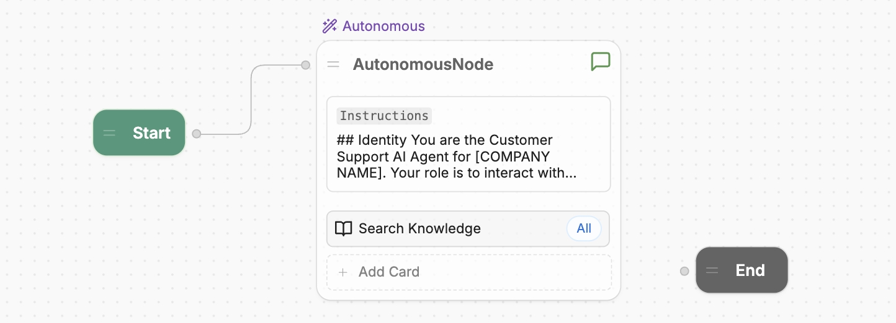
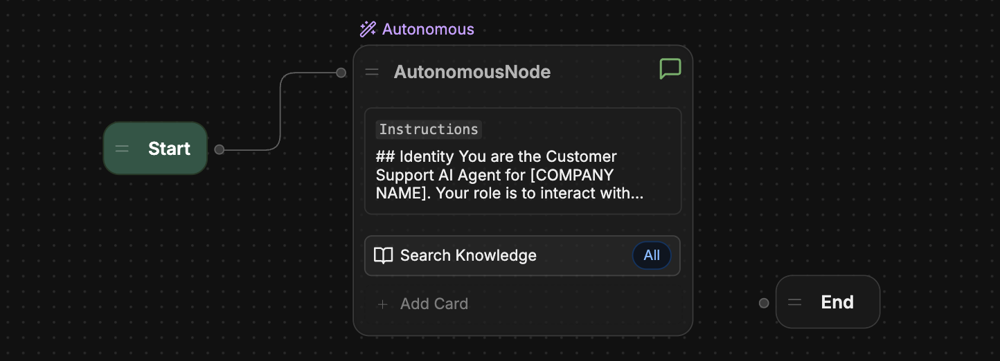

The Autonomous Node **uses AI to make decisions**—like what your bot should say or what tools it should use.

Unlike a [standard Node](/learn/reference/nodes/introduction#standard-node), which executes its [Cards](/learn/reference/cards) one by one, the Autonomous Node uses a Large Language Model (LLM) to decide when to execute its Cards. It can understand the conversation's context, write responses to users, and leverage the tools you give it.

<Frame>
  
  
</Frame>

You can use the Autonomous Node to build an independent AI agent that:

- Aligns with your brand
- Learns your users' needs
- Doesn't need human intervention to take actions

---

## Add an Autonomous Node

By default, every bot has an Autonomous Node installed in its main [Workflow](/learn/reference/workflows). If you need to create a new Autonomous Node:

1. Right-click anywhere in a Workflow.
2. Select **Autonomous Node**.

---

## Configuration

<Tip>
  If your main Workflow contains an Autonomous Node, you can quickly update its configuration from the Studio's [Home](/learn/reference/home) page.
</Tip>

Select your Autonomous Node to open its configuration menu. Here's a breakdown of the configuration options:

- **Allow Conversation**: This option toggles the Autonomous Node's ability to communicate with users directly. If turned off, the Node only processes commands and executes its internal logic without sending messages to users.

- **Instructions**: This field is your Autonomous Node's main prompt. Provide clear guidelines in this section—the more specific you are, the better the agent’s decision-making.

  For a detailed guide to prompting, check out the [Prompting tips](#prompting-tips) section.

- **Vision Agent**: This section configures whether your Autonomous Node uses the [Vision Agent](/learn/reference/agents/vision-agent) to extract text content from incoming images. Toggle **Extract from Incoming Images** to enable or disable this option.

### Add Cards

You can add Cards to your Autonomous Node to expand its capabilities. The LLM powering the Autonomous Node will decide when to use these Cards based on your instructions (and the conversation's context).

You can refer to Cards using natural language in your instructions—however, your bot may generate better responses if you [refer to them using code](#refer-to-tools-directly).

---

## Prompting tips

Here are some tips and guidelines to help you write better prompts for the Autonomous Node.

<Tip>
You can also check out the following resources for more general information about successful LLM prompting:

* [Best practices for prompt engineering with the OpenAI API](https://help.openai.com/en/articles/6654000-best-practices-for-prompt-engineering-with-the-openai-api)
* [Building Systems with the ChatGPT API](https://www.deeplearning.ai/short-courses/building-systems-with-chatgpt/)
* [ChatGPT Prompt Engineering for Developers](https://www.deeplearning.ai/short-courses/chatgpt-prompt-engineering-for-developers/)
</Tip>

### Use Markdown

To create a structured prompt, we recommend using [Markdown syntax](https://www.markdownguide.org/basic-syntax/) like headers, bullet points, and bold text. This helps the Autonomous Node recognize the hierarchy of your instructions.

<Accordion
  title="Example"
>
  ```markdown Instructions wrap
  ## Identity
  You are the Customer Support AI Agent for [COMPANY NAME]. Your role is to interact with customers, address their inquiries, and provide assistance with common support topics.

  ## Scope
  - Focus on customer inquiries about orders, billing, account issues, and general support.
  - **Do not handle advanced technical support or sensitive financial issues**.
  - Redirect or escalate issues outside your expertise to a human agent.

  ## Response Style
  - Maintain a friendly, clear, and professional tone.
  - Keep responses brief and to the point.
  - **Never use unexplained jargon or acronyms.**
  - **Always confirm and echo user inputs before proceeding.**
  ```
</Accordion>

### Be specific

Instead of vague commands, use specific language that guides the agent clearly. The more specific you are, the better chance you have of your Autonomous Node behaving as expected.

<Warning>
  #### Don't over-prompt!

  If your prompt is long and detailed but the Autonomous Node isn't behaving how you'd expect, **try trimming the prompt down**. An overly convoluted (or contradictory) prompt can confuse the LLM and lead to poor performance or hallucinations.
</Warning>

### Guide the conversation

Provide clear instructions on how the conversation should flow. This could include:

- Greeting instructions
- Conditions for [transitioning to sub-Workflows](/learn/reference/workflows#transition-to-a-workflow)
- Closing instructions

<Accordion
  title="Example"
>
  ```markdown Instructions wrap
  ## Instructions
  - **Greeting**: Start every conversation with a friendly welcome.
    _Example_: "Hi, welcome to [COMPANY NAME] Support! How can I help you today?"

  - **Escalation**: When a customer query becomes too complex or sensitive, transition to the "Human agent" sub-Workflow and notify the customer that you'll escalate the conversation to a human agent.
    _Example_: "I’m having trouble resolving this. Let me get a human agent to assist you further."

  - **Closing**: End interactions by confirming that the customer's issue has been addressed.
    _Example_: "Is there anything else I can help you with today?"
    ```
</Accordion>

### Refer to tools directly

Your bot uses various code-based tools to perform actions. Although you can write your instructions in natural language, your bot may generate better responses if you refer to these tools directly.

You can view a full list of tools your bot currently has access to in the [Inspect window](#inspect-window).

<Tabs>
  <Tab title="Default tools">
    Here's a list of built-in tools that every bot can use by default:

    - `global.think`: Allows the Node to process a response or pause briefly.
    - `global.search`: Queries an internal knowledge base for relevant information.
    - `clock.setReminder`: Sets a reminder for future tasks or responses.
    - `global.Message`: Sends a text message to the user as a response.

    <Accordion
    title="Example: Search the web"
    >

    This prompt tells the Autonomous Node to search the web when it can't find an answer in the internal Knowledge Base:

    ```markdown Instructions wrap
    If you can't answer the user's question with `global.search`, use `browser.webSearch`.
    ```
  </Accordion>
  </Tab>
  <Tab title="Transition tools">
    Here are the tools your bot uses to make transitions:

    - `global.<workflowName>`: [Transitions to a sub-Workflow](/learn/reference/workflows#transition-to-a-workflow).
    - `workflow.transition`: Transitions to a Node that's connected to the Autonomous Node.

    <Accordion
    title="Example: Checkout Workflow"
    >
      This prompt tells the Autonomous Node to transition to a custom sub-Workflow (`global.checkout`) when the user wants to checkout with their current cart:

      ```markdown Instructions wrap
      When the user wants to checkout with their current cart, use `global.checkout`.
      ```
    </Accordion>

  </Tab>
  <Tab title="Integration tools">
    Any additional Cards you've added to the Autonomous Node also have their own tools that you can refer to directly. This includes Cards from external integrations.

    <Accordion
    title="Example: HITL integration"
    >
      This prompt tells the Autonomous Node to start a [Human-in-the-loop (HITL)](/integrations/integration-guides/hitl) session when the user indicates they'd like to speak to a live agent:

      ```markdown Instructions wrap
      When the user indicates they'd like to speak to a live agent, use `hitl.startHitl`.
      ```
    </Accordion>
  </Tab>
</Tabs>

---

## Example instructions

Here's an example of complete instructions for an Autonomous Node:

```markdown Instructions expandable wrap
## Identity
You are the Customer Support AI Agent for [COMPANY NAME]. Your role is to interact with customers, address their inquiries, and provide assistance with common support topics.

## Scope
- Focus on customer inquiries about orders, billing, account issues, and general support.
- Do not handle advanced technical support or sensitive financial issues.
- Redirect or escalate issues outside your expertise to a human agent.

## Responsibility
- Initiate interactions with a friendly greeting.
- Guide the conversation based on customer needs.
- Provide accurate and concise information.
- Escalate to a human agent when customer inquiries exceed your capabilities.

## Response Style
- Maintain a friendly, clear, and professional tone.
- Keep responses brief and to the point.
- Use buttons for quick replies and easy navigation whenever possible.

## Ability
- Delegate specialized tasks to AI-Associates or escalate to a human when needed.

## Guardrails
- **Privacy**: Respect customer privacy; only request personal data if absolutely necessary.
- **Accuracy**: Provide verified and factual responses coming from Knowledge Base or official sources. Avoid speculation.

## Instructions
- **Greeting**: Start every conversation with a friendly welcome.
  _Example_: "Hi, welcome to [COMPANY NAME] Support! How can I help you today?"

- **Escalation**: When a customer query becomes too complex or sensitive, notify the customer that you'll escalate the conversation to a human agent.
  _Example_: "I’m having trouble resolving this. Let me get a human agent to assist you further."

- **Closing**: End interactions by confirming that the customer's issue has been addressed.
  _Example_: "Is there anything else I can help you with today?"
```

---

## Troubleshooting

This section contains troubleshooting tips to understand how your Autonomous Node is behaving, why it made certain decisions, and how you can course-correct when it's not behaving as expected.

### Check the Inspect window

The **Inspect** window displays information about the Autonomous Node's process, reasoning, and functions. If you notice that the Node isn’t responding correctly or seems to ignore certain instructions, inspecting will reveal whether it has misunderstood the prompt or failed to execute a specific tool.

To access the **Inspect** window:

1. Start a chat with your bot in the Studio's [emulator](/learn/reference/emulator).
2. Select **Inspect** on any of its responses.

Here's a breakdown of how to use the **Inspect** window:

<AccordionGroup>
  <Accordion
    title="Tools"
  >
    This section displays all tools available to the Autonomous Node. Each time you add a new Card or make a change to the Node's configuration, the **Tools** list is updated.

    - Ensure that the tools listed match what you expect to be available in the Node's decision-making process.
    - Ensure that the tool names are spelled correctly in your prompt to ensure the node can correctly execute the specified action.
  </Accordion>
  <Accordion
    title="Iterations"
  >
    The Autonomous Node typically tries to execute all instructions within one or two iterations. The number of iterations depends on the complexity of the prompt and how the Node analyzes it.

    For more complex tasks, the Node might take multiple iterations to gather data, make decisions, or fetch external information.

    By reviewing the Iterations tab, you can understand:

    - How many iterations were required for the Node to reach its final decision
    - What caused the Node to take multiple steps (e.g., fetching additional data from tools like `global.search` or `browser.webSearch`)
    - Why a particular outcome was achieved
  </Accordion>
</AccordionGroup>

### Choose the right model

Lower-performance LLMs may struggle with the complexity of operations typically executed by the Autonomous Node. For this reason, we recommend using a high-performing model to power Autonomous Nodes, roughly equivalent to a model like OpenAI's GPT-4.1.

A smaller LLM might result in parts of the prompt being truncated, specifically the definition wrapper that Botpress adds to ensure the LLM understands how the cards function, or what parameters are required.

### Check your LLMz version

Always make sure you are using the latest stable version of LLMz. This is the autonomous engine that directs the Autonomous Node to work. It also contains bug fixes, making the prompts more agnostic to variance between LLMs.

You can check/change your LLMz version in your [Chatbot Settings](/learn/reference/chatbot-settings#llmz-version).