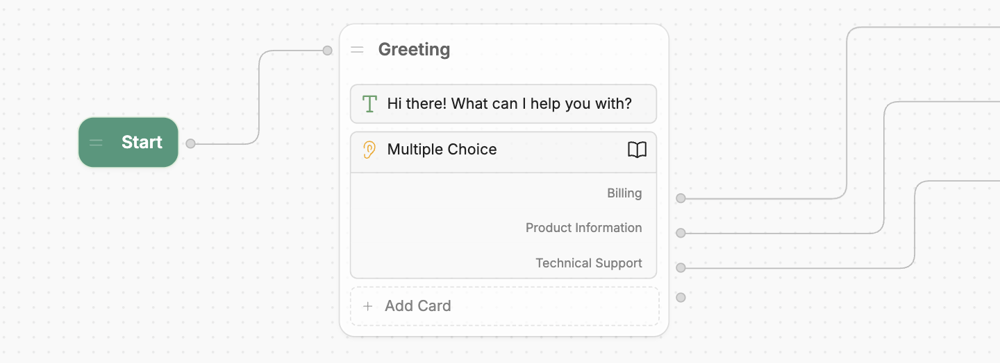
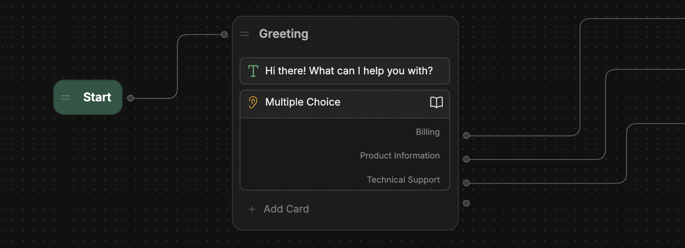
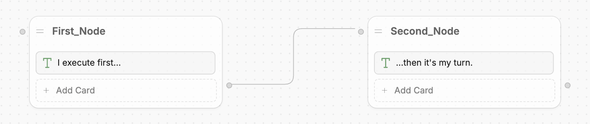
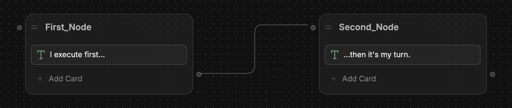

Nodes are the **primary units of conversational logic** in your bot.

Think of a Node as a single step in a conversation. It executes a sequence of actions — like sending a message, capturing information from a user, or performing a task — then transitions to the next Node.

<Frame>
  
  
</Frame>

---

## Overview

An individual Node's behaviour depends on what [Cards](/learn/reference/cards/introduction) it contains. You can add any combination of Cards to a Node to achieve your desired behaviour.

A Node [transitions to the next Node](#transition-between-Nodes) when either:

- It finishes executing all its Cards
- One of its Cards manually transitions to a new Node. You can set up manual transitions based on [user choice](/learn/reference/cards/capture-information), [true/false conditions](/learn/reference/cards/flow-logic), and more.

<Note>
  Some Nodes have specific properties that make them behave differently — check out [Types of Node](#types-of-node) for
  more details.
</Note>

<Tip>
  A group of Nodes is called a [Workflow](/learn/reference/workflows). You can use Workflows to organize your bot's
  behaviour.
</Tip>

---

## Usage

### Add a Node

To add a new Node:

1. Right-click anywhere in a Workflow.
2. Select a [type of Node](#types-of-node) from the popup menu.

### Transition between Nodes

To create a transition between two Nodes:

1. Select and hold the right edge of the Node you want to transition _from_.
2. Drag outwards, then release on the left edge of the Node you want to transition _to_. This will create a transition between the two Nodes:

<Frame>
  
  
</Frame>

### Move a Node

To move a Node around your Workflow, just drag and drop it wherever you like.

### Rename a Node

To rename a Node, just select its title and type in a new name.

### Test a Node

You can test a specific Node in the Studio's [Emulator](/learn/reference/emulator). Just select any Node, then press the <Icon icon="play" /> Play button to start a conversation with your bot from that Node.

### Copy/Delete a Node

Right-click any Node to copy or delete it.

---

## Types of Node

Nodes behave differently and have different available Cards based on their type. Here's a breakdown of each type of Node:

### Standard Node

Standard Nodes execute each of their Cards one-by-one, then transition to the next Node. They're the most basic type of Node, and are useful when you need full control over your bot's behaviour.

### Autonomous Node

The Autonomous Node uses AI to make decisions — like what your bot should say or what tools it should use.

Unlike a standard Node, which executes its Cards one by one, the Autonomous Node uses a Large Language Model (LLM) to decide when to execute its Cards. It can understand the conversation’s context, write responses to users, and leverage the tools you give it.

<Tip>For more information, check out the [Autonomous Node guide](/learn/reference/nodes/autonomous-node).</Tip>

### Start Node

The Start Node is the entrance point to every conversation with your bot. It's only available in the [Main Workflow](/learn/reference/workflows#main), can't be modified/deleted, and can't use Cards.

You can select the Start Node to configure:

- Which [Knowledge Base](/learn/reference/knowledge-base/introduction) your bot has access to
- Whether your bot has access to the [Vision Agent](/learn/reference/agents/vision-agent)

### Entry Node

The Entry Node is the start of every Workflow in your bot (except for the [Main Workflow](/learn/reference/workflows#main)). It executes whenever you [transition to a new Workflow](/learn/reference/workflows#transition-to-a-workflow) and can't be deleted.

The only Cards you can add to an Entry Node are:

- [Expression/Intent](/learn/reference/cards/flow-logic) Cards
- [Log](/learn/reference/cards/utilities#log) Cards

<Tip>
  You can toggle variables within an Entry Node — check out the guide to [passing variables between
  Workflows](/learn/reference/variables/pass-between-workflows) for more information.
</Tip>

### Exit Node

The Exit Node is the end of every custom Workflow in your bot ([built-in Workflows](/learn/reference/workflows#built-in-workflows) end with an [End Node](/learn/reference/nodes/introduction#end-node) instead). It defines the exit point for the Workflow — each custom Workflow must contain at least one Exit Node.

Exit Nodes can't use Cards.

<Tip>
  You can configure the Exit Node to pass a variable back to its parent Workflow — check out the guide to [passing
  variables between Workflows](/learn/reference/variables/pass-between-workflows) for more information.
</Tip>

### End Node

The End Node is the end point of every conversation with your bot. It has no configuration options and can't use Cards.

Only End Nodes can explicitly end a conversation, which:

- Clears the conversation session
- Erases all variables and user data
- Resets the bot to its initial state.

Each [built-in Workflow](/learn/reference/workflows#built-in-workflows) must contain at least one End node. You can also add End Nodes to custom Workflows.

### Triggers

Triggers are a special kind of Node that only execute when a certain event occurs. They're different from regular Nodes in a few ways:

- You can’t transition from a regular Node to a Trigger. Any Triggers in your Workflow will only execute when the event they listen for occurs.
- Unlike other Nodes, you can’t add or remove Cards from a Trigger. Each Trigger is built around a single Card that determines when it executes.

<Tip>For more information, check out the [Triggers guide](/learn/reference/triggers).</Tip>

### Exception handlers

Exception handlers are Nodes that execute whenever your bot encounters an error. They're optional, have no configuration options, and can't contain any Cards.

By default, your bot uses the built-in [Error Workflow](/learn/reference/workflows#error) to handle errors, regardless of which Workflow the error occurred in — exception handlers let you handle errors differently for specific Workflows.

You can only add exceptional handlers to the [Main Workflow](/learn/reference/workflows#main) or to custom Workflows. Each Workflow can contain one exception handler.

### Comments

You can leave comments, images or videos in your Workflow. They have no effect on your bot's behaviour — you can use them to annotate your Workflows and make them easier to understand for any collaborators.
