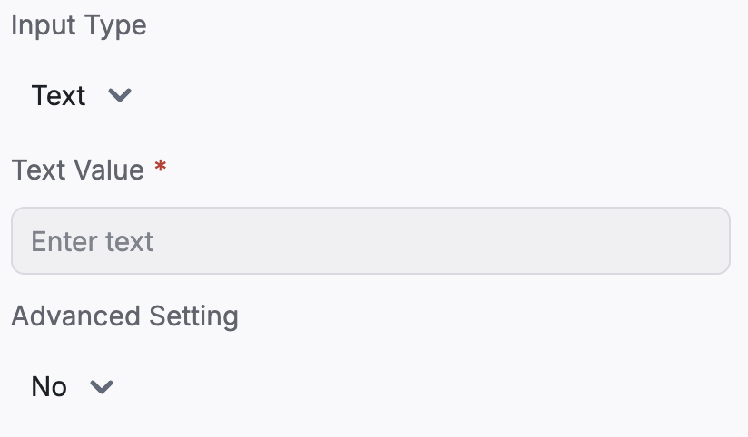
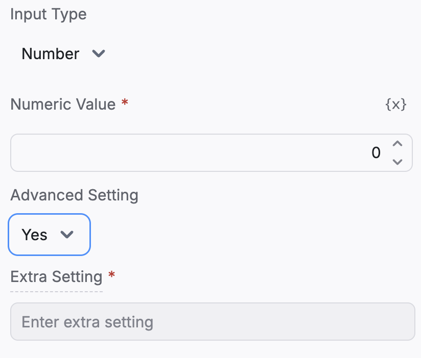

import { Img } from '/snippets/image.mdx'

A schema is a blueprint that defines the structure, required fields, data types, and validation rules for a piece of data. In Botpress, schemas are primarily used to ensure that data passed between various components—such as actions, modules, or API requests—meets the expected format and constraints.

Schemas are useful for:

* **Data Validation**: Preventing errors by ensuring that data adheres to the expected format.
* **Consistency**: Enforcing a consistent structure for data across different components.
* **Error Reduction**: Reducing the likelihood of runtime errors caused by unexpected or malformed data.
* **Ease of Maintenance**: Making it easier to understand and manage data flow within your Botpress application.

# Creating and Using Schemas

## JSON Schema Basics

Botpress uses JSON Schema, a standard for describing the structure and validation constraints of JSON documents.

A JSON Schema can define:

* **Types**: The type of data (e.g., string, number, object, array).
* **Required Fields**: Fields that must be present in the data.
* **Enum Values**: Specific allowed values for a field.
* **Nested Structures**: Complex data structures with multiple levels.

## Creating a schema

You can create a new schema by navigating to the Schema menu in the left-hand menu. You can also create a new schema when adding a new variable through the Variables menu.

## Using schemas

You can use schemas instead of selecting a variable type like String or Number. This means that the variable will contain the information in the structure you've defined in your schema.

For example, you might use a variable to contain information about your end user. This variable can use a schema to contain information like email, age, name, and home address, all contained in a single variable and structured by your schema.

# Testing Schemas

Here's a simple demo schema you can create to familiarize yourself with them.

1. Create a schema for a user object with the following properties:

```typescript
zui.object({
  name: zui.string(),
  age: zui.number(),
  email: zui.string().email(),
  address: zui.object({
    street: zui.string(),
    city: zui.string(),
    zip: zui.string().length(5)
  })
})
```

2. Create a Variable of the user schema type and name it `UserInformation`.
3. \[optionally] you can use these variables as inputs for workflows, allowing the user to fill in the schema as though it were a form.

## Usage in AI Task

* Task Instructions:

```
Fetch name, age, email and address from the provided input
```

* AI Task Input:

```
Rohan Kokkula, 26, at rohan@email.com, received a mysterious parcel at his doorstep:
42 Emerald Lane, Mystic Falls, 560078.
Inside, a map beckoned him to a hidden world beneath Mumbai's bustling streets,
where history and magic intertwined.
```

* Store result in variables: Select the Variable we created above.

<br />

# Conditionally Show Inputs - Input trees

We'll show you how to use discriminated unions in Zod to conditionally include fields in an object schema. We'll go through two examples:

1. Changing the type of a variable based on user input.
2. Conditionally showing an extra setting when an "Advanced Setting" toggle is activated.



<br />



### Example 1: Changing the Type of a Variable

In this example, we'll create a schema that allows a variable (`value`) to be either a string or a number, depending on the user's choice.

```typescript
z.object({
  inputData: z.discriminatedUnion('inputType', [
    z.object({
      inputType: z.literal('Text'),
      // When inputType is 'Text', value is a string
      value: z.string().title('Text Value').placeholder('Enter text')
    }),
    z.object({
      inputType: z.literal('Number'),
      // When inputType is 'Number', value is a number
      value: z.number().title('Numeric Value').placeholder('Enter a number')
    })
  ])
});
```

#### How It Works

* **`inputType`**: Acts as the discriminator that determines the type of the `value` field.
* **Discriminated Union**:
  * If `inputType` is `"Text"`, the schema expects `value` to be a string.
  * If `inputType` is `"Number"`, the schema expects `value` to be a number.

This approach is useful when you want to change the type of a variable based on a user's selection.

### Example 2: Conditionally Showing Extra Settings

This example demonstrates how to include an extra field when an "Advanced Setting" toggle is turned on.

```typescript
z.object({
  // ... your other inputs

  // Using discriminated union to handle the advanced setting toggle with Yes/No options
  settings: z.discriminatedUnion('advancedSetting', [
    z.object({
      advancedSetting: z.literal('No').describe('Advanced setting is disabled'),
      // No extra settings when advancedSetting is "No"
    }),
    z.object({
      advancedSetting: z.literal('Yes').describe('Advanced setting is enabled'),
      // Extra setting when advancedSetting is "Yes"
      extraSetting: z.string()
        .title('Extra Setting')
        .placeholder('Enter extra setting')
        .describe('Additional setting enabled when the advanced setting is turned on')
    })
  ])
});
```

#### How It Works

* **`advancedSetting`**: Acts as the discriminator that determines whether to include the `extraSetting` field.
* **Discriminated Union**:
  * If `advancedSetting` is `"No"`, the schema does not include `extraSetting`.
  * If `advancedSetting` is `"Yes"`, the schema requires `extraSetting` to be provided.

This pattern is useful when you want to include additional settings only when an "Advanced Setting" option is enabled.

### Trying it out

Trying it out is very easy!

1. Open Botpress Studio
2. Create and save the schema with discriminatedUnion fields
3. Create a variable in a workflow other than main, set its type to the schema's saved name.
4. Click on the input node for the workflow, then toggle the variable as an input.
5. Go to another workflow and add a card that points to the one with the schema input.
6. You'll now be able to able to see your input tree in all it's glory!

### Summary

* **Discriminated Unions** in Zod allow you to conditionally change the shape of an object.
* They are useful for:
  1. Changing the type of a variable based on user input.
  2. Conditionally including fields based on a toggle or option.

By using discriminated unions, you can build dynamic and flexible schemas that adapt based on user selections, making your form validation and UI more intuitive and responsive.
