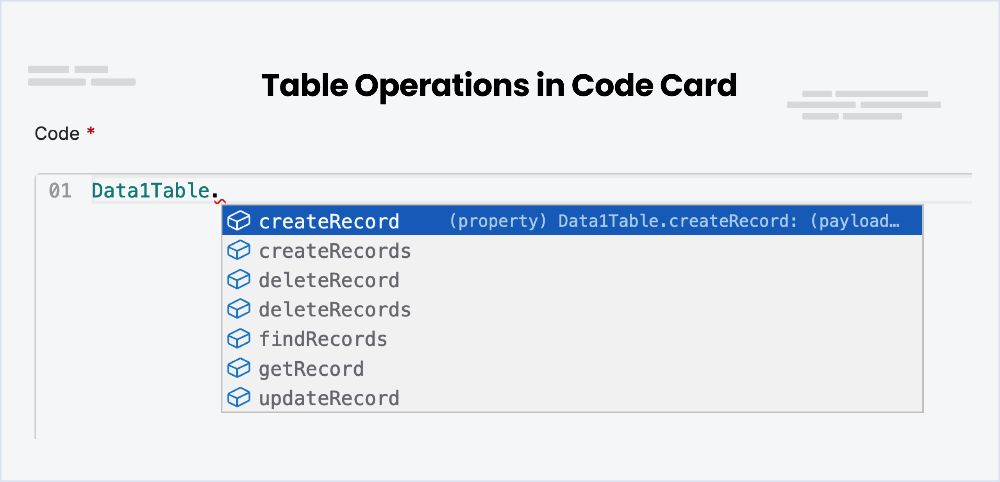
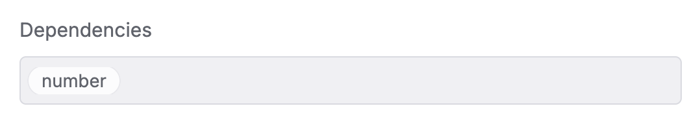
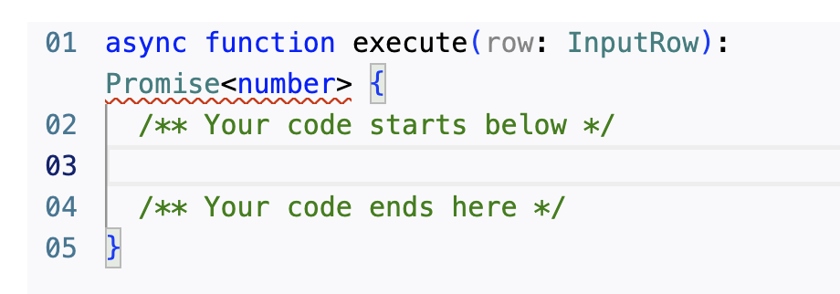
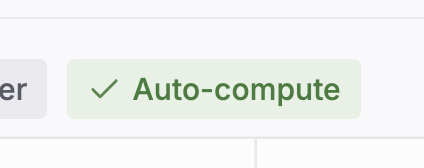
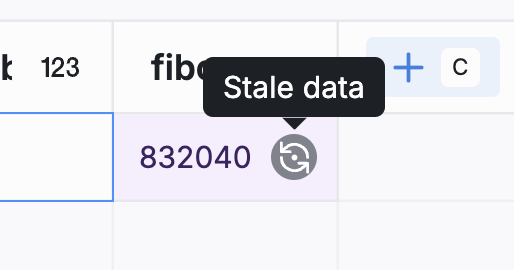

import { YouTube } from '/snippets/youtube.mdx'

Tables are an essential feature in the explorer, functioning as a local database within your chatbot's environment. They provide structured storage for various types of data that can be accessed and manipulated as required within your workflows.

They're particularly useful for storing information that needs to be persisted across multiple sessions, such as user profiles, transaction histories, and other types of data that need to be retrieved and updated over time.

<Note>
Note

You can create up to **10 tables** with **20 columns** and **10,000 rows** in the **Free Plan**. [Get in touch](https://botpress.com/contact-us) if you want to increase the limits. However, the 20 columns per table is a hard limit that can't be increased.
</Note>

<Warning>
  Table row capacity filling up quicker than you expected? Check your table's **row factor**.
  <div id='test' class='transparent-accordion'>
  <Accordion title='What are row factors?'>
    Every table has a row factor that determines the storage limit for each of its rows. When you create a new table, the default row factor is 1—this allows you store up to 4KB of data per row.

    If you need to store more than 4KB of data in each row, you can create a table with a higher row factor. However, increasing the table's row factor makes each row count more towards your table's row limit.

    **Example**: If you create a table with a row factor of 3, each row will have a storage limit of 12KB (because 4KB x 3 =  12KB). This will make each row will count as 3 rows towards your table's row limit.

    You can check any table's row factor in the bottom-right corner of that table.
  </Accordion>
  </div>
</Warning>

# Creating a Table

To add a new table, go to the explorer menu and select `Add Table`. You can then give your table a name and add fields to it. Each field has a name and a type. The type determines the kind of data that can be stored in the field. For example, a field with the type `String` can store any text value, while a field with the type `Number` can only store numeric values.

## Making Fields Searchable

You can make a field searchable by checking the `Searchable` checkbox. This will allow you to search for records based on the values in the field. For example, if you have a field called `Name` and you make it searchable, you can search for records based on the name of the person. This is available for fields of type `String`, `Object`, `Array` and [custom schemas](/learn/reference/schema).

# Types of Fields (Columns)

There are several types of fields you can add to a table. Each field type has a specific purpose and can only store certain types of data. These are the field types you can choose from: `String`, `Number`, `Boolean`, `Date`, `Object`, `Array` and [custom schemas](/learn/reference/schema).

<Warning>
Warning

The number of columns has a hard limit of **20 columns** per table.
</Warning>

# Filtering Records

Table filters are a powerful feature that allows you to refine and display only the records that meet certain criteria. Filters can be based on specific conditions, such as date ranges, text matches, and numerical comparisons.

## Logical Operators

* **AND**: Use the AND operator when you want all conditions to be true for a record to be displayed. For example, filtering by `createdAt` AND `status` will only show records that match both conditions.

* **OR**: Use the OR operator to display records that match any one of multiple conditions. For example, filtering by `createdAt` OR `updatedAt` will show records that match either one of the conditions.

## Types of Rules

Rules define the individual conditions applied to each column of data.

* `is equal to`: Shows records where the field is equal to the specified value.
* `is not equal to`: Shows records where the field isn't equal to the specified value.
* `less than`: Shows records where the field is less than the specified value.
* `less than or equal to`: Shows records where the field is less than or equal to the specified value.
* `greater than`: Shows records where the field is greater than the specified value.
* `greater than or equal to`: Shows records where the field is greater than or equal to the specified value.
* `in`: Shows records where the field matches any of the specified values.
* `not in`: Shows records where the field doesn't match any of the specified values.
* `is null`: Shows records where the field is empty.
* `is not null`: Shows records where the field isn't empty.

## Rule Groups

* **Group**: A group is a collection of rules combined by a logical operator (AND/OR). You can nest groups to create complex filters.

## Creating a Filter

1. Click on the `Filter` button to expand the filter menu.
2. Select a logical operator (AND/OR) from the dropdown.
3. Choose a field to filter by (e.g., `createdAt`).
4. Select a rule (e.g., `is equal to`).
5. Enter the required value or select from a calendar if it's a date field.
6. To add another rule within the same logical condition, click the `+ Rule` button.
7. To create a nested group of conditions, click the `+ Group` button.
8. Apply the filter by clicking the `Apply filter` button.

## Manually Editing Filters

Click on **Edit Manually** to view and edit the filter in JSON format. You can then copy this JSON filter and use it in your table operations via code.

# Operations on Tables - via the Interface

## Add records to a table

Once you've created a table, you can add records to it. To do this, click on the table in the explorer menu. You'll then see a list of all the records in the table. Click on the `Add Record` button to add a new record. You can then enter the values for each field in the record.

## Update records in a table

Double click on a table cell or press click it and press `Enter` to see an input that allows you to change the cell value. Once you are done, press `Enter` again or click away to save the new value.

## Delete records from a table

`Right Click` on the Record and select `Delete Record` to delete a record from a table.

# Operations on Tables - via Cards

Check out the [Table Cards documentation](/learn/reference/cards/execute-code#table-cards) to learn more about operations with cards.

# Operations on Tables - via Botpress Client

You can also interact with tables using the Botpress Client. Here are some of the functions you can use to interact with tables:

## listTables

To list all the tables in the bot, use the `listTables` function. This function will return an array of all the tables in the bot.

```javascript
try {
  const tables = await client.listTables({})
  console.log('Tables:', tables)
} catch (err) {
  console.error('Error fetching tables', err)
}
```

## Create Table Rows

Execute the following query to create one or multiple rows. The response will include the inserted rows, along with any encountered errors or warnings during the operation (e.g., unrecognized fields)

```javascript
const { rows, errors, warnings } = await client.createTableRows({
  table: 'Data1Table',
  rows: [
    {
      name: 'test'
    }
  ]
})
```

## Find & Filter Table Rows

To find and filter rows in a table, use the `findTableRows` function. You can specify the limit (number of records to return) and the offset (number of rows to start from).

```javascript
const { rows, limit, offset, count } = await client.findTableRows({
  table: 'Data1Table',
  limit: 50,
  offset: 0,
  filter: {},
  orderBy: 'row_id',
  orderDirection: 'asc'
})
```

Utilize filters to conduct more refined queries for specific rows, employing a MongoDB-like syntax. The query builder aids in understanding available operations and constructing the filter.

```javascript
const { rows, limit, offset, count } = await client.findTableRows({
table: 'Data1Table',
filter: {
  // Retrieve rows where date is greater than a specific date
  updatedAt: { gte: '2024-01-01' },
  // Or more complex conditions, such as name starting with 'a' or 'b', or 'isActive' being true
  $or: [{ name: { $regex: '^a' } }, { name: { $regex: '^b' } }, { isActive: true }]
}
})
```

The "search" property allows for a partial text search across the table. The query returns multiple results, each accompanied by a similarity score to indicate relevance.

```javascript
const { rows, limit, offset, count } = await client.findTableRows({
  table: 'Data1Table',
  search: 'John Doe'
})
```

## Projection & Aggregation

Employ the group property for projections and aggregations. The following example demonstrates returning a single row with requested data.

```javascript
const { rows } = await client.findTableRows({
  table: 'Data1Table',
  group: {
    id: 'count',
    name: ['unique', 'count'], // will return a list of unique values & the total count
    updatedAt: ['min', 'max'] // Retrieves the earliest and latest date
  }
})

// Output variables are named after the field, suffixed with the operation
const oldestChange = rows[0].updatedAtMin
const mostRecentChange = rows[0].updatedAtMax
const count = rows[0]['nameCount']
const uniqueValues = rows[0]['nameUnique']
```

<table>
  <thead>
    <tr>
      <th>
        Column
      </th>

      <th>
        Type
      </th>

      <th>
        Key
      </th>

      <th>
        Count
      </th>

      <th>
        Sum
      </th>

      <th>
        Avg
      </th>

      <th>
        Max
      </th>

      <th>
        Min
      </th>

      <th>
        Unique
      </th>
    </tr>
  </thead>

  <tbody>
    <tr>
      <td>
        id
      </td>

      <td>
        number
      </td>

      <td>
        ✔️
      </td>

      <td>
        ✔️
      </td>

      <td>
        ✔️
      </td>

      <td>
        ✔️
      </td>

      <td>
        ✔️
      </td>

      <td>
        ✔️
      </td>

      <td>
        ✔️
      </td>
    </tr>

    <tr>
      <td>
        createdAt
      </td>

      <td>
        date
      </td>

      <td>
        ✔️
      </td>

      <td>

      </td>

      <td>

      </td>

      <td>

      </td>

      <td>
        ✔️
      </td>

      <td>
        ✔️
      </td>

      <td>
        ✔️
      </td>
    </tr>

    <tr>
      <td>
        updatedAt
      </td>

      <td>
        date
      </td>

      <td>
        ✔️
      </td>

      <td>

      </td>

      <td>

      </td>

      <td>

      </td>

      <td>
        ✔️
      </td>

      <td>
        ✔️
      </td>

      <td>
        ✔️
      </td>
    </tr>

    <tr>
      <td>
        name
      </td>

      <td>
        string
      </td>

      <td>
        ✔️
      </td>

      <td>

      </td>

      <td>

      </td>

      <td>

      </td>

      <td>
        ✔️
      </td>

      <td>
        ✔️
      </td>

      <td>
        ✔️
      </td>
    </tr>
  </tbody>
</table>

**Key**: Projections are grouped by keys (ex: date)\
**Count**: Returns the total number of non-null values\
**sum**: Returns the sum of all values\
**Avg**: Returns the average of all values\
**Max**: Returns the maximum value\
**Min**: Returns the minimum value\
**Unique**: Returns a list of unique values

Providing one or multiple keys yields more specific results.

```javascript
const { rows } = await client.findTableRows({
  table: 'Data1Table',
  group: {
    someField: 'key', // Either provide a single operation
    someNumber: ['avg', 'sum'] // Or multiple operations
  }
})

// Returns multiple rows for each unique combination of keys
const result = rows.map((row) => {
  const { someFieldKey, someNumberAvg, someNumberSum } = row
})
```

## Update Table Rows

This operation updates rows based solely on their numeric IDs.

```javascript
const { rows, errors, warnings } = await client.updateTableRows({
  table: 'Data1Table',
  rows: [
    {
      id: 1,
      name: 'test'
    }
  ]
})
```

## Delete Table Rows

Rows can be deleted from a table in three distinct manners, each mutually exclusive.

By specifying row IDs\
By applying a filter\
By removing all rows

```javascript
const { deletedRows } = await client.deleteTableRows({
  table: 'Data1Table',
  // Specify a list of IDs
  ids: [1, 2, 3],
  // Or use a filter (caution: all rows matching the filter will be deleted. It's advisable to first test with the findTableRows query)
  filter: { name: 'John Doe' },
  // Deletes every row within this table, irreversible action
  deleteAllRows: true
})
```

## Upsert Table Rows

The upsert operation is a combination of insert or update, allowing you to insert new rows or update existing ones. The operation is based on the row's `keyColumn`.

**keyColumn**: The column used to identify the row. This column must be unique. Failure occurs if more than one row is found for the same key.

```javascript
const { rows, inserted, updated, errors, warnings } = await client.upsertTableRows({
  table: 'Data1Table',
  keyColumn: 'email',
  rows: [
    {
      email: 'hello@world.com', // will update this row, or create a new one if not found
      name: 'test'
    }
  ]
})
```

## Create Table

To create a table, simply provide a name and a schema. The naming convention follows the same rules as those applied within the studio. Initially, the schema can be empty and populated or modified later. The schema accepts either an example object, from which it will infer the structure, or a directly provided JSON schema.

```javascript
const { table } = await client.createTable({
  name: 'Data1Table',
  schema: {
    name: 'test'
  }
})
```

Example using a JSON schema. A field marked as 'searchable' will be indexed, enhancing its availability for search queries. Note, 'index' is a system-managed, read-only attribute.

```javascript
const { table } = await client.createTable({
  name: 'Data1Table',
  schema: {
    type: 'object',
    'x-zui': {},
    properties: {
      name: {
        type: 'string',
        'x-zui': {
          index: 0,
          searchable: true
        },
        nullable: true
      }
    },
    additionalProperties: true
  }
})
```

## Update Table

You can update a table's name, schema, or both. Providing only one of these attributes is also permissible. Should you alter the type of an existing column, be advised that all its entries will default to NULL.

### Adding a new field

```javascript
const { table } = await client.updateTable({
  table: 'Data1Table',
  schema: {
    myNewField: 'abc', // Direct value assignment
    // Or specify with a JSON schema
    myNewField: { type: 'string' }
  }
})
```

### Removing an existing field:

```javascript
const { table } = await client.updateTable({
  table: 'Data1Table',
  schema: {
    myOldField: null // Field removal
  }
})
```

### Renaming the table

A table name must end with "Table".

```javascript
await client.updateTable({ table: 'Data1Table', name: 'myNewTable' })
```

### Rename Table Column

To rename a table column, specify both the current and new names. The column's data type and attributes will remain unchanged.

```javascript
const { table } = await client.renameTableColumn({
  table: 'Data1Table',
  name: 'My Old Column Name',
  newName: 'New Column Name'
})
```

## Get Table

To retrieve a table's schema, use the `getTable` function. This will return the table definition, along with the total number of rows, number of stale rows and number of indexing rows.

```javascript
const { table, indexing, rows, stale } = await client.getTable({ table: 'Data1Table' })
```

## Delete Table

To delete a table, use the `deleteTable` function. This will permanently remove the table and all its records.

```javascript
const { table } = await client.deleteTable({ table: 'Data1Table' })
```

# Operations on Tables - via Code



## createRecord

To create a new record in a table, use the `createRecord` function. You can specify the values for each field in the record. This function can be particularly useful when you need to store new information, such as a new user's details or a newly completed transaction.

<YouTube url="https://www.youtube.com/embed/M0S3r-7FiVk?si=PZc5P9Q2zUHhL5Zq" />

```javascript
// Create a record in the table
await Data1Table.createRecord({ Age: 25, Name: 'Tom', Occupation: 'Student' })
```

## createRecords

To create multiple records in a table, use the `createRecords` function. You can specify the values for each field in the record. Useful for creating multiple records at once.

<YouTube url="https://www.youtube.com/embed/AAUO9p6zniw?si=jSb5DzGAVIyTr2D6" />

```JavaScript
// Creating two records in the table
await Data1Table.createRecords([
  { Name: 'Tom', Age: 25, Occupation: 'Student', 'Is Friendly': true },
  { Name: 'Didier', Age: 54, Occupation: 'Pilot', 'Is Friendly': true },
])
```

## deleteRecord

To delete a record in a table, use the `deleteRecord` function. You need to specify the record ID of the record you want to delete.

<YouTube url="https://www.youtube.com/embed/8zoqG07tulY?si=DH6GdQ-vuuME207-" />

```javascript
// Delete a record in the table at record ID 7
await Data1Table.deleteRecord(7)
```

## deleteRecords

To delete multiple records in a table, use the `deleteRecords` function. You need to specify the record IDs of the records you want to delete in an array.

<YouTube url="https://www.youtube.com/embed/TsUPf2FwrFY?si=cd19VWqxb5M2mC5R" />

```JavaScript
 // Delete records in the table at record IDs 7, 8, 9
await Data1Table.deleteRecords([7, 8, 9])
```

## findRecords

To find records in a table, use the `findRecords` function. You can add filters, just query everything or search using semantic search (like a Google Search!).

### Basic usage and pagination

To retrieve data from a table in Botpress, you can use the `findRecords` function. This function allows you to specify the limit (number of records to return) and the offset (number of rows to start from).

For instance, if you want the first 10 records, you can set the limit to 10 and the offset to 0. To fetch the next 10 records, you can set the limit to 10 and the offset to 10.

To determine if there are more records available, you can check the length of the array returned. If the length is greater than 0, it indicates the presence of additional records.

Here's an example:

```javascript
const limit = 10
const startRow = 0

workflow.records = await DataTable1.findRecords({
  limit,
  offset: startRow,
})

// Checking the second page
const secondPage = await Data1Table.findRecords({
  limit,
  filter: AI`everything`,
  offset: startRow + limit,
})

workflow.hasNextPage = secondPage.length > 0 // This flag can be consumed in your bot flow to handle pagination
```

You can apply a similar approach to determine if there are previous pages as well.

### Searching fields with natural language

To perform a traditional search, use the search parameter when calling the DataTable1.findRecords() function in Botpress. Here is an example:

```javascript
workflow.records = await DataTable1.findRecords({ search: 'red velvet chairs' })
```

You can pass variables like event.preview to the search parameter to search for user input or any other variable. This allows you to preprocess the user's input before performing the search.

### Filtering results

You can filter results using filters. Similar to MongoDB, this code provides methods to filter results. The filtering mechanism can be divided into two main categories: Primitive and Logical.

Don't want to deal with code? Skip to the [next section](#using-ai-to-generate-filters) for AI generated filters.

### **Primitive Filter**

Primitive filters are easy and simple to use, allowing you to match the exact values you are looking for. Here are some of the primitives you can use:

* `$eq`: Matches values that are equal to a specified value.

  ```json
  { "name": { "$eq": "John" } }
  ```

* `$gt`: Matches values that are greater than a specified value.

  ```json
  { "age": { "$gt": 20 } }
  ```

* `$gte`: Matches values that are greater than or equal to a specified value.

  ```json
  { "age": { "$gte": 20 } }
  ```

* `$lt`: Matches values that are less than a specified value.

  ```json
  { "age": { "$lt": 20 } }
  ```

* `$lte`: Matches values that are less than or equal to a specified value.

  ```json
  { "age": { "$lte": 20 } }
  ```

* `$ne`: Matches all values that aren't equal to a specified value.

  ```json
  { "name": { "$ne": "John" } }
  ```

* `$in`: Matches any of the values specified in an array.

  ```json
  { "name": { "$in": ["Alice", "Bob", "John"] } }
  ```

* `$nin`: Matches none of the values specified in an array.

  ```json
  { "name": { "$nin": ["Alice", "Bob", "John"] } }
  ```

* `$exists`: Matches documents that have the specified field.

  ```json
  { "name": { "$exists": true } }
  ```

* `$mod`: Performs modulo operation on the value of field and matches documents where field % divisor equals the specified remainder.

  ```json
  { "qty": { "$mod": [4, 0] } }
  ```

* `$size`: Matches any document where an array field contains a specified number of elements.

  ```json
  { "tags": { "$size": 3 } }
  ```

* `$regex`: Provides regular expression capabilities for pattern matching strings in queries. It uses a placeholder to prevent SQL injections.

  ```json
  { "name": { "$regex": "[a-z]" } }
  ```

* `$options`: Modifies the `$regex` operator to enable options. Currently, there are two options, 'i' for case-insensitive and 'c' for case-sensitive.

  ```json
  { "name": { "$regex": "[a-z]", "$options": 'i' } } // case-insensitive

  { "name": { "$regex": "[a-z]", "$options": 'c' } } // case-sensitive
  ```

### **Logical Filter**

Logical operators allow you to connect more filtering clauses.

* `$and`: Joins query clauses with a logical AND. Returns all documents that match the conditions of both clauses.

  ```json
  { "$and": [{ "price": { "$ne": 1.99 } }, { "price": { "$exists": true } }] }
  ```

* `$or`: Joins query clauses with a logical OR. Returns all documents that match the conditions of either clause.

  ```json
  { "$or": [{ "price": { "$eq": 1.99 } }, { "price": { "$exists": false } }] }
  ```

* `$not`: Inverts the effect of a query expression and returns documents that don't match the query expression.

  ```json
  { "$not": { "price": { "$eq": 1.99 } } }
  ```

Please note that these filters and operators can be used together to create complex queries to exactly fit your needs. You can also nest filters like so :

```javascript
{
   "$and": [
      { "price": { "$lte": 19.99 }},
      { "$or":  [
         {"category": { "$eq": "Shoes" }},
         {"category": { "$eq": "Hats"}}
        ]
      }
   ]
 }
```

If you have a column of type object, you can also use operators on nested paths:

```json
{
  "customer.name": { "$regex": "[a-z]" },
  "customer.age": { "$gte": 18 }
}
```

### Using AI to generate filters

Thankfully, Botpress comes with artificial intelligence (AI) capabilities when it comes to filtering records. This means you can provide a human-like query, and the AI will intelligently decipher it and create the right filters for your query.

This can significantly simplify the construction of complex queries and reduce the likelihood of human errors in the process.

```javascript
const leads = await LeadsTable.findRecords({
  filter: AI`works either at ${workflow.company} OR is not in IT`,
  limit: 10,
  offset: 0,
})
```

The query is written inside the backticks (\`) that come after \`filter: AI\`. The AI expects a query string, and that's why backticks are used.

### Re-using filters (selectors)

Selectors are filters that you can re-use. They don't have to be written again and again.

For example, you might use the query selector "People with age greater than 18" to find all users who are above 18.

1. Create a query selector in the table and give it a name. (for example: adults)
2. Add query as `People with age greater than 18`
3. use below code to find records and save it in a variable called `adults`

<YouTube url="https://www.youtube.com/embed/wYpsx6cvT5Q?si=u3YWiDmyasHEed0M" />

```javascript
// Find records in the table
const data = await Data1Table.findRecords({ selectorName: 'adults' })
workflow.adults = data
```

### Difference between search and AI filters

A standard `Search` in Botpress is employed to identify specific strings like a user's name. It gives precision-based results by matching specific sets of characters.

On the other hand, an `AI Filter` broadens the scope and is used primarily for filtering results rather than explicitly searching them. It helps you track down users based on certain criteria, such as age above 25.

Although the AI Filter isn't primarily designed for exact string hunting, it's flexible enough to allow it. For instance, you could use it to filter results for `Canada` as a country.

## getRecord

You can use the `getRecord` function to retrieve a specific record from a table based on a unique identifier. For example, you might use the `getRecord` function to retrieve a user's profile information based on their unique user ID.

<YouTube url="https://www.youtube.com/embed/zbcTGK8T1PQ?si=fZmhfg7gJVjgsab3" />

```javascript
// The record ID is 1 and User is the variable name
const data = await Data1Table.getRecord(1)
workflow.User = data
```

## updateRecord

You can use the `updateRecord` function to modify a specific record in a table. This will be useful when you need to update a specific field in the record. For example, you might use this function to update a user's profile information or to update the status of a transaction.

```javascript
// Update at record ID 8's Age to 45
await Data1Table.updateRecord(8, { Age: 45 })
```

## upsertRecords

The `upsertRecords` function allows you to update or create records in a table in a single operation. It's useful for any situation where you need to update or insert data into a table without having to worry about whether the rows already exist.

**Example:**

```javascript
// Update the name and address of the records with IDs 1 and 2.
await CustomersTable.upsertRecords('id', [
  { id: 1, name: 'John Doe', address: '123 Main Street' },
  { id: 2, name: 'Jane Doe', address: '456 Elm Street' },
])
```

This code will upsert the records into the CustomersTable. If the records with IDs 1 and 2 already exist in the table, the function will update the existing rows with the new name and address values. If the records with IDs 1 and 2 don't already exist in the table, the function will insert new rows into the table with the new name and address values.

# Computed Columns

Columns can be marked as "Computed" which allows the <Tooltip tip="Happy bot building!">bot builder</Tooltip> to observe changes in tables and generate computed values. This includes leveraging AI, as well as running code. This can be useful for a wide variety of use cases such as CRM enrichment, sentiment analysis, classification.

To use computed columns, simply create a column and toggle the **Computed** field as shown below.


## Selecting the basis of computation

To compute columns, you must select what information you will base your computed columns on. To do so, click the **Dependencies** field and select all column names that you will use.



In the above example, we selected a column called **number**.

## AI-based computed columns

You can perform AI text generation tasks by filling the prompt and including rows like this \{\{propertyName}}.

```
Come up with the title for a story like the three little pigs for the number {{number}}
```

In the above example, for the number 3, you might get "The Three Clever Squirrels" as a value in the cell.

## Code-based computed columns

To run arbitrary code, select the **Execute code** tab. Then, click **Edit Code**.


You will see a window with a code editor.



Simply add your code above. The proper syntax for accessing columns you've identified as dependencies is row[propertyName], and the displayed cell value is what is returned by this function. You can call asynchronous functions within the function, and have the **axios** library available to perform HTTP requests.

For instance, the following code will return the fibonacci number of the row value for the column **number**.

```js
function fibonacci(n) {
  if (n <= 1) {
    return n
  }
  return fibonacci(n - 1) + fibonacci(n - 2)
}

if (!row.number) {
  return 0;
}

return fibonacci(row.number)
```

There is currently an execution timeout of 2 minutes these.

## Updating computed values

To ensure computed values are always kept up to date, we recommend **Auto-compute** be toggled on.



If you don't have **Auto-compute** enabled, a grey icon will appear next to stale table cells.



To update the stale data, simply re-activate **Auto-compute**.

# Importing and Exporting

## Import a Table

You can import a table from a CSV file. Click on the `Import Table` button above the table and select the CSV file you want to import. Botpress will automatically detect the column names and types from the CSV file and create the table structure for you.

## Export a Table

Click on the `Export Table` button to export the table. This will download the table as a CSV file to your computer.

<Warning>
Reminder

Don't edit the CSV file directly to avoid data loss and import errors. Instead, make the changes in Botpress Studio and then export the updated table again.
</Warning>

<Note>
Note

When you export a bot, the tables are exported as well so there is no need to export them separately unless you want to use them in another bot.
</Note>
