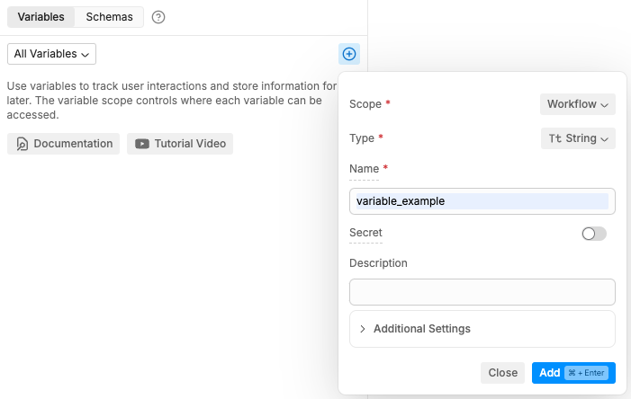
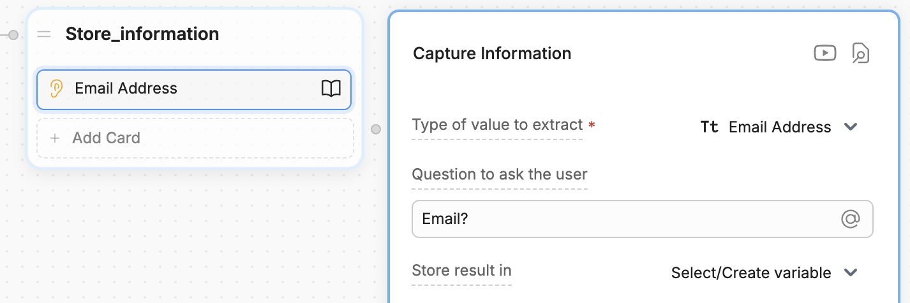

Variables let you **store information** from somewhere in Botpress Studio and **reuse it somewhere else**.

<Tip>
Think of a variable like an **empty box**. You can fill it with any kind of information you want—like a name, a number, or a preference—and put it away for safekeeping. Then, when your bot needs that information again, it can open the box and access what's inside.
</Tip>

## Variable scopes

You can use different types of variables to **scope** the information you store. This gives you control over where your bot can access a piece of information. For example, you might want some information to:

- [Follow a user across all their conversations](/learn/reference/variables/scopes/user) (for example, their name and address)
- [Persist only throughout a single conversation](/learn/reference/variables/scopes/conversation) (for example, items in a virtual cart)
- [Be safely accessible across all your bot's activity](/learn/reference/variables/scopes/configuration) (for example, API tokens and secrets)

Select any variable scope below to learn more about it:

<CardGroup cols={2}>
  <Card
    title="Workflow variables"
    href="/learn/reference/variables/scopes/workflow"
  >
    Only available within the current Workflow
  </Card>
  <Card
    title="User variables"
    href="/learn/reference/variables/scopes/user"
  >
    Available for all conversations with a user
  </Card>
  <Card
    title="Conversation variables"
    href="/learn/reference/variables/scopes/conversation"
  >
    Only available within the current conversation
  </Card>
  <Card
    title="Bot variables"
    href="/learn/reference/variables/scopes/bot"
  >
    Available throughout all your bot's activity
  </Card>
  <Card
    title="Configuration variables"
    href="/learn/reference/variables/scopes/configuration"
  >
    Available throughout all your bot's activity, but can't be displayed to users
  </Card>
</CardGroup>

## Create a variable

<Note>
  Configuration variables have a different setup process. Check out the [configuration variables](/learn/reference/variables/scopes/configuration) page for more information.
</Note>

Before you can store information in a variable, you need to create it:

1. Open any Workflow.
2. Select **+** in the **Variables** section at the bottom of the left navigation bar.
3. Choose a [Scope](#variable-scopes), [Type](#data-types-for-variables) and **Name** for your variable:

<Frame>

</Frame>

<Note>
  By default, variables are empty when created. However, you can create them with a default value if you prefer—just specify a **Default Value** in the **Additional Settings** menu.
</Note>

### Assign a value to your variable

A freshly created variable is like an empty box—you need put something inside it before you can use it. This is called **assigning a value** to your variable.

Studio will usually indicate where you have the option to assign a value to a variable.. For example, in a [Capture Information](/learn/reference/cards/capture-information) Card:

<Frame>

</Frame>

<Tip>
  If you want more control over when and how you assign a value to a variable, you can [use code instead](/learn/reference/variables/in-code).
</Tip>

### Read your variable

When you need to access the information stored in a variable, you can **read** it. This is like opening the box and looking at what's inside.

Each variable scope is read differently. Check out the [section for your variable's scope](#variable-scopes) for more information.

## Data types for variables

Botpress variables are **typed**, meaning they are limited in what data they can hold. These data types are important to:

- Ensure the code behind Botpress runs smoothly
- Help AI tasks generate better results

Here are the different data types available for Botpress variables:

<table>
  <thead>
    <tr>
      <th>
        Type
      </th>

      <th>
        Description
      </th>
    </tr>
  </thead>

  <tbody>
    <tr>
      <td>
        String
      </td>

      <td>
        Values that are treated as text. Strings can contain any amount of letters, numbers, or special characters.     Example uses: Storing a user's name, storing an AI task's generated message.
      </td>
    </tr>

    <tr>
      <td>
        Boolean
      </td>

      <td>
        Variables can be true or false, with a lowercase 't' or 'f'.    Example uses: Storing if a user is a returning customer, storing whether the bot has greeted the user or not
      </td>
    </tr>

    <tr>
      <td>
        Number
      </td>

      <td>
        Variables that are numeric, either with or without decimal places.    Example uses: Storing a user's phone number, storing an address's area code
      </td>
    </tr>

    <tr>
      <td>
        Date
      </td>

      <td>
        Variables that are a single date or date and time. Botpress uses ISO 8601 date/time format, such as `20220921T10:34:14` for `21 September 2023 at 10:34 AM` (with 14 seconds).    Example uses: Storing when the user starts a chat, storing a user's appointment date
      </td>
    </tr>

    <tr>
      <td>
        Object
      </td>

      <td>
        Variable that is a collection of key-value pairs. Useful when dealing with code and written like `{key: value}`.    Example uses: Storing a user's profile, storing the results of an API call
      </td>
    </tr>

    <tr>
      <td>
        Array
      </td>

      <td>
        Variable that is a collection of other, similar variables. Arrays can contain strings, like `[“a”, “b”, “c”]`, or Objects like `[{key:value},{key:value}]`.    Example uses: Storing a user's past messages, storing options for the user to choose from
      </td>
    </tr>

    <tr>
      <td>
        Enum
      </td>

      <td>
        Variable that can be one of a set number of choices.    Example uses: Storing days of the week, storing items available from a food menu
      </td>
    </tr>

    <tr>
      <td>
        Pattern
      </td>

      <td>
        Variable that uses Regular Expressions/Regex to store a special pattern. This pattern can match certain words or numbers.   Example uses: Storing account numbers, storing flight numbers
      </td>
    </tr>
  </tbody>
</table>