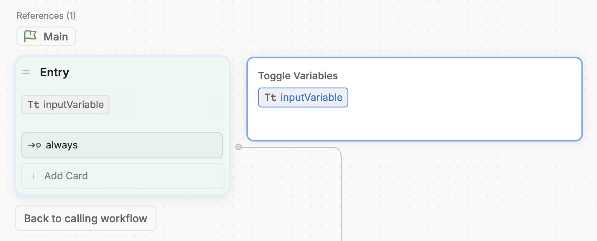

You can pass variables between Workflows. This is useful if you want to use a previously created variable within the scope of a single Workflow. For example:

- You want to collect user information in one Workflow, then validate it in a sub-Workflow.
- You have a Workflow that stores items in a virtual shopping cart, and you want to process payment for those items in a sub-Workflow.
- You have some condition in one Workflow, and you want a sub-Workflow to behave differently based on that condition.

To pass variables between Workflows:

<Steps titleSize="h2">
  <Step title="Setup your input variable">
    1. In your sub-Workflow (the one you want to pass the variable to), [create a new Workflow variable](/guides/studio/interface/variables/overview/#create-a-variable).

    <Note>
      You can pass any kind of variable from your parent Workflow, but your sub-Workflow needs to treat it as a Workflow variable.
    </Note>

    2. Select the Entry Node of your sub-Workflow, then select the variable you just created:
    
    <Frame>
    
    </Frame>

    This tells the parent Workflow that your sub-Workflow is expecting some input.
  </Step>
  <Step title="Pass the variable to the sub-Workflow">
    In your parent Workflow, select the Card that transitions to the sub-Workflow. It should display the input variable you just created:

    <Frame>
    
    </Frame>

    You can manually enter a value to pass to the sub-Workflow, or use a previously created variable from your parent Workflow.
  </Step>
</Steps>

<Check>
Now, whatever value you pass from your parent Workflow will be available in your sub-Workflow as a Workflow variable.
</Check>