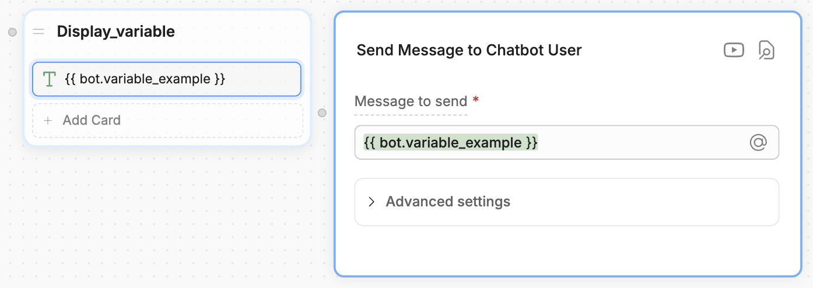

Bot variables let you store and reuse information **throughout your entire bot**.

Any information you assign to a bot variable will be accessible across all Workflows and conversations. This makes bot variables useful for storing global information about your bot, like:

- Your bot's name
- Your bot's version number
- Endpoints for your bot's API calls

<Warning>
    Bot variables aren't encrypted or stored securely. This means **an Autonomous Node can read and display any information you store in a bot variable**.

    Don't save sensitive information like API keys or passwords in bot variables—use [**configuration variables**](/learn/reference/variables/scopes/configuration) instead.
</Warning>

<Tip>
    Need help getting started with variables? Check out our [introduction to variables](/learn/reference/variables/overview).
</Tip>

## Read a bot variable

You can use `{{bot.variablename}}` or `@bot.variablename` to read a bot variable. For example, in a **Text** Card:

<Frame>

</Frame>
