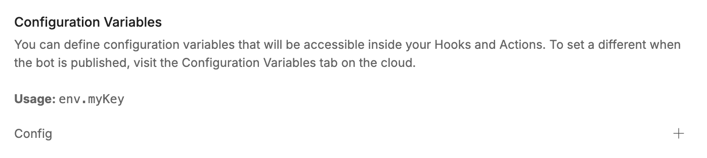
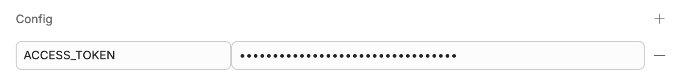
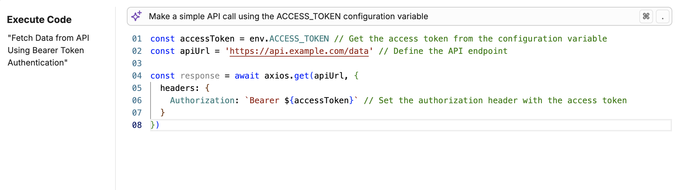

Configuration variables let you **securely store information throughout your bot**.

Like [bot variables](/learn/reference/variables/scopes/bot), configuration variables are accessible across all Workflows and conversations. The key difference is that configuration variables are **encrypted**. This means an Autonomous Node cannot read or display information you store in a configuration variable.

This extra layer of security makes configuration variables great for storing sensitive information, like:

- API Tokens
- Private IP Addresses
- Usernames and passwords

<Note>
    If you need your variable to be available globally but don't need/want to store it securely, use a [bot variable](/learn/reference/variables/scopes/bot).
</Note>

<Tip>
    Need help getting started with variables? Check out our [introduction to variables](/learn/reference/variables/overview).
</Tip>

## Create a configuration variable

To create a configuration variable:

1. In the Studio, select **Bot Settings** from the bottom-left corner.
2. Scroll to the **Configuration Variables** section:

<Frame>

</Frame>

3. Select **+**, then enter a **Name** and **Value** for your variable:

<Frame>

</Frame>

## Read a configuration variable

You can use `env.variablename` to read a configuration variable. For example, in an [Execute Code](/learn/reference/cards/execute) Card:

<Frame>

</Frame>