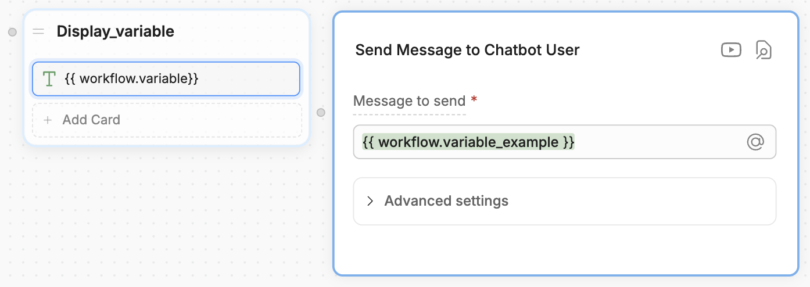

Workflow variables let you store and reuse information within the scope of **a single [Workflow](/learn/reference/workflows)**. They're great for:

- Storing an AI task's output
- Saving and reusing user input
- Organizing data returned from an API call

<Note>
Workflow variables are only accessible in the Workflow they were created in. If you need a variable to be accessible in multiple Workflows, use a different [variable scope](/learn/reference/variables/overview#variable-scopes).
</Note>

<Tip>
    Need help getting started with variables? Check out our [introduction to variables](/learn/reference/variables/overview).
</Tip>

## Read a Workflow variable

You can use `{{workflow.variablename}}` or `@workflow.variablename` to read a Workflow variable. For example, in a **Text** Card:

<Frame>

</Frame>
