<Icon icon="workflow"/> Workflows, or Flows, are **sequences of steps that your bot takes**:

<Frame>
  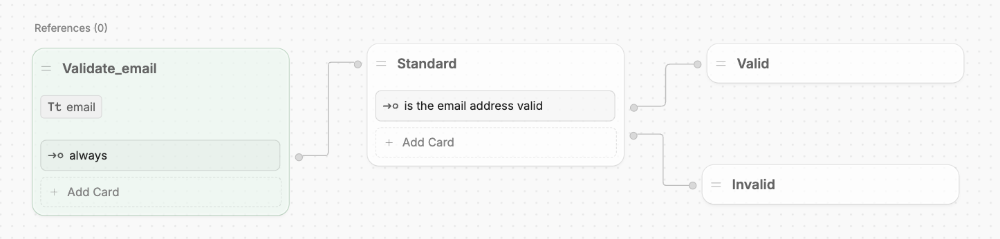
  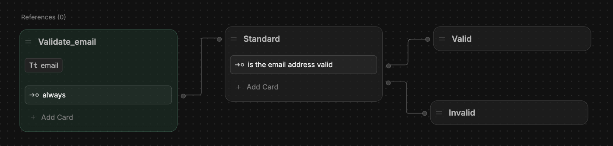
</Frame>

Each Workflow represents a reusable, customizable section of your bot's logic. You can use them to organize your bot's behaviour. For example, you might want to:

- Greet users and offer assistance
- Validate a user response
- Collect personal data before checking out

Instead of having the logic for each of these tasks in one big sequence, you can put each one in its own Workflow. Then, just [transition](#transition-to-a-workflow) to whichever Workflow you need.

---

## Overview

Workflows are made up of [Nodes](/learn/reference/nodes/) that determine their behaviour. You can modify the Nodes within a Workflow by dragging and dropping them.

Every Workflow you create has at least two Nodes:

- An **Entry Node** that executes whenever you transition to the Workflow
- An **Exit Node** which exits the current Workflow and returns to its parent Workflow

You can put any amount of Nodes in between these two — they'll execute in order when you transition to the Workflow.

<Note>
  You can [pass data between Workflows](/learn/reference/variables/pass-between-workflows) — check out the [variables](/learn/reference/variables/) section for more information.
</Note>

---

## Built-in Workflows

Every bot comes with a few built-in Workflows to handle specific situations gracefully:

<Frame>
  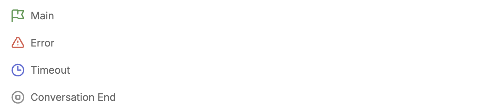
  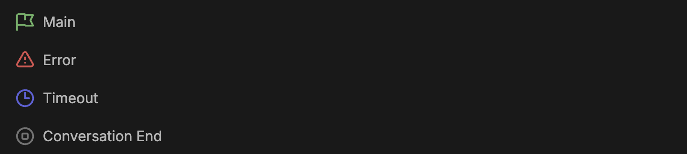
</Frame>

You can modify the contents of each one to suit your needs. Here's a breakdown of each default Workflow.

### Main

The Main Workflow is the entry point for every conversation with your bot. It executes every time a new conversation begins:

<Frame>
  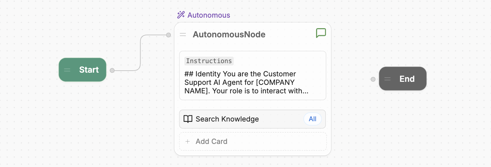
  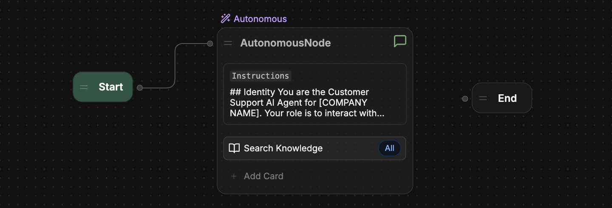
</Frame>

Unlike custom Workflows, the Main Workflow always contains:

- A **Start Node** that starts the conversation
- An **End Node** that ends the conversation

### Error

The Error Workflow executes when there's an unexpected error in one of your other Workflows. You can use it to inform the user that something went wrong:

<Frame>
  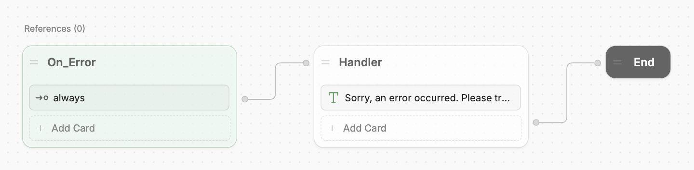
  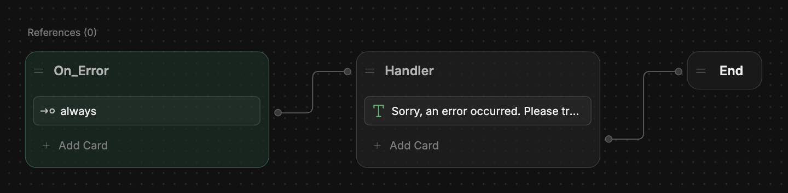
</Frame>

Instead of an **Exit** Node, the Error Workflow contains an **End** Node. This ensures that the conversation ends after the error occurs.

### Timeout

The Timeout Workflow executes after a period of prolonged inactivity from the user. You can use it to inform the user that the conversation timed out:

<Frame>
  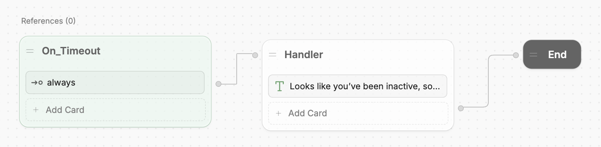
  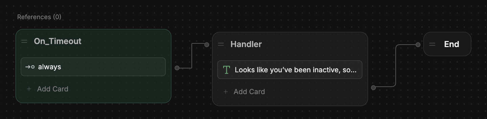
</Frame>

Instead of an **Exit** Node, the Timeout Workflow contains an **End** Node. This ensures that the conversation ends after the timeout occurs.

<Tip>
  You can set a custom timeout delay in your [Bot Settings](/learn/reference/chatbot-settings).
</Tip>

### Conversation End

The Conversation End Workflow executes right before the conversation ends explicitly. You can use it to summarize the conversation before it ends, or offer follow-up actions:

<Frame>
  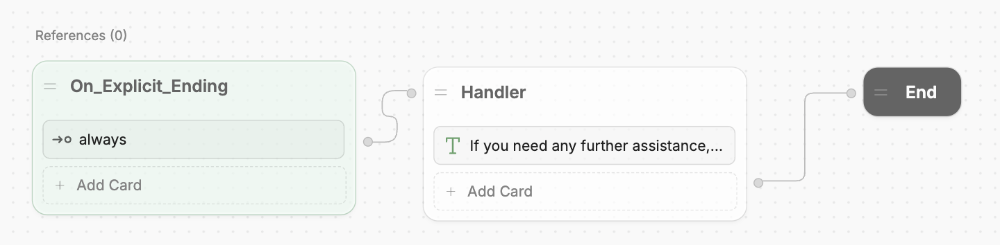
  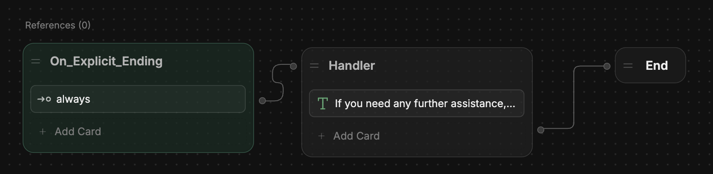
</Frame>

Instead of an **Exit** Node, the **Conversation End** Workflow contains an **End** Node. This ensures that the conversation ends after the Workflow executes.

<Note>
  The **Conversation End** Workflow only executes before the conversation ends explicitly — that is, when a Workflow transitions to an [End Node](/learn/reference/nodes/introduction#end-node).

  Since Autonomous Nodes don't transition to an End Node when the user ends the conversation, they won't transition to the Conversation End Workflow by default.
</Note>

---

## Add a Workflow

To add a new Workflow, navigate to the **Workflows** menu in Studio:

  <Frame>
    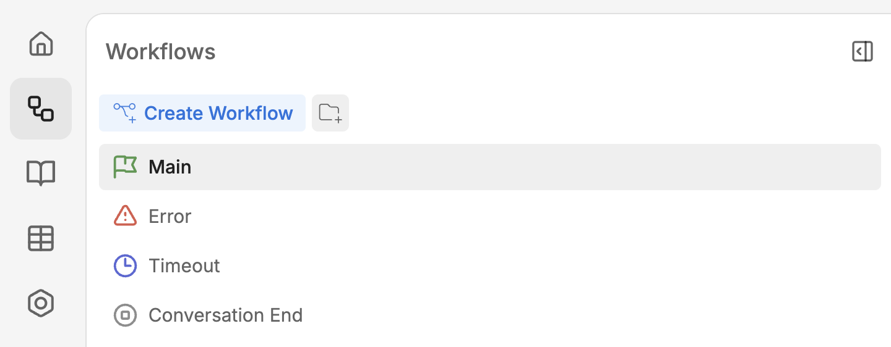
    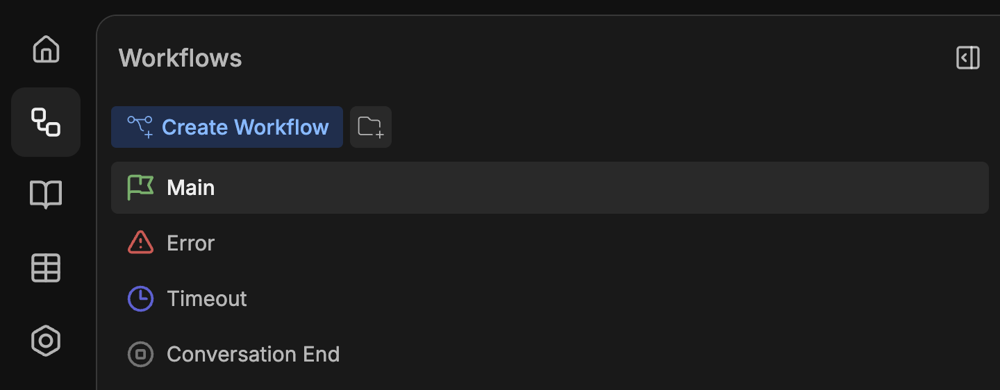
  </Frame>

Then, select **Create Workflow** and enter a name for the new Workflow:

<Frame>
  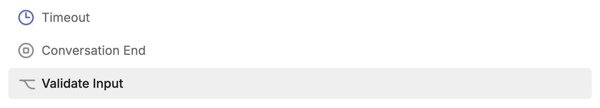
  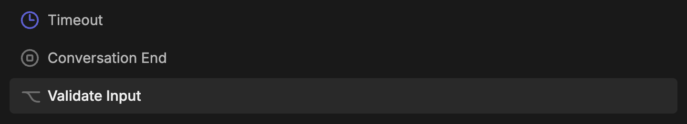
</Frame>

### From Botpress Hub

You can also browse [Botpress Hub](/integrations/get-started/botpress-hub) for user-uploaded Workflows and add them to your bot. Just filter by Workflow to see all available Workflows:

<Frame>
  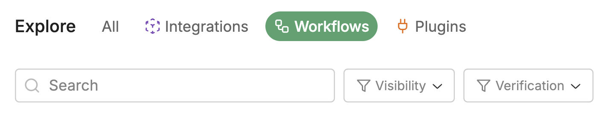
  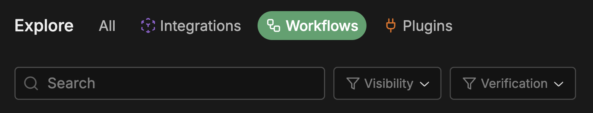
</Frame>

To add any Workflow, select it, then select **Install Workflow**.

<Tip>
    To edit a Workflow you installed from Botpress Hub, you need to make a copy of it within your bot. After installing, select **Make a copy and Edit** — the Workflow will then open in Studio.
</Tip>

---

## Transition to a Workflow

Any Workflows you add are available as a [Card](/learn/reference/cards/) from the **Flow Logic** section of the Card tray:

<Frame>
  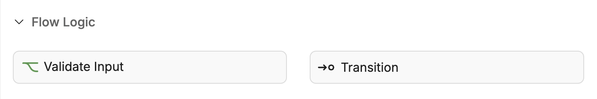
  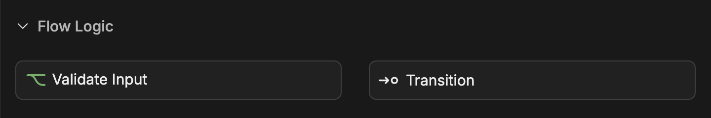
</Frame>

To transition to a new Workflow, just add it to the Node you want to transition from:

<Frame>
  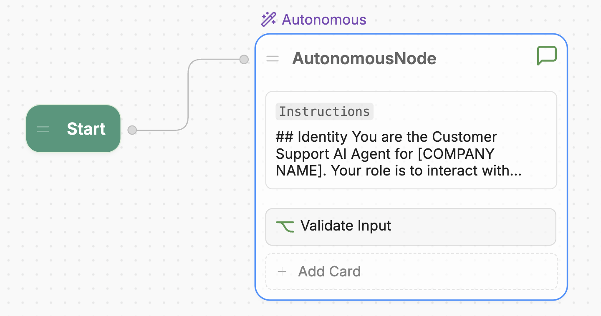
  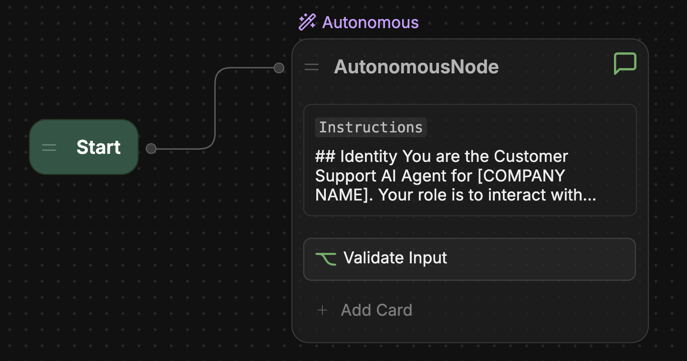
</Frame>

---

## Group Workflows in folders

You can group Workflows into folders to keep them organized:

<Frame>
  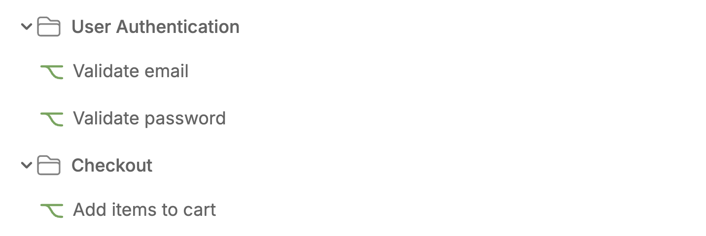
  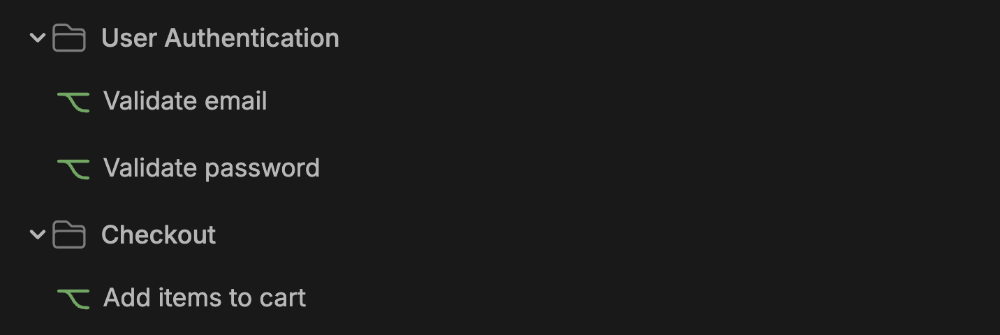
</Frame>

Just select **Add Folder** in the Workflows menu to create a new folder. Then, you can drag any Workflows (or sub-folders) you want into the folder.

---

## Share a Workflow

You can share any Workflow you create on [Botpress Hub](/integrations/get-started/botpress-hub) to make it available to other users. Just select **Share Workflow** <Icon icon="external-link"/> in the upper-right corner of the Workflow and fill out the required fields.