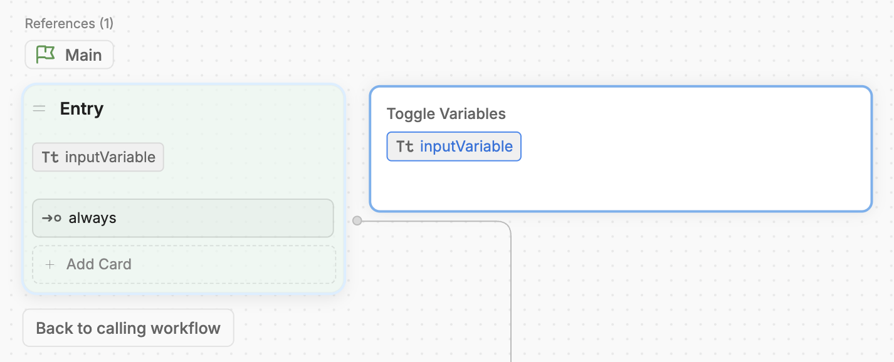
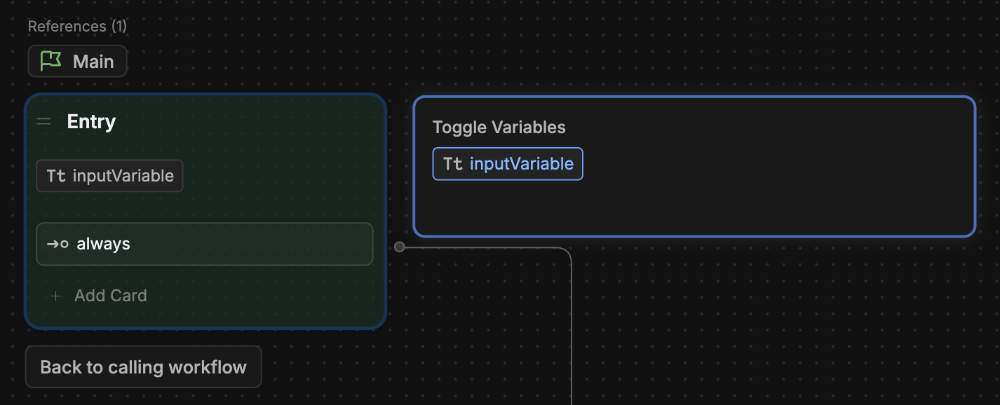
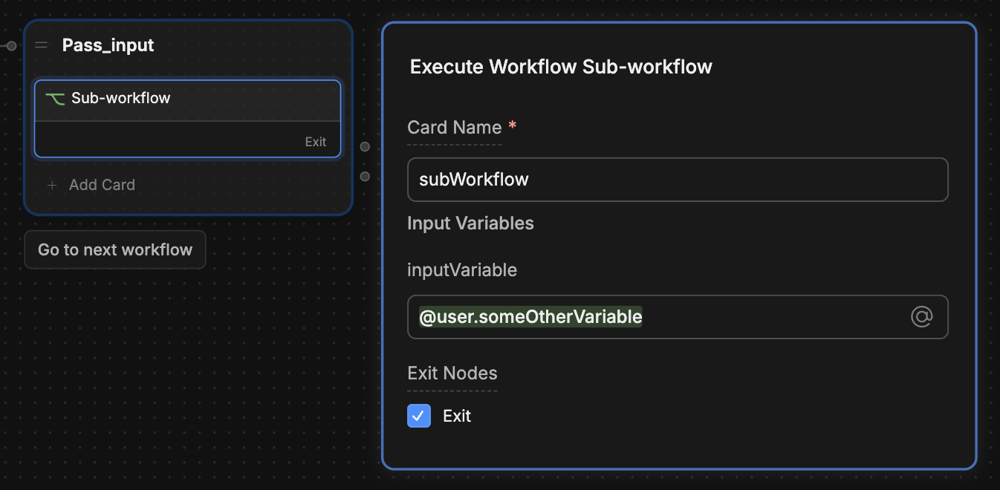
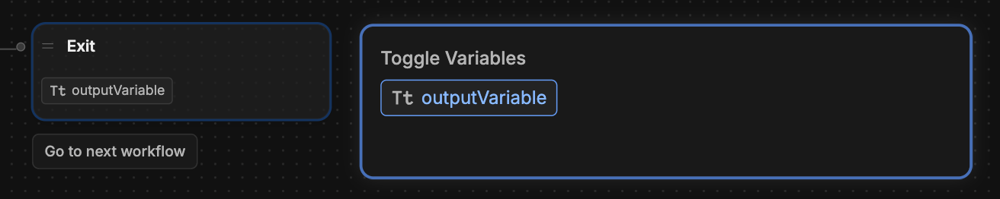
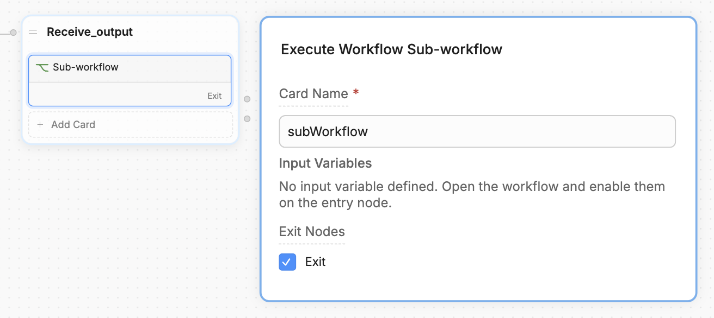
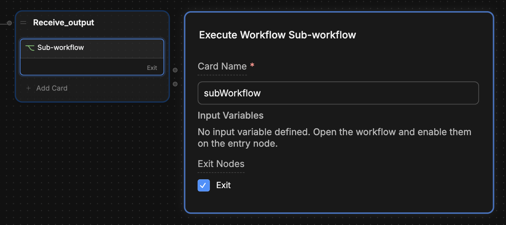

You can pass variables between Workflows. This is useful if you want to use a previously created variable within the scope of a single Workflow. For example:

- You want to collect user information in one Workflow, then validate it in a sub-Workflow.
- You have a Workflow that stores items in a virtual shopping cart, and you want to process payment for those items in a sub-Workflow.
- You have some condition in one Workflow, and you want a sub-Workflow to behave differently based on that condition.

## From a parent Workflow to a sub-Workflow

<Steps titleSize="h3">
  <Step title="Setup your input variable">
    1. In your sub-Workflow (the one you want to pass the variable to), [create a new Workflow variable](/studio/concepts/variables/overview/#create-a-variable).

    <Note>
      You can pass any kind of variable from your parent Workflow, but your sub-Workflow needs to treat it as a Workflow variable.
    </Note>

    2. Select your sub-Workflow's [Entry Node](/studio/concepts/nodes/introduction#entry-node).
    3. Under **Toggle Variables**, select the variable you just created:
    
    <Frame>
      
      
    </Frame>

    This tells the parent Workflow that your sub-Workflow is expecting some input.
  </Step>
  <Step title="Pass the variable to the sub-Workflow">
    In your parent Workflow, select the Card that transitions to the sub-Workflow. It should display the input variable you just created:

    <Frame>
      
      
    </Frame>

    You can manually enter a value to pass to the sub-Workflow, or use a previously created variable from your parent Workflow.

    <Check>
    Now, whatever value you pass from your parent Workflow will be available in your sub-Workflow as a Workflow variable.
    </Check>
  </Step>
</Steps>

## From a sub-Workflow to a parent Workflow

<Steps titleSize="h3">
  <Step title="Pass your output variable">
    1. Select your sub-Workflow's [Exit Node](/studio/concepts/nodes/introduction/#exit-node).
    2. Under **Toggle Variables**, select the variable you want to pass:

    <Frame>
      
      
    </Frame>

    This tells the parent Workflow to expect some output from the sub-Workflow.

    <Note>
      You can only pass Workflow variables from a sub-Workflow to a parent Workflow.
    </Note>
    
  </Step>
  <Step title="Configure the sub-Workflow Card">
    1. In the parent Workflow, select the Card that transitions to the sub-Workflow:

    <Frame>
      
      
    </Frame>

    2. Make sure the **Exit Nodes** option is selected.
  </Step>
  <Step title="Read the output variable in the parent Workflow">
    To access the sub-Workflow's output variable from within the parent Workflow, read:
    
    `workflow.<cardName>.<variableName>`

    <Frame>
      
      
    </Frame>

    <Check>
      Your parent Workflow now has access to its sub-Workflow's variable.
    </Check>
  </Step>
</Steps>