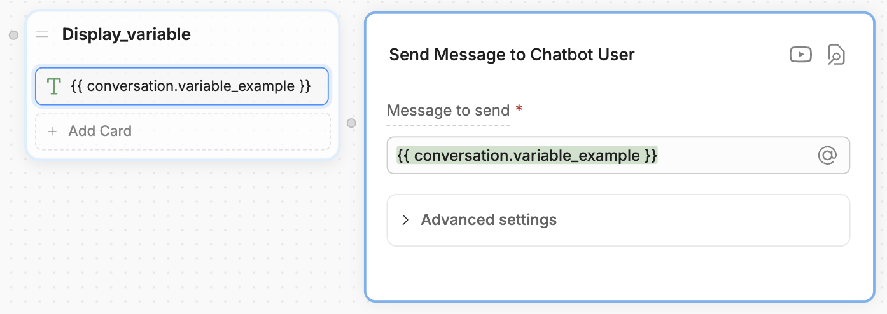

Conversation variables let you store and reuse information within the scope of **a single conversation**.

This makes them great for storing information that's only relevant to the current conversation, but that you need to access in multiple Workflows. For example:

- Items in a virtual shopping cart
- Conversation-specific preferences
- A checklist to track the completion of sub-Workflows

<Note>
Information stored in conversation variables is deleted when the current conversation is over. If you need a variable to persist across multiple conversations, use a different [variable scope](/studio/concepts/variables/overview#variable-scopes).
</Note>

<Tip>
    Need help getting started with variables? Check out our [introduction to variables](/studio/concepts/variables/overview).
</Tip>

## Read a conversation variable

You can use `{{conversation.variablename}}` or `@conversation.variablename` to read a conversation variable. For example, in a **Text** Card:

<Frame>

</Frame>