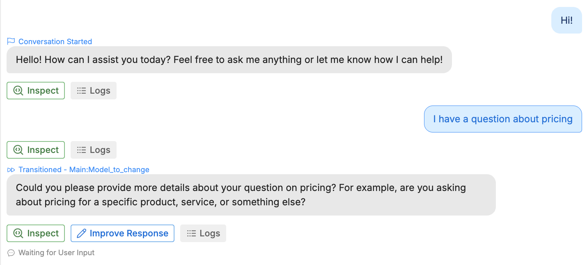
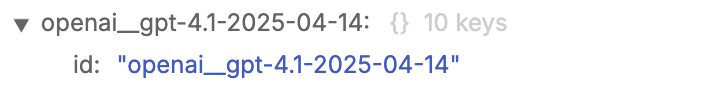
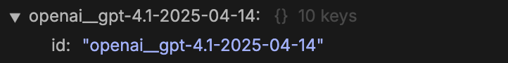
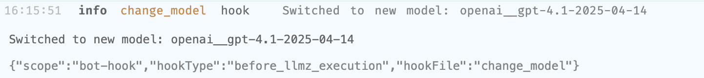

<Warning>
  You can now [override default LLMs directly in your Autonomous Node's settings](/studio/concepts/nodes/autonomous-node#override-default-models).

  This method is simpler and recommended for most use cases. The guide below remains available for advanced use cases.
</Warning>

You can configure [Autonomous Nodes](/studio/concepts/nodes/autonomous-node) to use a different LLM than the default model specified in your [Bot Settings](/studio/concepts/bot-settings#autonomous-language-model). This is useful if your bot needs a higher-performing model for certain tasks.

<Info>
  You will need:

  - A [published bot](/get-started/quick-start)
  - A [Workflow](/studio/concepts/workflows) containing more than one Autonomous Node
  - Familiarity with JavaScript
</Info>

## Step 1: Find the Node, Workflow and model IDs

First, you need to find:

- The ID of the Autonomous Node whose model you want to change
- The ID of the Workflow containing that Autonomous Node
- The ID of the model you want to change to

### Node and Workflow IDs

1. Start a conversation with your bot in the [Emulator](/studio/concepts/emulator).
2. Continue until the bot transitions to the Autonomous Node whose model you want to change:

<Frame>
  
  
</Frame>

3. Select one of your messages from after the bot transitioned to the new Autonomous Node. Then, open the [JSON tab](/studio/concepts/debugger-logs-json#json) in the bottom panel.
4. Under **Payload**, navigate to `state > context`:

<Frame>
  
  
</Frame>

5. Copy the values of `currentFlow` and `currentNode`—these are your Workflow's ID and Autonomous Node's ID.

### Model ID

1. Return to your conversation in the Emulator.
2. Select **<Icon icon="search-code"/> Inspect** on any message generated by the Autonomous Node whose model you want to change.
3. Select **View Raw <Icon icon="braces"/>** in the upper-right corner.
4. Navigate to `context > options > models`.
5. Find the model you want to switch to. Expand it, then copy its full `id`. For example, for GPT-4.1:

<Frame>
  
  
</Frame>

## Step 2: Add a Hook to change models

1. In the Studio, navigate to the <Icon icon="anchor"/> [Hooks](/studio/concepts/hooks) section.
2. Select **Create Hook** and set its type to [Before LLMz Execution](/studio/concepts/hooks#before-llmz-execution).
3. Paste the following code into the Hook:

```js highlight={6-7, 15}
// Get the current Workflow and Node IDs
const flowID = event?.state?.context?.currentFlow ?? ''
const nodeID = event?.state?.context?.currentNode ?? ''

// Check if they match the ones we're targeting
const flowMatches = (flowID.includes('yourWorkflowID')) // Replace with your own
const nodeMatches = (nodeID.includes('yourNodeID')) // Replace with your own

console.log('Current model: ', context.model)
console.log('Current Workflow: ', flowID.toUpperCase())
console.log('Current Node: ', nodeID.toUpperCase())

// Switch models if they match
if (flowMatches && nodeMatches) {
  context.model = 'yourModelChoice' // Replace with your desired model
  console.log('Switched to ', context.model)
}
```
  - Replace `yourWorkflowID` and `yourNodeID` with [your actual IDs](#node-and-workflow-ids).
  - Replace `yourModelChoice` with the [actual model ID](#model-id).

<Check>
  Now, this Autonomous Node will use a different model than the default model specified in your [Bot Settings](/studio/concepts/bot-settings#autonomous-language-model).
</Check>

## Troubleshooting

Here are some troubleshooting tips:

### State is undefined

If the `state` property from [Step 1](#node-and-workflow-ids) is `undefined`, make sure you're viewing your own message's logs—not the Autonomous Node's.

### Check if IDs matched

You can check if the Node and Workflow IDs matched by checking your bot's [logs](/studio/concepts/debugger-logs-json) after transitioning to the Autonomous Node in the Emulator:

<Frame>
  
  
</Frame>

### Check if model actually changed

To check if the model actually changed:

1. Select **<Icon icon="search-code"/> Inspect** on any response from the target Autonomous Node.
2. Select **View Raw <Icon icon="braces"/>** in the upper-right corner.
3. Navigate to `context > options > model`. This will display model the Autonomous Node used for the response.
