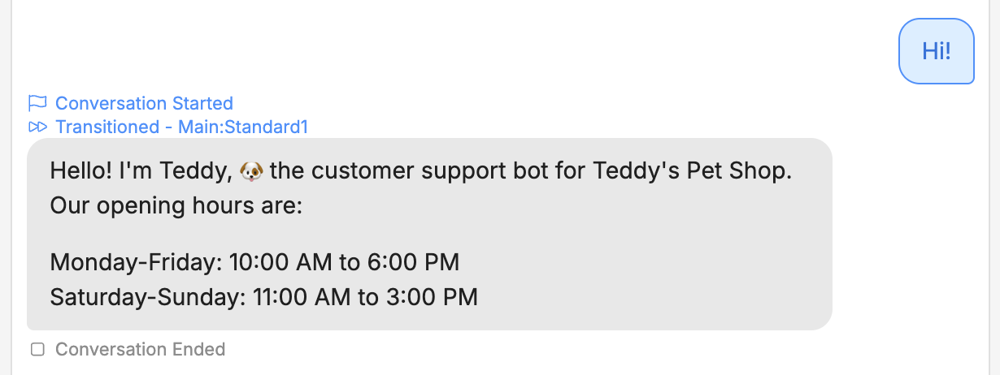

An empty Node isn't very interesting. To make it do something, we can add a *Card*—an individual task your bot performs within a Node.

Since customers tend to ask about opening hours, let's add a Card that displays them as soon as the conversation starts:

1. In the new Node, select **+ Add Card**.
2. Under **Send Messages**, select **Text**.

<Frame>
  
  
</Frame>

Notice that adding a Card opens the **Inspector** on the right side of the Studio:

<Frame>
  
  
</Frame>

Let's add our greeting. In the **Message to send** field, paste the following:

```txt wrap
Hello! I'm Teddy, 🐶 the customer support bot for Teddy's Pet Shop. Our opening hours are:

Monday-Friday: 10:00 AM to 6:00 PM
Saturday-Sunday: 11:00 AM to 3:00 PM
```

Now we can test it out. Switch back to the **Emulator** and select **Test your bot**:

<Frame>
  
  
</Frame>

Nice! The bot now displays a custom greeting with the opening hours.
