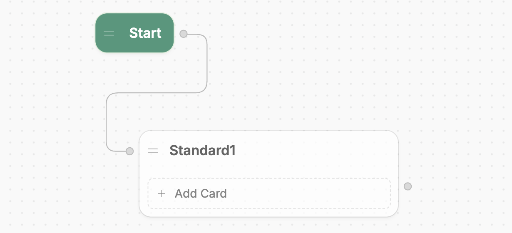
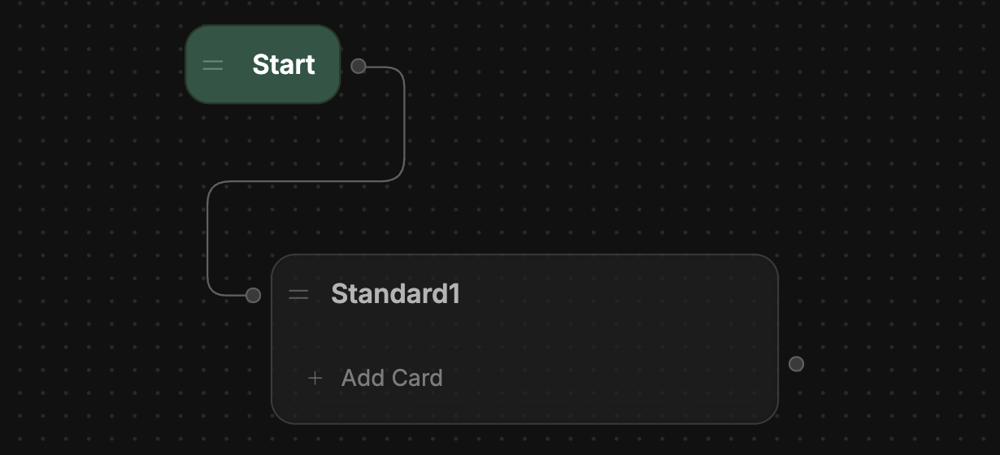

import { GoodToKnow } from '/snippets/tutorial/good-to-know.mdx'

Let's create a new Node and add a step to our bot's logic:

1. Select and hold the right edge of the Start Node.
2. Drag outwards to create a new transition.
3. Release anywhere on the canvas. You'll see a list of Node types to choose from—select **Standard Node**.

You just created a new Node! Notice that because you dragged out from the edge of the Start Node, it automatically transitioned to the new Node:

<Frame>
  
  
</Frame>

Standard Nodes, unlike Autonomous Nodes, don't use AI by default. This makes them great for hard-coding behaviour into your bot.

<GoodToKnow>
You can drag-and-drop Nodes anywhere in your Workflow. This doesn’t affect your bot’s behavior—it just helps keep your Workflow organized.
</GoodToKnow>
