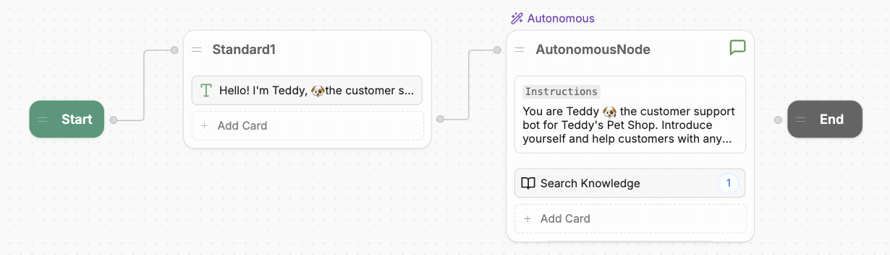
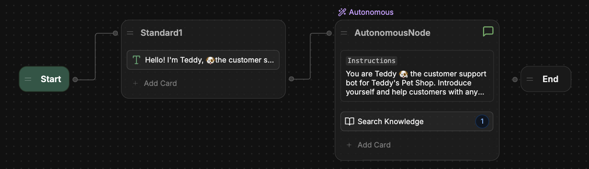
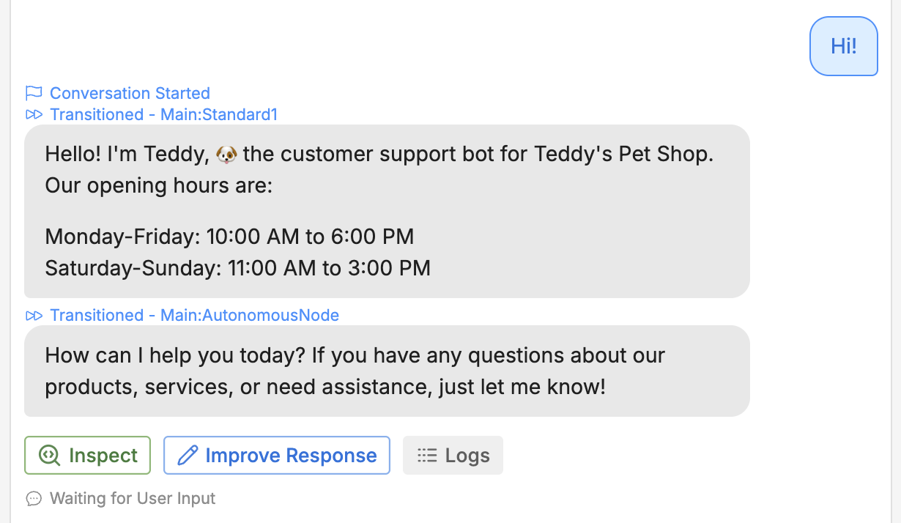
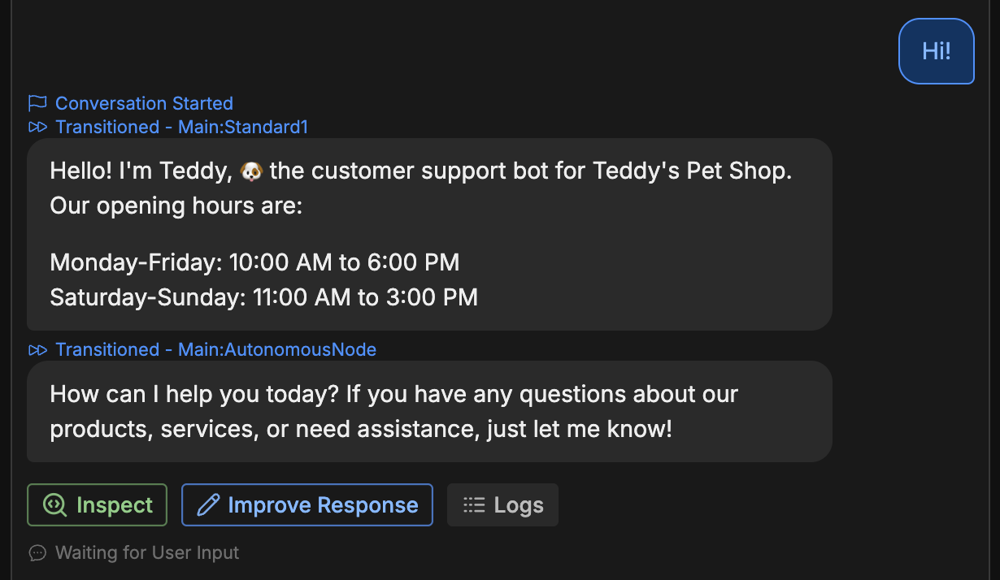

import { GoodToKnow } from '/snippets/tutorial/good-to-know.mdx'

Having a custom greeting is great, but we still want the bot to respond with AI after displaying it. Let's connect the Standard Node to the Autonomous Node:

<Frame>
  
  
</Frame>

Now, when you test in the Emulator, your bot begins the conversation with your hard-coded message. Then, the Autonomous Node takes the wheel for any further responses:

<Frame>
  
  
</Frame>

You can use any combination of Standard Nodes and Autonomous Nodes to customize your bot's behaviour.

<GoodToKnow>

  **Why can't I transition from an Autonomous Node?**

  You may have noticed that the Autonomous Node doesn't have a right edge, meaning you can't transition from an Autonomous Node to another Node.

  This is intentional—since the Autonomous Node uses AI to generate responses in a loop, it needs a different approach for transitioning out of that loop. We'll cover this in a later section, so don't worry about it for now.
</GoodToKnow>
