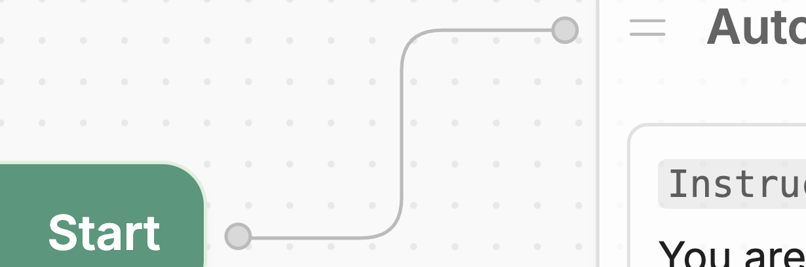
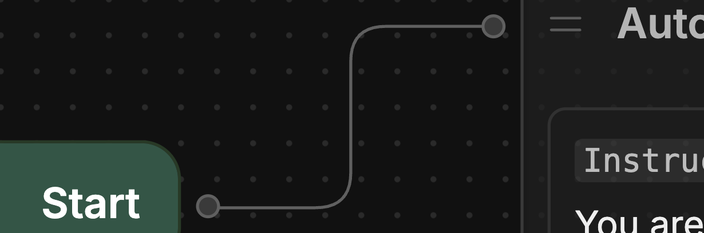

import { GoodToKnow } from '/snippets/tutorial/good-to-know.mdx'

So far, we've only had our bot generate responses using AI. In practice, though, you might run into situations where you want your bot to perform some hard-coded logic.

In Studio, you can do this using *Workflows*. A Workflow is a drag-and-drop canvas that represents the steps your bot follows during a conversation with a user.

## Nodes

Each step in a Workflow is represented by a *Node*. Let's open the Main Workflow and take a look at its Nodes:

1. Go to the **<Icon icon="workflow"/> Workflows** section in the left sidebar.
2. Select your **Main** Workflow. It should look something like this:

<Frame>
  
  
</Frame>

The Main Workflow contains the main logic for your bot—it executes as soon as a user starts a new conversation. By default, it contains:

- A *Start Node*, which starts the conversation
- An *Autonomous Node*, which generates AI responses
- An *End Node*, which ends the conversation

<GoodToKnow>
  You may have noticed the Autonomous Node has an **Instructions** field with the same instructions we provided earlier. This is no coincidence! The settings on Studio's home screen are shortcuts to configure the Autonomous Node.
</GoodToKnow>

## Transitions

Notice the path connecting the Start Node and the Autonomous Node:

<Frame>
  
  
</Frame>

This is a *transition*. It tells your bot:

> "When the conversation starts, go directly to the Autonomous Node."
