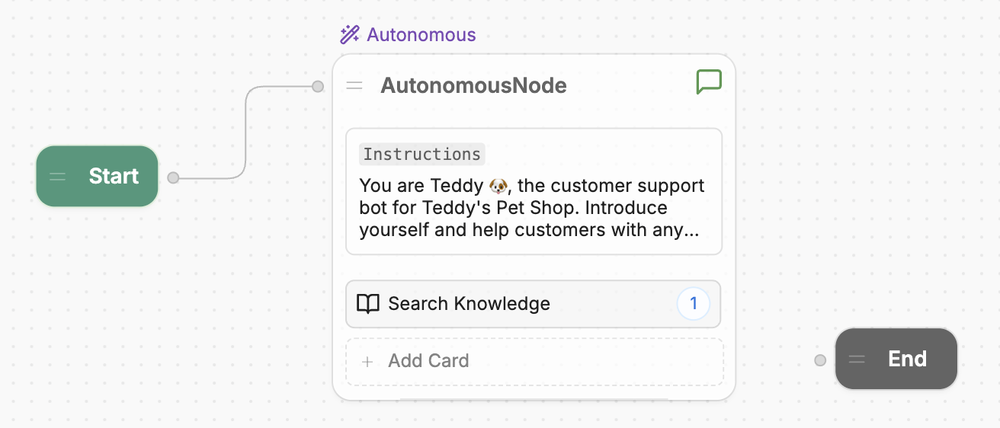

So far, we've only had our bot generate responses using AI. In practice, though, you'll probably want your bot to perform hard-coded logic in certain situations.

In Studio, you can do this using *Workflows*. A Workflow is a drag-and-drop canvas that represents the steps your bot follows during a conversation with a user.

## Main Workflow

Let's open a Workflow to get a better sense of how they work:

1. Go to the **<Icon icon="workflow"/> Workflows** section in the left sidebar.
2. Select your **Main** Workflow. It should look something like this:

<Frame>
  
  
</Frame>

The **Main** Workflow contains the main logic for your bot—it executes as soon as a user starts a new conversation. By default, the **Main** Workflow contains:

- A **Start Node**
- An **Autonomous Node**
- An **End Node**
