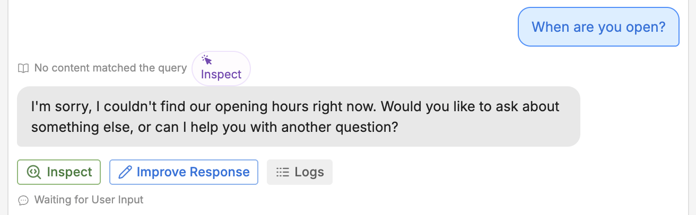
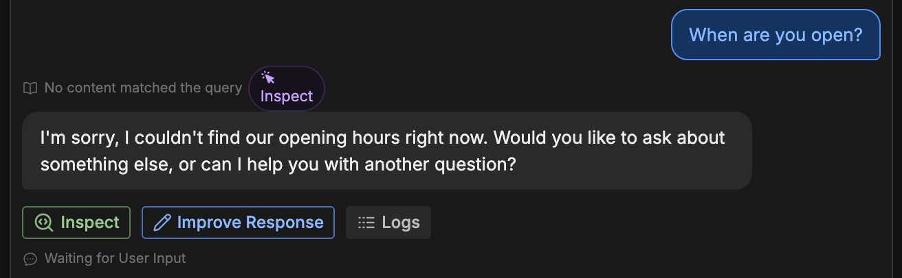
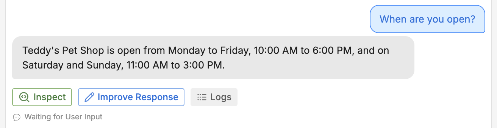
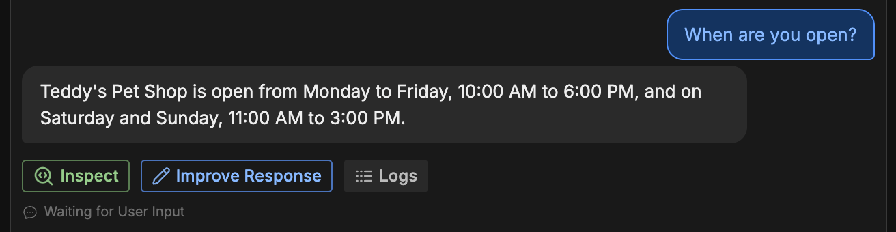

Now that our bot has a custom prompt, let's try asking it a question:

<Frame>
  
  
</Frame>

That's not very helpful. The bot couldn't answer the question because we haven't given it the store's opening hours. Let's add them:

1. Under **<Icon icon="book-open"/> Knowledge Bases**, select **Rich Text**.
2. Select the newly created rich text file.

This opens a blank text field. Copy and paste in the following text:

```txt wrap
Monday-Friday: 10:00 AM to 6:00 PM
Saturday-Sunday: 11:00 AM to 3:00 PM
```

Now, let's try that same question again in the emulator:

<Frame>
  
  
</Frame>

Much better! The bot was able to answer the question correctly.
