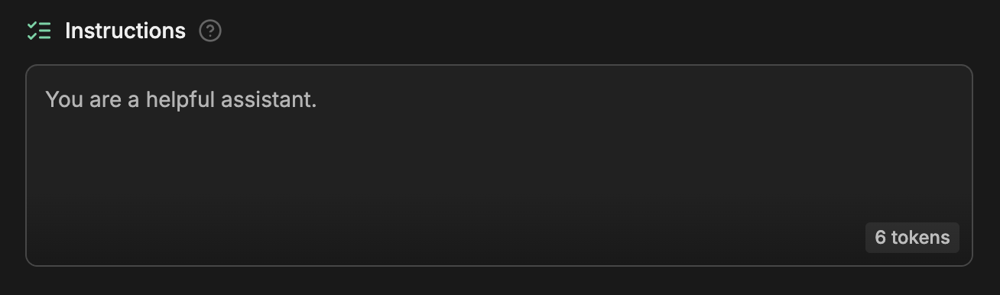
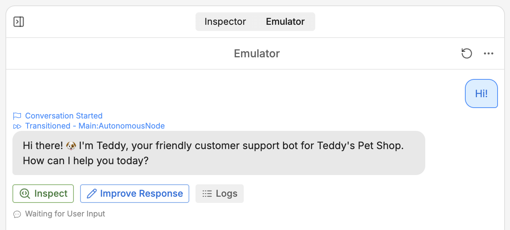
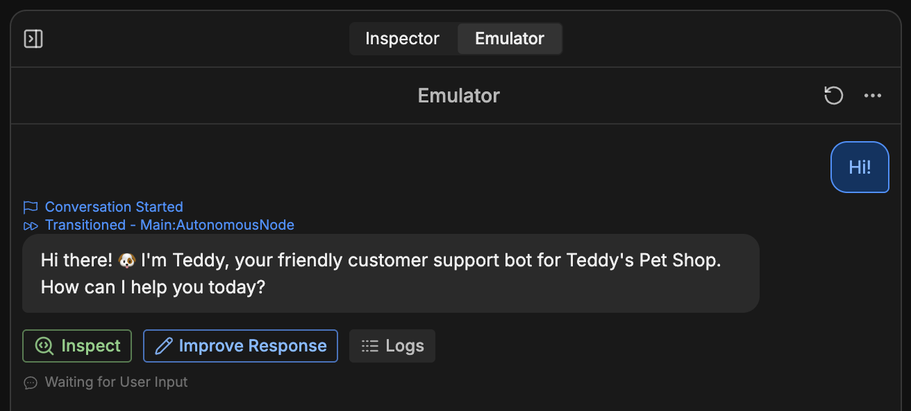

In Botpress, an AI agent is a bot that follows a *prompt* (instructions) to respond to users.

You can view your bot's prompt in Studio. After skipping the initial setup, select **Edit in Studio**. This opens Studio in a new tab—you'll see the prompt under **<Icon icon="list-checks"/> Instructions** at the top of the page. It should look something like this:

<Frame>
  
  
</Frame>

## Write a custom prompt

This isn't a very useful prompt by itself, so let's write a better one. Erase everything in the **Instructions** section, then copy and paste in the following prompt:

```txt wrap
You are Teddy 🐶, the customer support bot for Teddy's Pet Shop. Introduce yourself and help customers with any questions.
```

We can test this new prompt using the Emulator on the right side of the Studio. To start a conversation, just select **Test your bot**, or type a message into the text field:

<Frame>
  
  
</Frame>

Nice! The bot followed our instructions.
