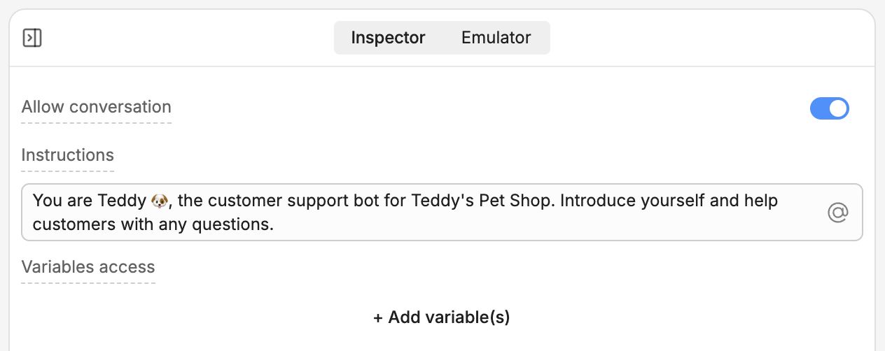
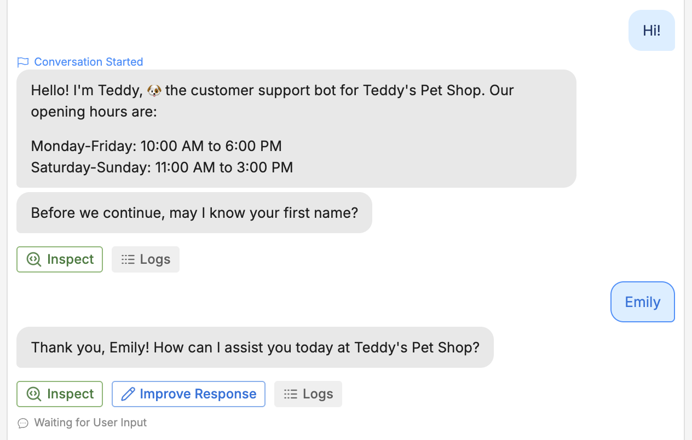

import { GoodToKnow } from '/snippets/tutorial/good-to-know.mdx'

A newly-created variable is like an empty box—you need put something inside it before you can use it. This is called *assigning a value* to your variable.

Let's use our `firstName` variable to remember the user's first name. Go back to the Main Workflow and select your Autonomous Node. This opens its inspector:

<Frame>
  
  
</Frame>

## Giving access to variables

By default, the Autonomous Node can't check what's in a variable or assign it a different value.

Let's give it access. Select **+ Add variable(s)**, then select `workflow.firstName`. Then, check **Allow write access**, so your bot has permission to modify the variable.

<Frame>
  
  
</Frame>

## Modifying your prompt

Next, modify the prompt so your bot knows how to work with the variable. Erase everything in the **Instructions** field, then paste the following:

```txt wrap
You are Teddy 🐶, the customer support bot for Teddy's Pet Shop.

If the `firstName` variable has a value, use it to address the user by name. If not, prompt the user to enter their name, then assign it to `firstName`.
```

Now, switch back to the Emulator and start a conversation with your bot:

<Frame>
  
  
</Frame>

Nice! Our modified prompt worked. If you look back at the Variables section, you can see that the value updated:

<Frame>
  
  
</Frame>
