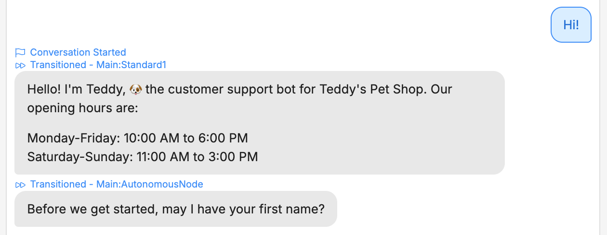
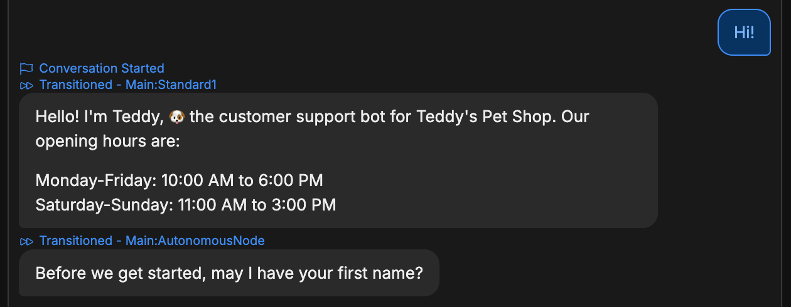
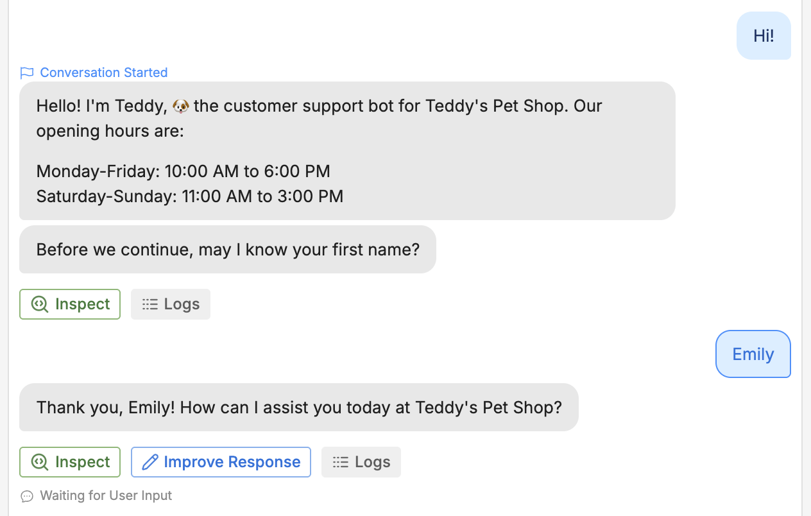
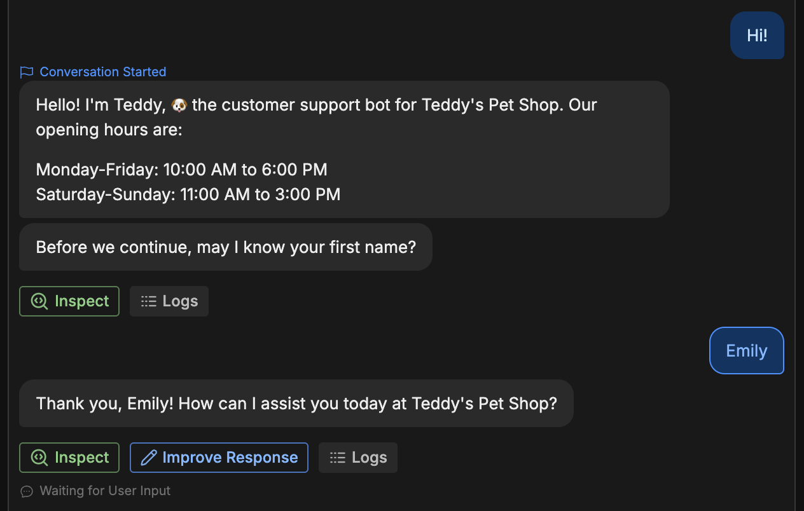
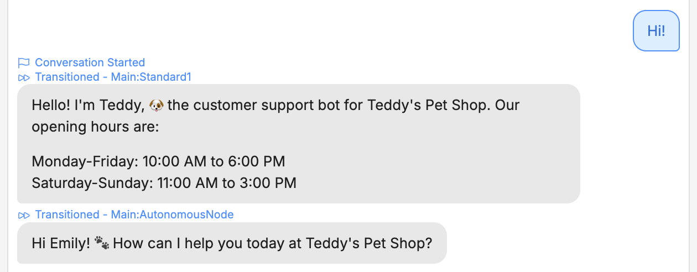
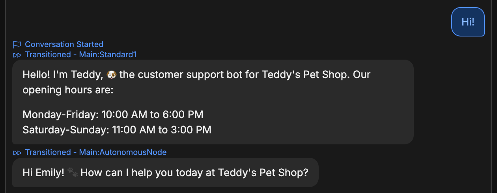
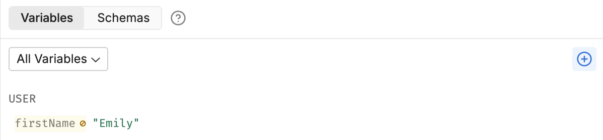
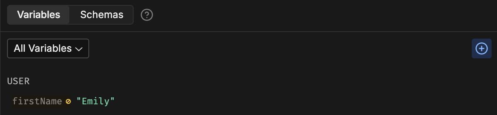

import { GoodToKnow } from '/snippets/tutorial/good-to-know.mdx'

Every variable has a *scope* that determines where and when your bot can access it.

Try restarting the conversation. Select **<Icon icon="rotate-ccw"/>** in the Emulator, then send a message:

<Frame>
  
  
</Frame>

That's not ideal—the bot asked for our name again, even though we already told it in a previous conversation.

This is because `firstName` is a *Workflow* variable—it keeps the same value for the current Workflow, then resets when the Workflow is done its execution. Since each new conversation re-executes the Main Workflow, the value resets every time.

<GoodToKnow>
Newly-created variables have the Workflow scope by default.
</GoodToKnow>

## Changing a variable's scope

Let's change `firstName` to a *User* variable:

1. In the Variables section, hover over `firstName` and select **<Icon icon="pen"/>** to edit it.
2. In the **Scope** drop-down, switch from **Workflow** to **User**.
3. Select **Save**.

Now, go back to the Emulator and repeat the process. Start one conversation and tell it your name:

<Frame>
  
  
</Frame>

Then, select **<Icon icon="rotate-ccw"/>** to restart the conversation and send a message:

<Frame>
  
  
</Frame>

Much better! The bot remembered the name from our previous conversation. Notice that in the Variables section, the value stayed the same:

<Frame>
  
  
</Frame>
