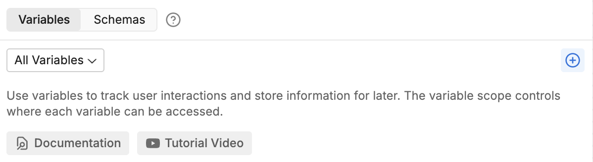
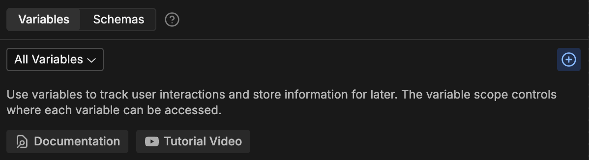
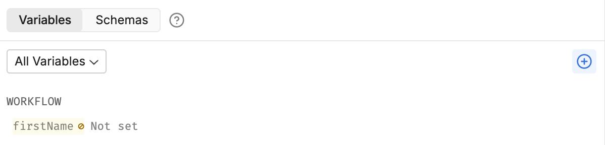

Sometimes, it's useful for your bot to remember some information—for example, about a specific user or conversation.

You can do this using *variables*. A variable is a container that lets you store information from somewhere in Botpress Studio and reuse it somewhere else.

Create a new variable in the bottom-left section of the Studio:

<Frame>
  
  
</Frame>

1. Select **<Icon icon='plus'/>** in the upper-right corner.
2. In the name field, enter `firstName`.
3. Select **Add** to save your variable:

<Frame>
  
  
</Frame>
