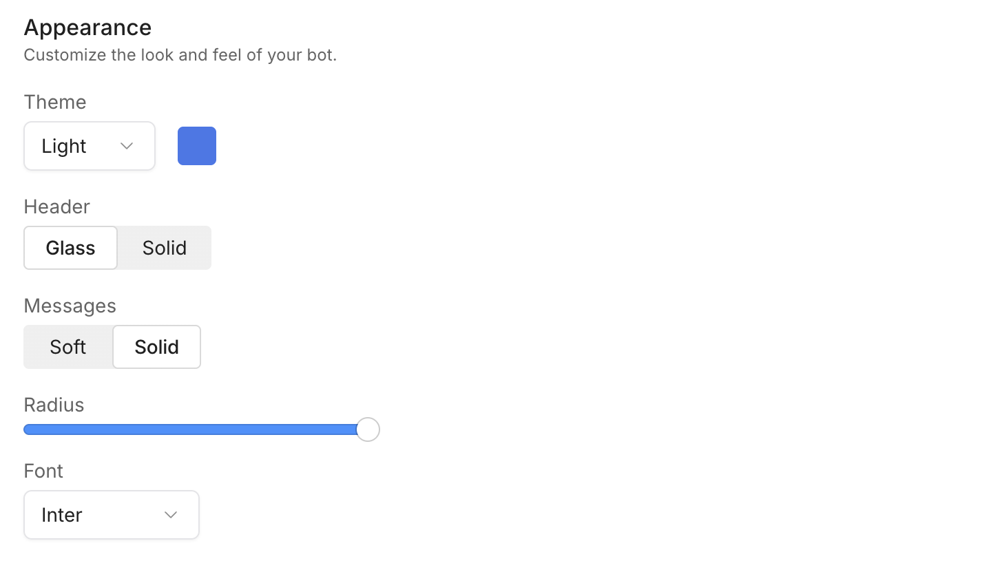
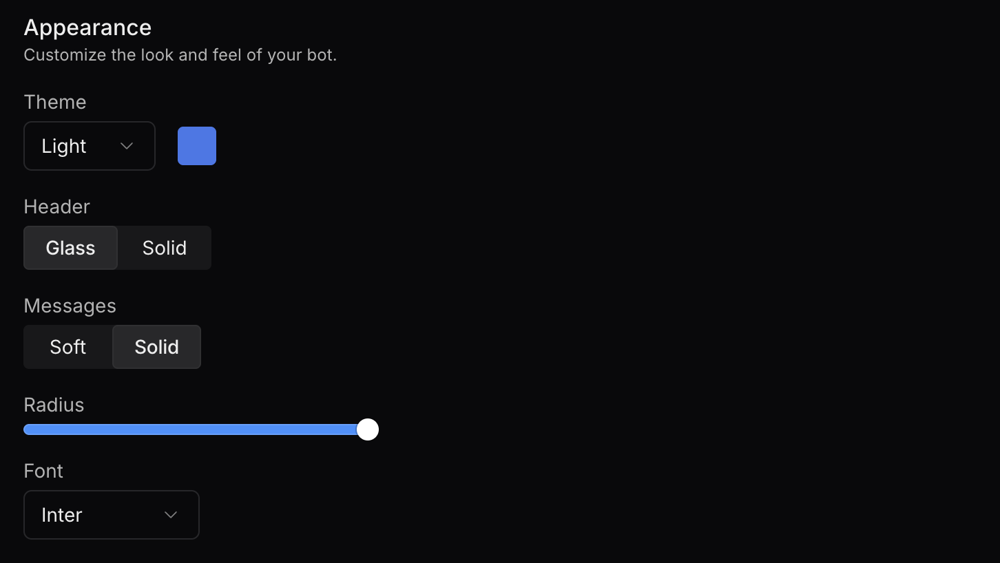

<Info>
    You will need:
    - A [published bot](/learn/get-started/quick-start/)
    - Familiarity with CSS (if you want to use custom styles)
</Info>

## General configuration

You can configure your bot in the Dashboard:

1. Navigate to the [Dashboard](/learn/get-started/dashboard/) and open your bot's Workspace.
2. In the left navigation bar, find the bot you want to style and select **Webchat**.

Here's a breakdown of each configuration section:

### About your bot

This section lets you configure general information about your bot:

- Your bot's name (defaults to `Bot`)
- Your bot's avatar (defaults to the first letter of your bot's name)
- Your bot's description (optional)
- A placeholder for your bot's composer (defaults to `Type your message...`)
- A custom footer for your bot (requires a [Plus plan](https://botpress.com/pricing))
- A custom avatar for the FAB (Floating Action Button)

### Contact

This section lets you configure optional contact information for your bot:

- Email address
- Phone number
- Website
- Terms of service
- Privacy policy

### Settings

This section lets you configure your bot's settings:

- Enable/disbable message feedback. When enabled, you can view feedback data in the [Analytics](/learn/get-started/dashboard/bot/analytics) tab
- Enable/disable user file upload
- Choose between local storage and session storage

<Note>
  #### Session storage vs. Local storage

  Session storage creates a new user and conversation each time the page is re-opened. Local storage keeps them for your next visits.

  You can [learn more about local and session storage](https://www.geeksforgeeks.org/javascript/difference-between-local-storage-session-storage-and-cookies/).
</Note>

## Style and appearance

To style your bot using the built-in Webchat styler:

1. Navigate to the [Dashboard](/learn/get-started/dashboard/) and open your bot's Workspace.
2. In the left navigation bar, find the bot you want to style and select **Webchat**.
3. Select the **Theme** tab to open the styler:

<Frame>
  
  
</Frame>

You can view your changes in the Webchat preview on the right side of the screen. Whenever you want to update the bot's configuration, select **Save Configuration** in the bottom-right corner.

<Warning>
  Styles from this section won't apply if:

    - You're [manually initializing Webchat](/webchat/get-started/embedding-webchat) by calling `window.botpress.init` in your website's source code. In this case, use the `configuration` object to configure Webchat.

    - You're using the [Webchat React library](/webchat/react-library/get-started). In this case, use the [configuration prop](/webchat/react-library/components/webchat#param-configuration) to configure Webchat.
</Warning>

## Use custom styles

If you want to customize your bot's appearance further, you can modify the built-in CSS classes:

<Accordion
  title="CSS Classes"
>
| CSS Class | Element description |
| :--- | :--- |
| `bpContainer` | Main Webchat container |
| `bpDropzoneOverlay` | Overlay shown when dragging files into the chat |
| `bpDropzoneContainer` | Container for the dropzone area during file uploads |
| `bpLoader` | Loader/spinner container for loading states |
| `bpModalOverlay` | Background overlay behind modals |
| `bpModalContainer` | Wrapper for the modal dialog |
| `bpModalTitle` | Styles the title text in modals |
| `bpModalDescription` | Styles the description text in modals |
| `bpModalContentContainer` | Container for content inside the modal |
| `bpModalContentTextArea` | Text area element inside modals |
| `bpModalButtonContainer` | Wrapper for modal action buttons |
| `bpModalButtonConfirm` | Styles the confirm button in modals |
| `bpModalButtonCancel` | Styles the cancel button in modals |
| `bpFabContainer` | Container for the floating action button |
| `bpFabIcon` | Icon inside the FAB |
| `bpFabImage` | Image inside the FAB (when using custom images) |
| `bpNotificationContainer` | Wrapper for notification messages |
| `bpNotificationTitle` | Title text in notifications |
| `bpNotificationDescription` | Description text in notifications |
| `bpNotificationIcon` | Icon displayed in notifications |
| `bpNotificationCloseIcon` | Close icon/button on notifications |
| `bpHeaderContainer` | Container for the chat header |
| `bpHeaderContentContainer` | Wrapper for header content (title, avatar, actions) |
| `bpHeaderContentTitle` | Title text in the header |
| `bpHeaderContentDescription` | Description text in the header |
| `bpHeaderContentAvatarContainer` | Container for the header avatar |
| `bpHeaderContentAvatarImage` | Styles the avatar image in the header |
| `bpHeaderContentAvatarFallback` | Fallback avatar styling if image fails |
| `bpHeaderContentActionsContainer` | Wrapper for header action icons |
| `bpHeaderContentActionsIcons` | Styles the action icons in the header |
| `bpHeaderExpandedContentContainer` | Container for expanded header content |
| `bpHeaderExpandedContentDescriptionItemsContainer` | Wrapper for description items in expanded header |
| `bpHeaderExpandedContentDescriptionItemsIcon` | Icon for each expanded header description item |
| `bpHeaderExpandedContentDescriptionItemsText` | Text for expanded header description items |
| `bpHeaderExpandedContentDescriptionItemsLink` | Link styling for expanded header description items |
| `bpHeaderExpandedContentGroup` | Grouping container for expanded header items |
| `bpHeaderNewConversationIcon` | Icon for starting a new conversation in the header |
| `bpComposerWrapper` | Wrapper around the entire composer area |
| `bpComposerContainer` | Container for the composer |
| `bpComposerFooter` | Footer area of the composer (e.g., upload/voice buttons) |
| `bpComposerInputContainer` | Container for the text input field |
| `bpComposerInput` | Text input field styling |
| `bpComposerSendButton` | Send button styling in the composer |
| `bpComposerUploadButton` | File upload button in the composer |
| `bpComposerVoiceButton` | Voice recording button in the composer |
| `bpComposerFileContainer` | Container for attached files in the composer |
| `bpComposerFileAttachement` | Wrapper for each file attachment |
| `bpComposerFileLoader` | Loader shown during file upload in composer |
| `bpComposerFileIconWrapper` | Container for the file type icon |
| `bpComposerFileIcon` | Icon representing the file type |
| `bpComposerFileMetadata` | Container for file metadata (name and type) |
| `bpComposerFileName` | Styles the file name text |
| `bpComposerFileExtension` | Styles the file extension/type text |
| `bpComposerFileRemoveIcon` | Icon/button to remove an attached file |
| `bpComposerFileErrorIcon` | Icon indicating an error with the attached file |
| `bpComposerFilePreviewImage` | Thumbnail preview image for attachments |
| `bpMessageListScrollDownButton` | Button to scroll to the latest message |
| `bpMessageListContainer` | Container for the message list |
| `bpMessageListViewport` | Viewport area for scrolling messages |
| `bpMessageListMarqueeContainer` | Container for marquee/announcement banners |
| `bpMessageListMarqueeContent` | Content area for marquee messages |
| `bpMessageListMarqueeTitle` | Title text in marquee banners |
| `bpMessageListMarqueeDescription` | Description text in marquee banners |
| `bpMessageListMarqueeAvatarContainer` | Container for avatars in marquee banners |
| `bpMessageListMarqueeAvatarImage` | Avatar image in marquee banners |
| `bpMessageListMarqueeAvatarFallback` | Fallback avatar styling in marquee banners |
| `bpMessageListHeaderMessage` | Header message block styling |
| `bpMessageContainer` | Container for individual messages |
| `bpMessageAvatarContainer` | Container for the message avatar |
| `bpMessageAvatarImage` | Styles the avatar image in messages |
| `bpMessageAvatarFallback` | Fallback styling for missing message avatars |
| `bpMessageBlocksTextHeading1` | H1 text block within messages |
| `bpMessageBlocksTextHeading2` | H2 text block within messages |
| `bpMessageBlocksTextHeading3` | H3 text block within messages |
| `bpMessageBlocksTextHeading4` | H4 text block within messages |
| `bpMessageBlocksTextUnorderedList` | Unordered list text block |
| `bpMessageBlocksTextOrderedList` | Ordered list text block |
| `bpMessageBlocksTextListItem` | List item text block |
| `bpMessageBlocksTextLink` | Hyperlink text block |
| `bpMessageBlocksTextItalic` | Italic text styling |
| `bpMessageBlocksTextBold` | Bold text styling |
| `bpMessageBlocksTextText` | Standard paragraph text block |
| `bpMessageBlocksTextImage` | Inline image block within text |
| `bpMessageBlocksTextHorizontalRule` | Horizontal rule within text |
| `bpMessageBlocksTextLineBreak` | Line break within text |
| `bpMessageBlocksTextInput` | Input field block within messages |
| `bpMessageBlocksTextCodeBlockContainer` | Container for code block elements |
| `bpMessageBlocksTextCodeBlockTitle` | Title area for code blocks |
| `bpMessageBlocksTextCodeBlockCopyIcon` | Copy-to-clipboard icon in code blocks |
| `bpMessageBlocksTextCodeBlock` | Code block styling |
| `bpMessageBlocksTextCode` | Inline code text styling |
| `bpMessageBlocksTextTableContainer` | Container for tables within messages |
| `bpMessageBlocksTextTable` | Table element styling |
| `bpMessageBlocksTextTableHeader` | Table header cell styling |
| `bpMessageBlocksTextTableData` | Table data cell styling |
| `bpMessageBlocksTextTableRow` | Table row styling |
| `bpMessageBlocksAudio` | Audio player block styling |
| `bpMessageBlocksImageImage` | Image block styling |
| `bpMessageBlocksImagePlaceholder` | Placeholder for loading images |
| `bpMessageBlocksVideo` | Video player block styling |
| `bpMessageBlocksLocationContainer` | Container for location blocks |
| `bpMessageBlocksLocationTitle` | Title text for location blocks |
| `bpMessageBlocksLocationIcon` | Icon for location blocks |
| `bpMessageBlocksFileContainer` | Container for file blocks |
| `bpMessageBlocksFileTitle` | Title text for file blocks |
| `bpMessageBlocksFileIcon` | Icon for file blocks |
| `bpMessageBlocksRow` | Row layout block within messages |
| `bpMessageBlocksColumn` | Column layout block within messages |
| `bpMessageBlocksBubble` | Chat bubble container |
| `bpMessageBlocksBubbleFeedbackContainer` | Container for bubble feedback icons |
| `bpMessageBlocksBubbleFeedbackIcon` | Feedback icon inside bubbles |
| `bpMessageBlocksCarouselContainer` | Container for carousel blocks |
| `bpMessageBlocksCarouselSlidesContainer` | Slides container within carousels |
| `bpMessageBlocksCarouselBackButton` | Back button in carousel blocks |
| `bpMessageBlocksCarouselNextButton` | Next button in carousel blocks |
| `bpMessageBlocksDropdownButtonContainer` | Dropdown button container |
| `bpMessageBlocksDropdownButtonText` | Text inside dropdown buttons |
| `bpMessageBlocksDropdownButtonIcon` | Icon inside dropdown buttons |
| `bpMessageBlocksDropdownContentContainer` | Container for dropdown content |
| `bpMessageBlocksDropdownContentItem` | Individual dropdown item styling |
| `bpMessageBlocksButton` | Button block styling within messages |
| `bpTypingIndicatorContainer` | Container for typing indicator |
| `bpTypingIndicatorLoader` | Loader animation for typing indicator |
</Accordion>

Just add your styles to the **Styles** field.

### Position Webchat on the Left

By default, the Webchat FAB (Floating Action Button) and the chat window appear on the right side of the screen. You can move them to the left by overriding the default CSS.

Add the following CSS to your website's stylesheet:

```css
.bpFabWrapper {
  left: 20px !important;
  right: auto !important;
}

.bpWebchat {
  left: 20px !important;
  right: auto !important;
}
```

This will position both the FAB icon and the main Webchat window 20 pixels from the left edge of the viewport. You can adjust the `20px` value as needed.
