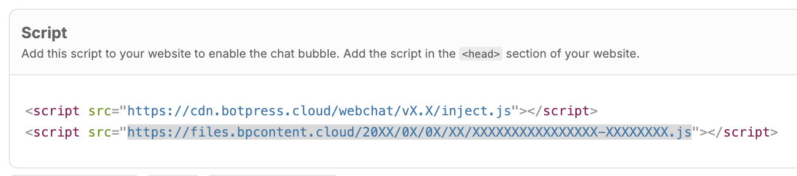
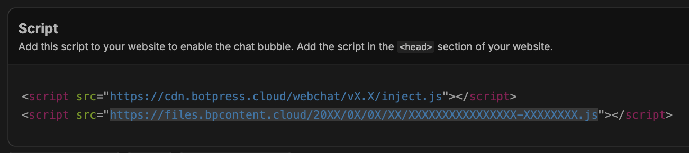
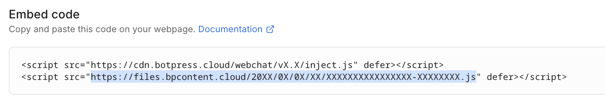
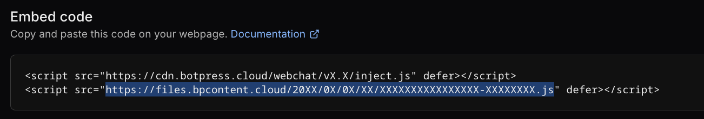

You can manually embed your Webchat as a component or an HTML `<div>`.

<Note>
  If you just want to quickly add a bot to your website, use the [Quick Start guide](/webchat/get-started/quick-start). 
</Note>

<Info>
  You will need:
  - A [published bot](/learn/get-started/quick-start)
  - Basic familiarity with HTML
</Info>

## As a component

You can embed Webchat directly in your website as a component:

<Steps titleSize="h3">
  <Step title="Get your embed code">
    Navigate to either the [Studio](/learn/reference/introduction) or the [Dashboard](/learn/get-started/dashboard/).

  <Tabs>
    <Tab title="From the Studio">
      1. Select **Share** in the upper-right corner.
      2. Select **Configure**, then copy the `src` URL in the **second** `script` tag:
      
      <Frame>
        
        
      </Frame>
    </Tab>
    <Tab title="From the Dashboard">
      1. Open your bot's Workspace. In the left navigation bar, find the bot you want to embed.√
      2. Select **Webchat**, then open the Share tab.
      3. Copy the `src` URL in the **second** `script` tag:
      
      <Frame>
        
        
      </Frame>

    </Tab>
  </Tabs>
  </Step>
  <Step title="Copy the script URL">
      Open the URL in your browser and **copy the content of the page**. It should look something like this:

      ``` uri https://files.bpcontent.cloud/20XX/0X/0X/XX/XXXXXXXXXXXXXXXX-XXXXXXXX.js [expandable]
      window.botpress.init({
          "botId": "xxxxxxxxxxxxxxxxxxxxxx",
          "configuration": {
              "website": {},
              "email": {},
              "phone": {},
              "termsOfService": {},
              "privacyPolicy": {},
              "variant": "soft",
              "themeMode": "light",
              "fontFamily": "inter"
          },
          "clientId": "xxxxxxxxxxxxxxxxxxxxxx"
      });
      ```
  </Step>
  <Step title="Add the Webchat component">
    Insert the following HTML where you want Webchat to appear, then paste the script:

    ```html {14} [expandable]
    <div class="webchat" style="height: 600px; width: 400px;">
      <iframe
        style="height: 100%; width: 100%; border: none;"
        srcdoc='
        <!doctype html>
        <html lang="en">
          <head></head>
          <body>
            <script src="https://cdn.botpress.cloud/webchat/v3.0/inject.js"></script>
            <script defer>
              window.botpress.on("webchat:ready", () => {
                botpress.open();
              });
              // Paste your Webchat config snippet here
            </script>
          </body>
        </html>'
      ></iframe>
    </div>
    ```

    Now you can customize the styles of the parent `<div>` to suit your layout.
      <Tip>
        To make Webchat fill your website's entire screen, update the wrapper's `height` and `width` properties: 

        ```html
        <div class="webchat" style="height: 100vh; width: 100vw;">
        ```
      </Tip>
  </Step>
</Steps>

## In an HTML div

You can embed Webchat directly in an HTML `<div>`:

<Steps titleSize="h3">
  <Step title="Get your embed code">
    Navigate to either the [Studio](/learn/reference/introduction) or the [Dashboard](/learn/get-started/dashboard/).

  <Tabs>
    <Tab title="From the Studio">
      1. Select **Share** in the upper-right corner.
      2. Select **Configure**, then copy the `src` URL in the **second** `script` tag:
      
      <Frame>
        
        
      </Frame>
    </Tab>
    <Tab title="From the Dashboard">
      1. Open your bot's Workspace. In the left navigation bar, find the bot you want to embed.√
      2. Select **Webchat**, then open the Share tab.
      3. Copy the `src` URL in the **second** `script` tag:
      
      <Frame>
        
        
      </Frame>

    </Tab>
  </Tabs>
  </Step>
  <Step title="Copy the script URL">
      Open the URL in your browser and **copy the content of the page**. It should look something like this:

      ``` uri https://files.bpcontent.cloud/20XX/0X/0X/XX/XXXXXXXXXXXXXXXX-XXXXXXXX.js [expandable]
      window.botpress.init({
          "botId": "xxxxxxxxxxxxxxxxxxxxxx",
          "configuration": {
              "website": {},
              "email": {},
              "phone": {},
              "termsOfService": {},
              "privacyPolicy": {},
              "variant": "soft",
              "themeMode": "light",
              "fontFamily": "inter"
          },
          "clientId": "xxxxxxxxxxxxxxxxxxxxxx"
      });
      ```
  </Step>
  <Step title="Add Webchat to an HTML div">
    Now you can embed Webchat directly in an HTML `<div>`. For example:

    ```html {8} [expandable]
    <div id="webchat-container" style="position: relative; width: 100%; height: 100%;">
      <script src="https://cdn.botpress.cloud/webchat/v3.0/inject.js"></script>
      <script>
        window.botpress.on("webchat:ready", () => {
          window.botpress.open();
        });

        // Paste your Webchat config snippet here
      </script>
      <style>
        #webchat-container {
          position: relative;
          width: 100%;
          height: 100%;
        }
        .bpFab {
          display: none;
        }
        .bpWebchat {
          position: absolute !important;
          top: 0 !important;
          left: 0 !important;
          right: 0 !important;
          bottom: 0 !important;
          width: 100% !important;
          height: 100% !important;
        }
      </style>
    </div>
    ```

    <Tip>
      You can also use this script in a CMS like [Wix](/webchat/integrations/wix).
    </Tip>
  </Step>
</Steps>