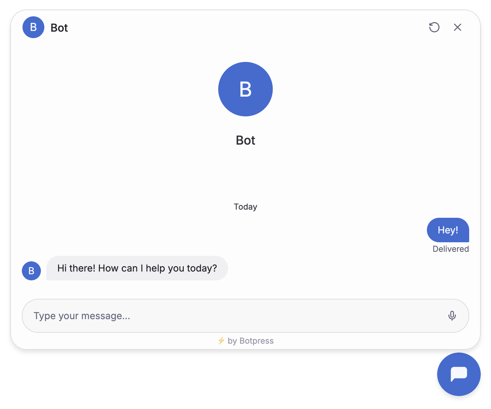
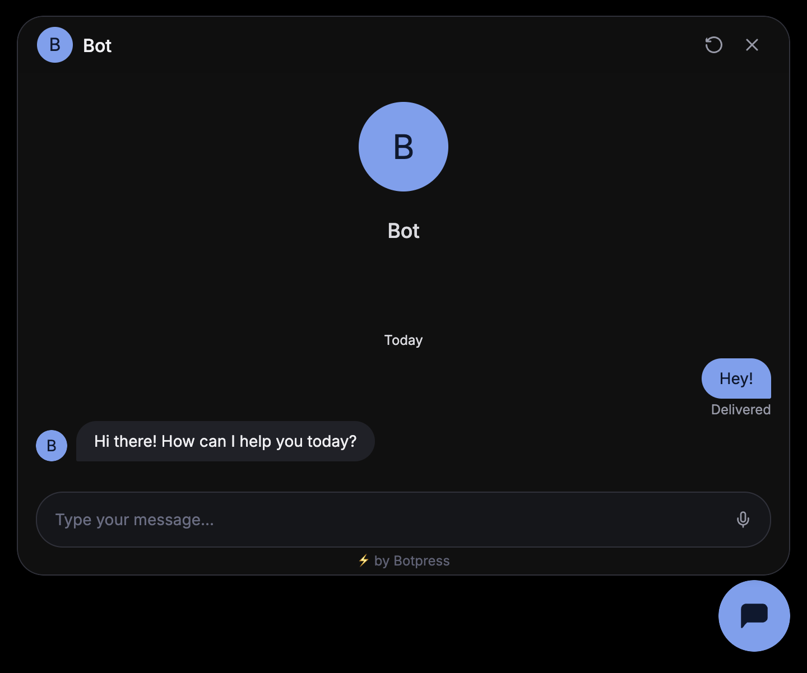

import GetEmbedCode from "/snippets/webchat/get-embed-code.mdx"

Webchat makes it easy to embed a bot on your website. If you self-host your website, just follow the instructions on this page.

<Note>
  If you use a website-building tool like [Wordpress](/webchat/integrations/wordpress), [Wix](/webchat/integrations/wix) or [Webflow](/webchat/integrations/webflow), see the other pages in this section for instructions on how to add your bot.
</Note>

<Info>
  You will need:
  - A [published bot](/learn/get-started/quick-start)
  - Basic familiarity with HTML
</Info>

<Steps titleSize='h2'>
  <Step title="Get your embed code">
    
    <GetEmbedCode/>

  </Step>
  <Step title="Add to your website">
    Next, add the Webchat embed code to the `head` section of your website's HTML. For example:

    ```html index.html {4-5}
    <!DOCTYPE html>
    <html>
    <head>
      <script src="https://cdn.botpress.cloud/webchat/vX.X/inject.js"></script>
      <script src="https://files.bpcontent.cloud/xxxx/xx/xx/xx/xxxxxxxxxxxxx-xxxxxxxx.js"></script>
    </head>
    <body>
      <!-- Website content -->
    </body>
    </html>
    ```
  </Step>
  <Step>
    You're all set! Open your website and start chatting with your bot. It should look something like this:

    <Frame>
      
      
    </Frame>
  </Step>
</Steps>

<Check>
  Done! Your bot is now live on your website.
</Check>

## Next steps

Now that you've added your bot, try [styling it](./configure-your-webchat) to match the rest of your website's user interface.