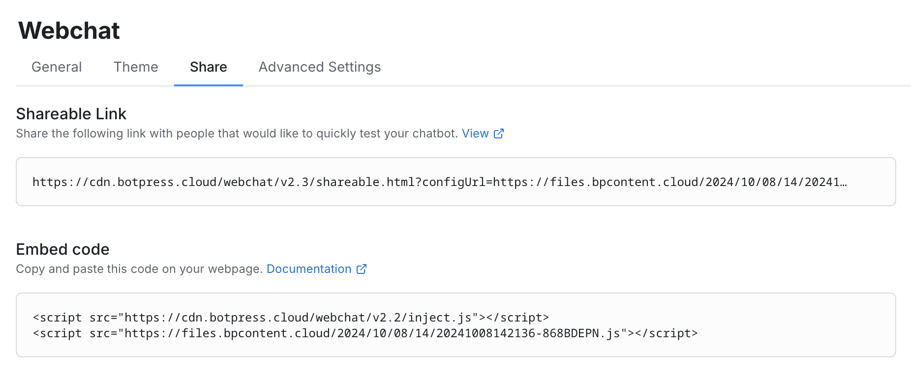
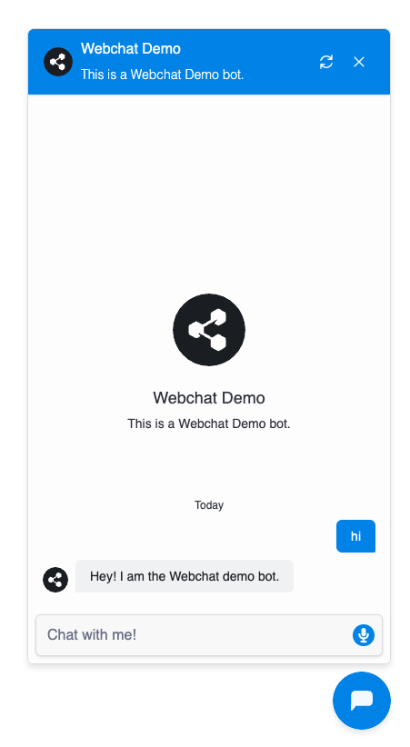

import { Img } from '/snippets/image.mdx'

The Injected Webchat allows you to integrate chatbot functionality directly into your web application. It supports message handling, event subscriptions, and customization, enabling a dynamic user experience within the browser.

## Setup

The simplest way to get started with Webchat for your web application is by embedding a couple of script tags into your HTML.

<Steps>
  <Step title="Copy embed script">
    Open your bot in the Botpress Dashboard, then navigate to the Webchat tab in your sidebar. Click on the
    Share tab and copy the provided Embed Code.

    
  </Step>
  <Step title="Paste">
Paste the code into the body of your HTML page

  ```html {4-5}
<!DOCTYPE html>
<html>
<head>
    <script src="https://cdn.botpress.cloud/webchat/v2.3/inject.js"></script>
    <script src="https://files.bpcontent.cloud/2025/03/18/14/20250318141028-30WRMG85.js"></script>
</head>
<body>
  <!-- Website content -->
</body>
</html>
  ```
  </Step>
  <Step title="Chat">
    You're all set! Open your webpage and start chatting with your bot. Your page should look something like this:

    
  </Step>
</Steps>

### Embedding Webchat as a Component in Your Web Application

To embed Webchat as a component, follow these steps:

1. First, copy the embed script using the steps mentioned above.
2. Instead of injecting the scripts directly into your HTML, open the src URL of the second `<script>` tag and copy the JavaScript snippet—it should look like this:

```javascript
window.botpress.init({
  ... // Your botpress config
});
```

3. Next, insert the following HTML where you want the Webchat to appear. Replace the window.botpress.init call inside the iframe with the snippet you just copied:

```html {14}
<div class="webchat" style="height: 600px; width: 400px;">
  <iframe
    style="height: 100%; width: 100%; border: none;"
    srcdoc='
    <!doctype html>
    <html lang="en">
      <head></head>
      <body>
        <script src="https://cdn.botpress.cloud/webchat/v2.2/inject.js"></script>
        <script defer>
          window.botpress.on("webchat:ready", () => {
            botpress.open();
          });
          // Paste your Botpress config snippet here
        </script>
      </body>
    </html>'
  ></iframe>
</div>
```

4. Customize the styles of the parent `<div>` to suit your layout. \
   <Tip>To make the Webchat take up the full screen, update the wrapper like so: </Tip>

```html
<div class="webchat" style="height: 100vh; width: 100vw;">...</div>
```

### Embedding the Webchat Directly in a HTML div

Webchat can also be embedded directly into a HTML div of a site. For instance, this can be done on Wix. The code for doing such an embedding is found below:

```html {8-10}
<div id="webchat-container" style="position: relative; width: 100%; height: 100%;">
  <script src="https://cdn.botpress.cloud/webchat/v2.2/inject.js"></script>
  <script>
    window.botpress.on("webchat:ready", () => {
      window.botpress.open();
    });

    window.botpress.init({
      ... // Your botpress config
    });
  </script>
  <style>
    #webchat-container {
      position: relative;
      width: 100%;
      height: 100%;
    }
    .bpFab {
      display: none;
    }
    .bpWebchat {
      position: absolute !important;
      top: 0 !important;
      left: 0 !important;
      right: 0 !important;
      bottom: 0 !important;
      width: 100% !important;
      height: 100% !important;
    }
  </style>
</div>
```
