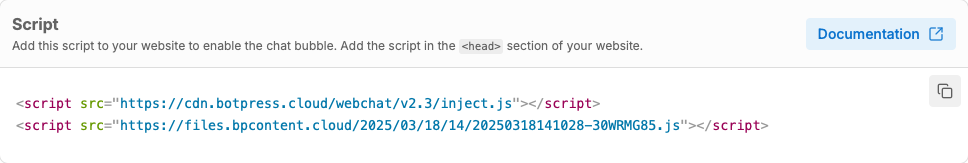

import { Img } from '/snippets/image.mdx'

<Info>
You will need:

* A [published bot](/guides/quick-start)
* A WordPress website. Your website could be managed ([WordPress.org](https://wordpress.org/)) or self-hosted ([WordPress.com](https://wordpress.com/))
* If you're self-hosting: a WordPress [plan that allows installing plugins](https://wordpress.com/pricing/)
</Info>

<Tip>
Visual learner?

Check out our [WordPress guide](https://www.youtube.com/watch?v=PzGFVqOzDsk) on YouTube, which teaches you how to build and embed a bot on your WordPress website.
</Tip>

# Step 1: Get your embed code

To embed a bot on your WordPress website, you need the bot's Webchat embed code. You can get the embed code from either the [Studio](/guides/studio/interface/introduction) or your [Webchat settings](/webchat/quick-start).

## From the Studio

1. Select **Share** in the upper-right corner.
2. Select **Configure**, then copy the `script` tags:

## From your Webchat settings

1. Open your bot's Workspace. In the left navigation bar, find the bot you want to embed.
2. Select **Webchat**, then open the **Share** tab.
3. Copy the **Embed code**:

# Step 2: Install the WPCode Plugin in WordPress

1. Login to your [WordPress dashboard](https://login.wordpress.org).
2. From the left navigation bar, select **Plugins**.
3. Search for the [WPCode plugin](https://wordpress.org/plugins/insert-headers-and-footers/#description) and select **Install Now**.

# Step 3: Add the bot to your WordPress website

1. From the left navigation bar, select **Code Snippets**.
2. Select **Add New**. Then, select **Add Your Custom Code (New Snippet)**.
3. Select **HTML Snippet**. Then, paste your Webchat embed code into the **Code Preview** field.
4. Scroll to the **Insertion** section, then open the **Location** drop-down menu. Select **Side Wide Body**.
5. In the upper-right corner, set the snippet to **Active**, then select **Save Snippet**.

<Check>
Done!

Your bot is now live on your WordPress site.
</Check>

# Next steps

Now that you've added your bot, try [styling](/webchat/styling-your-webchat) it to match the rest of your website's user interface.
