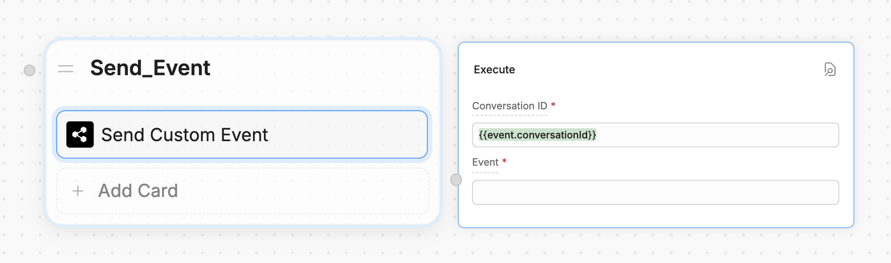

You can send custom events from Webchat to your website. This is useful if you want your website to perform an action when your user reaches a certain point in its conversation with your bot.

<Info>
    You will need:

    - A website with an [embedded bot](webchat/quick-start)
    - Familiarity with JavaScript
</Info>

<Steps titleSize="h3">
    <Step title="Add a Send Custom Event Card">
        1. In Botpress Studio, add a **Send Custom Event** Card to any Node:

        

        2. Set the **Conversation ID** to `{{ event.conversationId }}`
        3. Add anything you want to the **Event** field.

        <Note>
            The **Event** field contents must be in JSON format.
        </Note>
    </Step>
    <Step title="Listen for the event on your website">
        Now, you can listen for the event in your website's source code:

        ``` javascript index.js {3}
        window.botpress.on('customEvent', (event) => {
            console.log('Custom event triggered: ', event);
            // Insert your code here
        });
        ```

        <Tip>
        You can [listen to other kinds of Webchat events](/webchat/interact/listen-to-events), too.
        </Tip>
    </Step>
</Steps>

<Check>
    Now your website can respond to your custom event!
</Check>