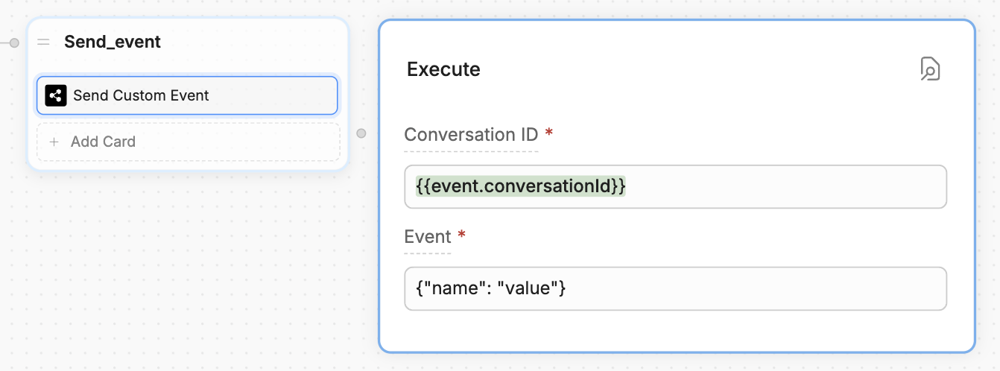
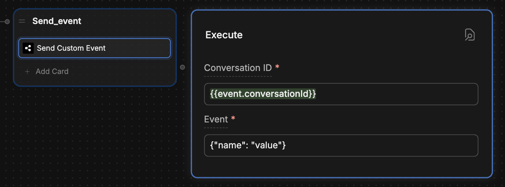

You can send custom events from Webchat to your website. This is useful if you want your website to perform an action when your user reaches a certain point in its conversation with your bot.

<Info>
    You will need:

    - A website with an [embedded bot](webchat/get-started/quick-start)
    - Familiarity with JavaScript
</Info>

<Steps titleSize="h3">
    <Step title="Add a Send Custom Event Card">
        In Botpress Studio, add a **Send Custom Event** Card to the Node you want to trigger the event from:

        <Frame>
          
          
        </Frame>

        Set the **Conversation ID** to `{{event.conversationId}}`. Then, add any [valid JSON](https://www.w3schools.com/js/js_json_syntax.asp) to the **Event** field.

        The contents of the **Event** field should clearly identify the action you want your website to perform. For example, if you want to checkout with the user's current shopping cart, you could add something like `{"action": "checkout"}`.

        <Tip>
            You can also use [variables](/studio/concepts/variables/) to dynamically insert the contents of the **Event** field.
        </Tip>
        
    </Step>
    <Step title="React to the event on your website">
        Now, you can react to the event in your website's source code using a [custom event listener](/webchat/interact/listen-to-events/#custom-event).

        ``` javascript index.js {3}
        window.botpress.on('customEvent', (event) => {
            console.log('Custom event triggered: ', event);
            // Insert your code here
        });
        ```

        Here, `event` contains whatever data you put in the **Event** field of the **Send Custom Event** Card. You can read its contents if you want your website to react differently depending on which custom event you send. For example:

        ``` javascript index.js {3-8}
        window.botpress.on('customEvent', (event) => {  
            console.log('Custom event triggered: ', event);
            if (event.action === "action1") {
                // Handle the first kind of event
            }
            else if (event.action === "action2") {
                // Handle the second kind of event
            }
        });
        ```


        <Tip>
        You can [listen to other kinds of Webchat events](/webchat/interact/listen-to-events), too.
        </Tip>
    </Step>
</Steps>