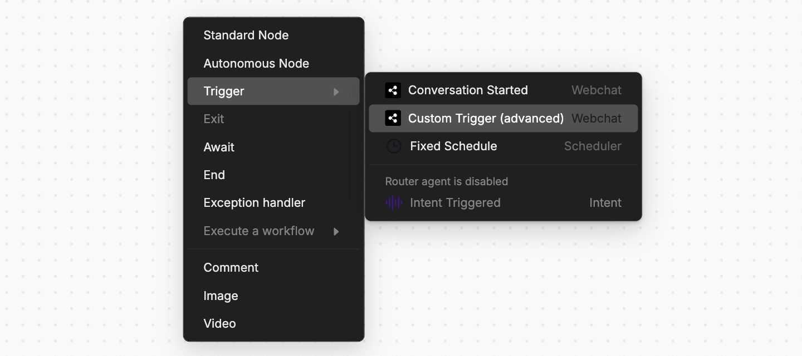
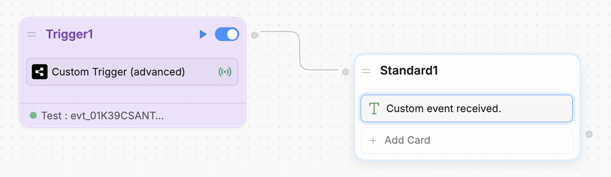

You can send custom events from your website to Webchat. This is useful if you want your bot to transition to a certain Node or Workflow when something happens on your website.

<Info>
    You will need:

    - A website with an [embedded bot](/webchat/quick-start)
    - Familiarity with JavaScript
</Info>

<Tip>
    Visual learner? Check out our [YouTube guide](https://www.youtube.com/watch?v=dDGY_wHFt3s&pp=0gcJCY0JAYcqIYzv) on sending custom events.
</Tip>

<Steps titleSize="h3">
    <Step title="Send an event to Webchat">
        First, setup an **event** to send Webchat from your website's source code:

        ``` javascript index.js
        const customPayload = {
            "test": "test"
        }

        await window.botpress.sendEvent(customPayload)
        ```

        `customPayload` can be any JSON object.

    </Step>
    <Step title="Add a custom trigger">
        Next, add a custom trigger Node in Studio:

        1. In your Workflow, right-click and select **Trigger**, then **Custom Trigger**:

        

        2. In the Event Filter field, enter `{{ event.payload }}`. This will capture the most recent event you send.
        3. Select **Test**, then **Show last received events**. This will display any events you've send from your website.
        4. If you've already sent your event, it should show up here. Select **Add as Test**, then **Save**.

        <Warning>
            The trigger Node won't work until you've succesfully tested it.
        </Warning>

    </Step>
    <Step title="Test your trigger">
        Now, you can test your trigger Node:

        1. Add a transition from the trigger Node to another Node. For example:

        

        2. Select the **Play** button to execute the trigger Node in the Emulator.
    </Step>
</Steps>

<Check>
    Done! Now you can send custom events to Webchat.
</Check>