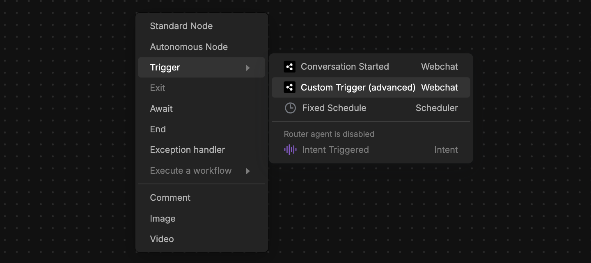
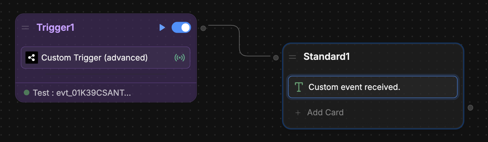

You can send custom events from your website to Webchat. This is useful if you want your bot to transition to a certain Node or Workflow when something happens on your website.

## With embedded Webchat

If you added Webchat to your website [using the embed code](/webchat/get-started/quick-start), follow the steps below to send custom events:

<Info>
    You will need:

    - A website with an [embedded bot](/webchat/get-started/quick-start)
    - Familiarity with JavaScript
</Info>

<Tip>
    Visual learner? Check out our [YouTube guide](https://www.youtube.com/watch?v=dDGY_wHFt3s&pp=0gcJCY0JAYcqIYzv) on sending custom events.
</Tip>

<Steps>
    <Step title="Send an event to Webchat">
        First, set up an **event** to send Webchat from your website's source code.

        ``` javascript index.js
        const customPayload = {
            "test": "test"
        }

        window.botpress.sendEvent(customPayload)
        ```

        You can replace the data in `customPayload` with anything you like.

    </Step>
    <Step title="Add a Custom Trigger">

      Next, add a [Custom Trigger](/learn/reference/triggers#custom-trigger) to your bot's Workflow:

      1. In your Workflow, right-click and select **Trigger**, then **Custom Trigger**:

      <Frame>
        
        
      </Frame>

      2. In the **Event Filter** field, enter `{{event.payload}}`. This will capture the most recent event you send.
      3. Select **Test**, then **Show last received events**. This will display any events you've sent from your website.
      4. If you've already sent your event, it should show up here. Select **Add as Test**, then **Save**.

      <Warning>
        This step is mandatory. The Custom Trigger won't work until you've successfully tested it.
      </Warning>

    </Step>
    <Step title="Test your trigger">
        Now you can test your Custom Trigger:

        1. Add a transition from the Custom Trigger to another Node. For example:

        <Frame>
          
          
        </Frame>

        2. Select the <Icon icon="play" /> button to test the Custom Trigger's behaviour in the Studio's [Emulator](/learn/reference/emulator).
    </Step>
</Steps>

<Check>
  Once you've re-published your bot, it'll respond to custom events.
</Check>

## With the Webchat React library

If you're using the [Webchat React library](/webchat/react-library/get-started), follow the steps below to send custom events:

<Info>
  You will need:

  - A working React app that [implements Webchat](/webchat/react-library/get-started#step-2%3A-build-a-component)
</Info>

<Steps>
  <Step title="Add the useWebchat hook">
    At the top level of your React component that renders Webchat, add the [`useWebchat`](/webchat/react-library/hooks/use-webchat-client) hook and destructure the `client` object:

    <CodeGroup>

    ```jsx Hook by itself
    const { client } =
      useWebchat({
        clientId: "xxxxxxxx-xxxx-xxxx-xxxx-xxxxxxxxxxxx"
        // Replace with your actual client ID
    })
    ```

    ```jsx Example in a full React app expandable lines highlight={13-16}
    import { Fab, Webchat, useWebchat } from '@botpress/webchat'
    import { useState } from 'react'

    function App() {
      const clientId = "xxxxxxxx-xxxx-xxxx-xxxx-xxxxxxxxxxx"
      // Replace with your actual client ID

      const [isWebchatOpen, setIsWebchatOpen] = useState(false)
      const toggleWebchat = () => {
        setIsWebchatOpen((prevState) => !prevState)
      }

      const { client } =
        useWebchat({
          clientId: clientId
        })

      return (
        <>
          <Webchat
            clientId={clientId}
            style={{
              width: '400px',
              height: '600px',
              display: isWebchatOpen ? 'flex' : 'none',
              position: 'fixed',
              bottom: '90px',
              right: '20px',
            }}
          />
          <Fab
            onClick={() => toggleWebchat()}
            style={{
              position: 'fixed',
              bottom: '20px',
              right: '20px',
              width: '64px',
              height: '64px'
            }}
          />
        </>
      )
    }

    export default App
    ```

    </CodeGroup>

    Remember to replace the placeholder `clientId` with your bot's actual client ID.

  </Step>
  <Step title="Send an event to Webchat">
    Now, use the `client` instance to send an event to Webchat. First, define a payload object with any data you'd like. For example:

    ```jsx
    const customPayload = {
        "test": "test"
    }
    ```

    Then, send the event using `client.sendEvent(customPayload)`. For example, in a button:

    <CodeGroup>

    ```jsx Send event button
    <button onClick={() => client.sendEvent(customPayload)}>
      Send custom event
    </button>
    ```

    ```jsx Example in a full React app expandable lines highlight={17-19, 23-25}
    import { Fab, Webchat, useWebchat } from '@botpress/webchat'
    import { useState } from 'react'

    function App() {
      const clientId = "xxxxxxxx-xxxx-xxxx-xxxx-xxxxxxxxxxx"
      // Replace with your actual client ID
      const [isWebchatOpen, setIsWebchatOpen] = useState(false)
      const toggleWebchat = () => {
        setIsWebchatOpen((prevState) => !prevState)
      }

      const { client } =
        useWebchat({
          clientId: clientId
      })

      const customPayload = {
        "test": "test"
      }

      return (
        <>
          <button onClick={() => client.sendEvent(customPayload)}>
            Send custom event
          </button>
          <Webchat
            clientId={clientId}
            style={{
              width: '400px',
              height: '600px',
              display: isWebchatOpen ? 'flex' : 'none',
              position: 'fixed',
              bottom: '90px',
              right: '20px',
            }}
          />
          <Fab
            onClick={() => toggleWebchat()}
            style={{
              position: 'fixed',
              bottom: '20px',
              right: '20px',
              width: '64px',
              height: '64px'
            }}
          />
        </>
      )
    }

    export default App
    ```

    </CodeGroup>
  </Step>
  <Step title="Add a Custom Trigger">
    Next, add a [Custom Trigger](/learn/reference/triggers#custom-trigger) to your bot's Workflow:

    1. In your Workflow, right-click and select **Trigger**, then **Custom Trigger**:

    <Frame>
      
      
    </Frame>

    2. In the **Event Filter** field, enter `{{event.payload}}`. This will capture the most recent event you send.
    3. Select **Test**, then **Show last received events**. This will display any events you've sent from your website.
    4. If you've already sent your event, it should show up here. Select **Add as Test**, then **Save**.

    <Warning>
      This step is mandatory. The Custom Trigger won't work until you've successfully tested it.
    </Warning>
  </Step>
  <Step title="Test your Custom Trigger">
    Now you can test your Custom Trigger:

    1. Add a transition from the Custom Trigger to another Node. For example:

    <Frame>
      
      
    </Frame>

    2. Select the <Icon icon="play" /> button to test the Custom Trigger's behaviour in the Studio's [Emulator](/learn/reference/emulator).
  </Step>
</Steps>

<Check>
  Once you've re-published your bot, it'll respond to custom events.
</Check>
