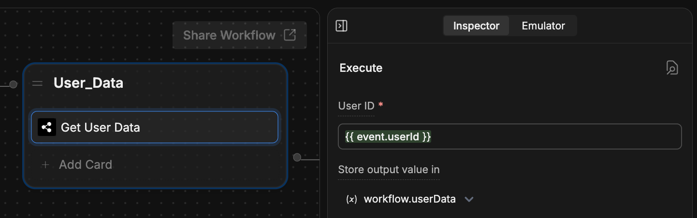

You can use Webchat to easily **provide your bot with information about the current user**. This is useful if your website stores user data (like with a customer login) and you want your bot to have access to that data.

Sending user data to your bot allows it to:

- Address the user by name
- Have immediate access to their contact information
- Streamline their experience

<Info>
    You will need:

    - A website with an [embedded bot](/webchat/get-started/quick-start)
    - Familiarity with HTML and JavaScript

</Info>

## Update user data

Use the [`window.botpress.updateUser`](/webchat/interact/reference#updateuser) method to update user data after your website has initialized Webchat:

```js
window.botpress.updateUser({
  data: {
    firstName: newFirstName,
    lastName: newLastName,
    email: newEmail,
  },
})
```

<Warning>
  The `updateUser` method is only available after Webchat has been initialized. To avoid errors, consider [listening for the initialization event](/webchat/interact/listen-to-events#webchat-is-initialized) before calling `updateUser`.
</Warning>

## Initialize with user data

You may want to provide some user data while initializing Webchat on your website. This allows your bot to deliver a more personalized conversation experience from the start.

To provide user data as soon as Webchat is ready, listen for Webchat's initialization event and call [`window.botpress.updateUser`](/webchat/interact/reference#updateuser) as soon as it fires:

```js {3-9}
window.botpress.on('webchat:initialized', () => {
  console.log('Webchat has been initialized. Loading user...');
  window.botpress.updateUser({
    data: {
      firstName: newFirstName,
      lastName: newLastName,
      email: newEmail,
    },
  })
});
```

## Access user data

You can also retrieve the user data your bot currently has access to:

### In Studio

Once you've provided Webchat with user data, you can use the [Get User Data](/studio/concepts/cards/webchat#get-user-data) Card to access it in the [Studio](/studio/introduction):

<Frame>
  
  
</Frame>

In the **User ID** field, enter `{{ event.userId }}`. You can store the user data in any variable you'd like.

### On your website

Use the [`window.botpress.getUser`](/webchat/interact/reference#getuser) method to access the current user data programmatically:

```js
async function getBotpressUser() {
  const user = await window.botpress.getUser()
  console.log(user)
}

getBotpressUser();
```
