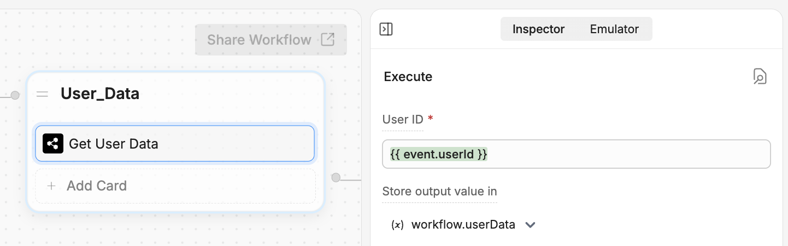

You can use Webchat to easily **provide your bot with information about the current user**. This is useful if your website stores user data (like with a customer login) and you want your bot to have access to that data.

Sending user data to your bot allows it to:

- Address the user by name
- Have immediate access to their contact information
- Streamline their experience

<Info>
    You will need:

    - A website with an [embedded bot](/webchat/get-started/quick-start)
    - Familiarity with HTML and JavaScript

</Info>

## Initialize with user data

You may want to provide some user data while initializing Webchat on your website. This allows your bot to deliver a more personalized conversation experience from the start.

<Note>
  If you directly copy any of the code in this guide, be careful — it contains **placeholder values**. Your code should
  contain your actual Webchat parameters.
</Note>

<Steps titleSize="h3">
    <Step title="Find your Webchat embed code">

        Open the `.html` file that contains your Webchat embed code. For example:

        ```html index.html {4-5}
        <!DOCTYPE html>
        <html>
        <head>
            <script src="https://cdn.botpress.cloud/webchat/v3.2/inject.js"></script>
            <script src="https://files.bpcontent.cloud/2025/03/18/14/20250318141028-30WRMG85.js"></script>
        </head>
        <body>
            <!-- Website content -->
        </body>
        </html>
        ```
    </Step>
    <Step title="Copy the script URL">
        Copy the `src` URL in the second script tag. For example:

        ``` html index.html {2}
        <script src="https://cdn.botpress.cloud/webchat/v3.2/inject.js"></script>
        <script src="https://files.bpcontent.cloud/2025/03/18/14/20250318141028-30WRMG85.js"></script>
        ```

        Then, open it in your browser and **copy the content of the page**. It should look something like this:

        ``` uri https://files.bpcontent.cloud/2025/03/18/14/20250318141028-30WRMG85.js [expandable]
        window.botpress.init({
            "botId": "xxxxxxxxxxxxxxxxxxxxxx",
            "configuration": {
                "website": {},
                "email": {},
                "phone": {},
                "termsOfService": {},
                "privacyPolicy": {},
                "variant": "soft",
                "themeMode": "light",
                "fontFamily": "inter"
            },
            "clientId": "xxxxxxxxxxxxxxxxxxxxxx"
        });
        ```

        This is the **Webchat auto-initialization script**. Usually, this executes when your website is loaded. However, to load your bot with user data, you need to **manually** initialize it.

    </Step>
    <Step title="Remove the auto-initialization script">
        Go back to the `.html` file with your embed code. Then, **delete** the second line:

        ```html index.html {2}
          <script src="https://cdn.botpress.cloud/webchat/v3.2/inject.js"></script>
        - <script src="https://files.bpcontent.cloud/2025/03/18/14/20250318141028-30WRMG85.js"></script>
        ```
    </Step>
    <Step title="Manually initialize Webchat">
        Paste the script into your website's JavaScript code. For example:

        ``` javascript index.js [expandable]
        window.botpress.init({
            "botId": "xxxxxxxxxxxxxxxxxxxxxx",
            "configuration": {
                "website": {},
                "email": {},
                "phone": {},
                "termsOfService": {},
                "privacyPolicy": {},
                "variant": "soft",
                "themeMode": "light",
                "fontFamily": "inter"
            },
            "clientId": "xxxxxxxxxxxxxxxxxxxxxx"
        });
        ```

        Now, your website will manually initialize Webchat.

        <Note>
            You could leave this code as-is — Webchat would behave exactly the same as before. All we did was move the script directly into your source code.

            However, since you can now modify the script directly, you can **load Webchat with user data**.
        </Note>
    </Step>
    <Step title="Load Webchat with user data">
        Now, you can add any user data you'd like to your script. For example, if you define variables for login information, you can reference them in the script:

        ``` javascript index.js [expandable] {1-3, 18-24}
        const firstName = "John";
        const lastName = "Doe";
        const email = "john.doe@example.com";

        window.botpress.init({
            "botId": "xxxxxxxxxxxxxxxxxxxxxx",
            "configuration": {
                "website": {},
                "email": {},
                "phone": {},
                "termsOfService": {},
                "privacyPolicy": {},
                "variant": "soft",
                "themeMode": "light",
                "fontFamily": "inter"
            },
            "clientId": "xxxxxxxxxxxxxxxxxxxxxx",
            "user": {
                "data": {
                    "firstName": firstName,
                    "lastName": lastName,
                    "email": email
                }
            }
        });
        ```

    </Step>

</Steps>

## Update user data

Use the `window.botpress.updateUser` function to update user data after your website has initialized Webchat:

```javascript index.js {3-5}
window.botpress.updateUser({
  data: {
    firstName: newFirstName,
    lastName: newLastName,
    email: newEmail,
  },
})
```

## Access user data in Studio

Once you've provided Webchat with user data, you can use the **Get User Data** Card to access it in the Studio:



In the **User ID** field, enter `{{ event.userId }}`. You can store the user data in any variable you'd like.
