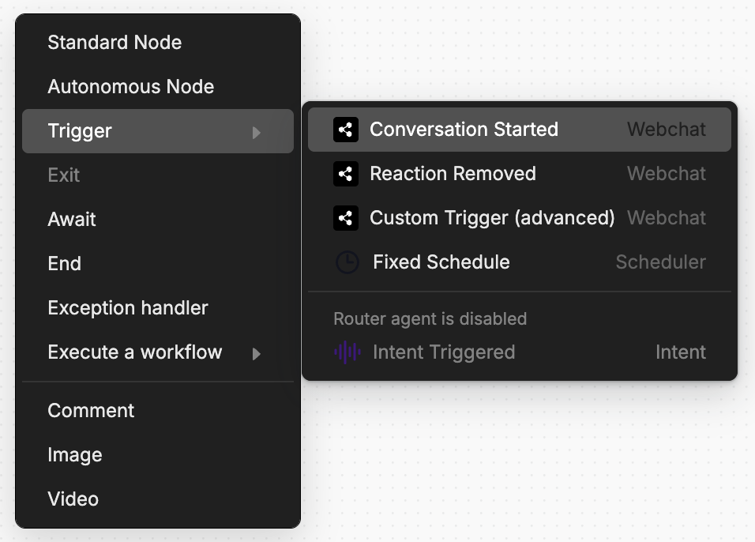
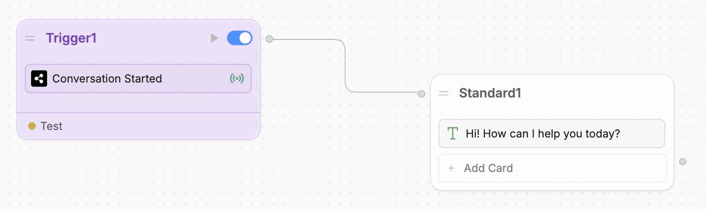

You can make Webchat perform specific actions as soon as a user starts a new conversation. These actions execute before the user sends their first message, making them useful for:

- Sending a welcome message to the user
- Notifying a live agent that a user is chatting with the bot
- Pre-loading any data required for the conversation

<Steps titleSize="h2">
    <Step title="Add the Conversation Started Trigger">
        In your Workflow, right-click and select **Trigger**, then **Conversation Started**:

        <Frame>
        
        </Frame>

        This will add the **Conversation Started** Trigger to your Workflow.
    </Step>
    <Step title="Setup your Trigger">
        Now, you can add anything you want after your Trigger — it'll execute when a user starts a new conversation:

        <Frame>
        
        </Frame>

        <Note>
            Like other Triggers, **Conversation Started** won't work in the Studio's emulator — you have to test it using Webchat.
        </Note>
    </Step>
</Steps>