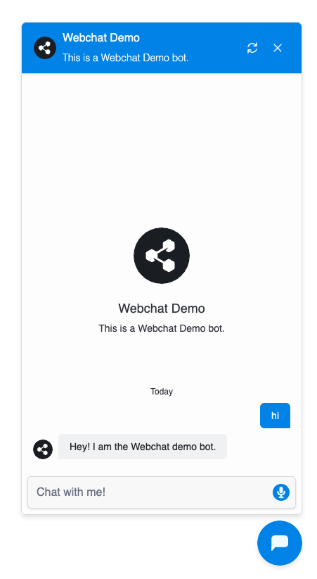

Webchat makes it easy to embed a bot on your website. If you self-host your website, just follow the instructions on this page.

<Note>
  If you use a website-building tool like [Wordpress](/webchat/integrate/wordpress), [Wix](/webchat/integrate/wix) or [Webflow](/webchat/integrate/webflow), see the other pages in this section for instructions on how to add your bot.
</Note>

<Info>
  You will need:
  - A [published bot](/guides/quick-start)
  - Basic familiarity with HTML
</Info>

<Steps titleSize='h2'>
  <Step title="Get your embed code">
    To embed a bot a bot on your website, you need the bot's Webchat embed code. You can get the embed code from either the [Studio](/guides/studio) or the [Dashboard](/guides/dashboard/).

  <Tabs>
    <Tab title="From the Studio">
      1. Select **Share** in the upper-right corner.
      2. Select **Configure**, then copy the `script` tags:
      
    </Tab>
    <Tab title="From the Dashboard">
      1. Open your bot's Workspace. In the left navigation bar, find the bot you want to embed.
      2. Select **Webchat**, then open the Share tab.
      3. Copy the **Embed code**:
      
    </Tab>
  </Tabs>

  </Step>
  <Step title="Add to your website">
    Next, add the Webchat embed code to the head section of your website's HTML. For example:

    ```html index.html {4-5}
    <!DOCTYPE html>
    <html>
    <head>
      <script src="https://cdn.botpress.cloud/webchat/v2.3/inject.js"></script>
      <script src="https://files.bpcontent.cloud/2025/03/18/14/20250318141028-30WRMG85.js"></script>
    </head>
    <body>
      <!-- Website content -->
    </body>
    </html>
    ```
  </Step>
  <Step>
    You're all set! Open your website and start chatting with your bot. It should look something like this:

    
  </Step>
</Steps>

<Check>
  Done! Your bot is now live on your website.
</Check>

## Next steps

Now that you've added your bot, try [styling it](./styling-your-webchat) to match the rest of your website's user interface.